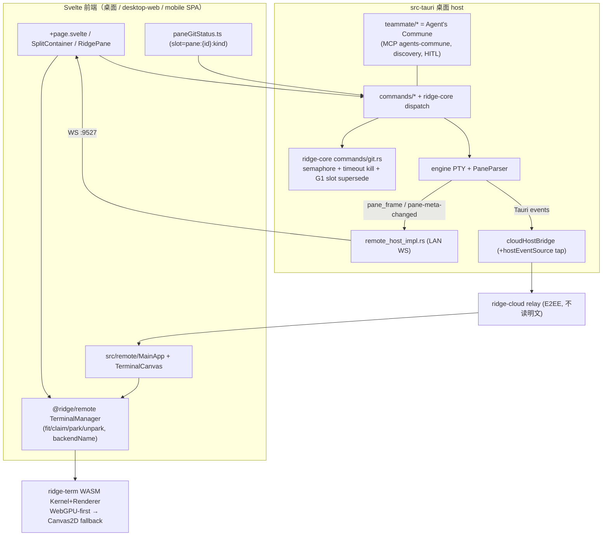
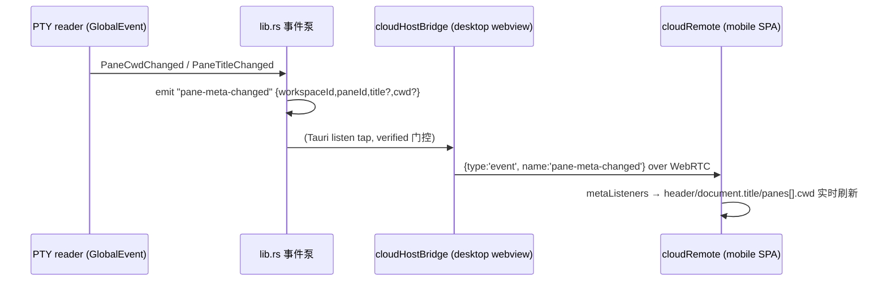
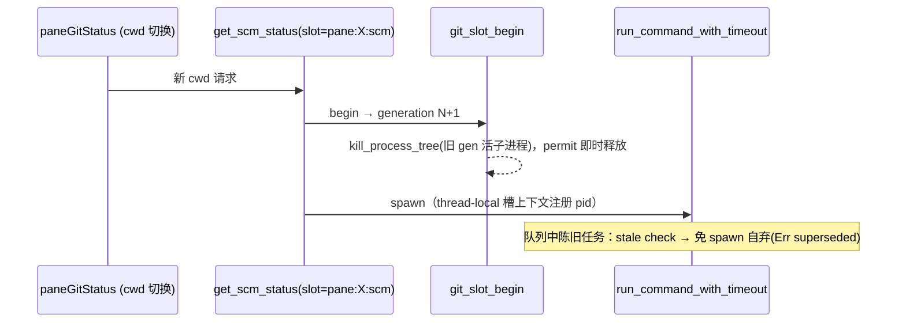

# Ridge 架构现状（ARCHITECTURE）

- **状态日期**: 2026-07-26（iter-60：git supersede + remote 尺寸/元信息广播/IME 修复 + Agent's Commune 品牌与发现接线 + CI test gate）
- **覆盖**: `wind`（C:\code\wind）主仓；兄弟仓 `ridge-cloud`（协议/relay 权威，另仓）。
- **用途**: 人 + NotebookLM 共用的**当前现状**单一来源（愿景/规划见 NLM notes）。据 CodeGraph + 源码符号确认。
- **不含**: 密钥、生产凭据、用户数据；不把历史计划或未复测功能写成已验证事实。
- **证据等级**: 代码事实=CodeGraph/源码符号；Git 事实=分支/tag/HEAD；运行事实=须本轮测试/退出码，缺则标「未验证/用户轨」。

---

## 1. 仓库快照

| 项 | 值 |
| --- | --- |
| 分支 / HEAD | `main` / `2c799ba` |
| 应用版本 | **0.1.2**（`package.json` / `src-tauri/tauri.conf.json` / `src-tauri/Cargo.toml` / Cargo.lock 四处同步） |
| 发布 tag（近） | v0.1.2, v0.1.1, v0.0.20, v0.0.19, v0.0.18 …（annotated；`release.yml` on tag push 触发全平台构建 + draft） |
| 工作区成员（6） | `src-tauri`、`packages/{ridge-core, ridge-cli, ridge-remote, ridge-term, ridge-tmux}`（虚拟 manifest，`resolver="2"`） |
| profile 拆分 | 全局原生提速档 `opt-level=2 + lto="thin" + codegen-units=16 + strip`；`ridge-term`（wasm 主 crate）体积档 `opt-z + cgu=1` |
| 未跟踪/非本仓 | `ridge-code/`（独立实验区，未 `git add`，**不属 Ridge 架构**）；`.venv-notebooklm/`、`.pnpm-store/`、`skills/` 等工具目录 |

**两条独立发布线**（版本号各验，不混）：
1. **桌面安装包 + rdg**：`release.yml`（tag `v*` 触发）出全平台矩阵 → GitHub Release（11 类资产：Win nsis/msi/rdg.exe、Linux deb/AppImage/rdg、macOS dmg×2/app.tar.gz×2/rdg-aarch64）。
2. **Remote 云 artifact**：`publish-remote.yml`（手动触发）构建 desktop-web + mobile 两套 bundle → `POST /api/v1/remote-artifacts`（`RIDGE_ARTIFACT_TOKEN`）→ 9527127.xyz 持久卷原子换 `current`，留最近 3 版回滚。手机 PWA 经此线更新。

---

## 2. 当前架构（CodeGraph 勾勒）

### 2.0 总览图（mermaid；节点为真实符号/文件，随现状同步）



### 2.0.1 关键流程：pane 元信息广播（iter-60 G9）



### 2.0.2 关键流程：git 检索 latest-win（iter-60 G1）



### 2.1 桌面与终端主链路
```
Svelte 页面/组件 → Tauri invoke/事件 → src-tauri commands / ridge-core dispatch
  → 工作区状态 + PTY engine → pane 输出/GridDelta
  → @ridge/remote TerminalManager → ridge-term WASM Kernel + Renderer → Canvas
```
- `src/routes/+page.svelte` 组装工作区/侧栏/远控/Agent Center；`SplitContainer.svelte` / `RidgePane.svelte` 管 Pane 布局。
- `packages/remote/src/shared/terminal/manager.ts::TerminalManager`（:408）统一终端实例生命周期，**桌面与 Remote 复用**（12+ 调用方）。
- `packages/ridge-term` = 终端语义 SSOT（parser/grid/scrollback/selection/search/增量渲染/modes/WASM 绑定）；渲染 **WebGPU-first + Canvas2D 自动回退**（`default=["webgpu"]` 生产默认、运行时 GPU 探测，**不得删除**；真机收益测量属用户轨 E1）。
- `packages/ridge-core` 承接 workspace/pane/Git 命令与异步 dispatch；Tauri 保留宿主状态/平台资源/事件桥。
- `packages/ridge-cli/src/main.rs`：`tui` / `login` / `remote`（公网 host daemon）/ `connect`（LAN controller）/ `tmux`。

### 2.2 远控三入口（控制面 / 数据面）
| 入口 | 控制面 | 数据面 |
| --- | --- | --- |
| 本地桌面 | Tauri 进程内命令/事件 | 本机 PTY |
| LAN Web | host 内置 HTTPS/WSS（TOTP/session 鉴权） | 局域网 WS，共享 Remote 协议 |
| 公网 Web | ridge-cloud 认证/信令 | WebRTC DataChannel + E2EE |

- 公网：`ControllerCloudProvider`（退避重连；RTC disconnected 15s watchdog→ICE restart；restart 后 12s deadline 未复→整体重建；重建后重 E2EE+TOTP，hello/pane recovery 恰一次）↔ `CloudHostBridge`（:188；验证完成前门控 invoke 与 Pane 订阅；Pane 背压 drain 后每 pane 恰重同步一次、不串 pane）。
- 1 房间 = 1 host + N controller，`cid` 定向寻址；同 cli 新连顶替旧连。

### 2.3 Pane 服务腿收敛（v0.1.1–v0.1.2 SSOT）
**三腿曾各自手抄帧/重同步**，现收口一份：
- **帧格式 SSOT** `ridge_remote::pane`（`pane_frame` = 16B pane-id 前缀 + PTY 载荷；`pane_resync_frame` = 前缀 + `build_resync_frame`；常量 `RESYNC_MIN_INTERVAL`/`RAW_CHAN_CAP`/`RESYNC_SCROLLBACK_LAN=64KiB`/`_CLOUD=256KiB`/`PANE_ID_PREFIX_LEN=16`）。
- **帧体 SSOT** `ridge_term::term::modes::build_resync_frame`（`RIS(\x1bc) + 模式前导 + scrollback`；前导 `Modes::to_reattach_preamble` 重挂 TUI 一次性开启的鼠标/alt 屏态）。
- **modes 追踪 SSOT** `ridge_term::ModeTracker`（桌面 PaneParser 与 rdg 各用一份 modes 快照，rdg 补 live modes → 修 rdg TUI 鼠标）。
- 三腿 I/O 管道差异保留（桌面 LAN `remote_host_impl.rs::handle_ws` 的 WS Binary / 桌面 cloud `cloud_pane.rs` 的 Tauri 事件 / rdg `lan_host_impl.rs::run_ws`），但**只调上述帧构造 + 常量**。
- **cloud 首订阅收敛（R-CLOUD-CONVERGE，v0.1.2）**：host 命令 `get_pane_resync_frame(pane_id,max_bytes)→{frame,start_seq,at_oldest,head_seq}`（`terminal.rs`，用 `build_resync_frame` 出完整帧），cloud 控制端 `cloudRemote._subscribe` 原样喂、不再前端自拼；旧 `get_pane_resync_preamble` 删除（详见 §3 能力门教训）。

### 2.4 P4 手机保活（v0.1.1）+ iter-60 手机体验修复
- 手机端弃「单例 kernel + 旁路缓存」，接共享 `TerminalManager` 多 kernel park 保活（切 pane 不 wipe）。
- `resume`（无 RIS 续订）全链路激活 + `PaneScrollback::since` / `sinceSeq` **后端**增量 replay 基础（前端未接 → R-INCR）。
- **iter-60 新增**：
  - **G9 元信息实时**：host 聚合事件 `pane-meta-changed`（lib.rs）→ cloud 桥 `hostEventSource` tap（cloudHostBridge，verified 门控/reset 退订；cloud 腿此前零事件推送）→ `cloudRemote.metaUnlisten` → 头部标题/CWD + Pane 弹层实时（`panes[].cwd` 同步）。LAN 腿沿用 `pty-meta`。
  - **G10 导航栈**：文件/diff viewer 关闭回「打开它的那级」（`viewerReturnTab`），终端来源仍回终端。
  - **G11 IME 补全去重**：`imeCommitDelta` 纯函数（`imeDelta.ts`，9 测）——公共前缀去重+退格差量；compositionend 与 insertReplacementText 双接线（后者原为整帧丢弃）。
  - **G4 backend 可观测**：`TerminalManager.backendName(paneId)` 回填页脚（P4 后恒显 Canvas2D 的显示回归）；`_makeHandle` 回退 warn 常显并报探测失败因。
  - **G2 desktop-web 填充**：shared-remote 模式 attach/unpark 初次 fit 即 claim；`claimPaneSize` 1s 验证+重试（详见 manager.ts 注释）。
- 真机矩阵（iOS/Android 实机）仍属用户轨；dev-CDP 证据见 `docs/iterations/2026-07-26-iteration-60.md`。

### 2.5 多 host 出站（H1，iter 22–31）
- `src-tauri/src/hosts/outbound.rs::OutboundTransport` trait（`LanOutboundTransport` + `MockOutboundTransport`）：`send_json_rpc`/`send_raw`/`drain_pane_raw`。
- 纯状态机 `packages/remote/src/shared/hosts/outboundLifecycle.ts`（Idle→Hello→Listed→Subscribed→Live/Reconnecting/Detached/Error；`assertNoCrossHostFanout` 禁跨 host 串扰）。
- 真机双端联调属用户轨。

### 2.6 Agent's Commune（Teammate / Agent 控制面；iter-60 品牌层改名）
- **命名（G5）**：对外品牌 **Agent's Commune**（UI 指挥部标题/侧栏、内置 MCP `serverInfo.name="agents-commune"`）；**wire 方法名不动**（get_teammate_topology 等，零版本偏斜）。代码目录仍 `src-tauri/src/teammate/`。
- `suspend.rs`（软暂停/恢复 + 可选 OS 冻结 Job/SIGSTOP；agent 写路径归一 `agent_pty_write` 唯一收口，suspended 拒；人类输入/Ctrl-C 刻意不门控）、`orch_health.rs`（`get_orchestration_health` = suspended/pending 快照 + `generation`/`degraded`）、`hitl.rs`（`list_hitl_pending` 只读脱敏投影无 action 全文；`resolve_hitl_remote` nonce 单次消费、modify 永不开放）。
- **Commune MCP 工具面（G7 盘点+补全）**：`ridge_send_to_teammate` / `ridge_delegate_task` / `ridge_get_team_profile`（roster+groups+**title**——iter-60 `inject_roster_titles` 两拓扑路径共用，agent 可感知队友正在跑什么）/ `ridge_join_group`（编组=前端 localStorage SSOT，后端 `set_teammate_groups` 镜像随快照下发）。
- **Agent 自动发现（G6）**：`discover_cli_agents`（sysinfo 进程内枚举 + `discover.rs` 纯指纹匹配 + 5s TTL 缓存；设置开关默认开，关=零扫描）→ 指挥部「Discovered」只读区。不入 roster、不建 pane。
- 桌面 `resolve_hitl_request` / `suspend_agent` / `resume_agent` 仅桌面 IPC，**不可远达**（负断言守卫）。

### 2.7 ridge-cloud（另仓，摘要）
- 单 Rust/Axum：API + WS relay + 多 SPA 托管（主域/admin/租户 controller 按 UA 分桌面/移动产物）。relay 不读业务明文；业务帧仅端侧 E2EE。JWT user/device scope（EdDSA，迁移期兼容 HS256）。协议权威全文 `ridge-cloud/docs/ridge-cloud-protocol.md`（wind 侧仅 canonical 入口 + 自动守卫）。

---

## 3. 安全 / 架构不变量（代码强制）

- **协议 SSOT 唯一**：`ridge-cloud/docs/ridge-cloud-protocol.md` 权威；协议变更先改契约再改各端。
- **E2EE 边界**：relay 不读终端业务明文；业务帧仅端侧加解密。host/controller 同账户；房间/配额用已验证身份 + DB 实时状态（不信任长寿命 JWT plan claim）。
- **鉴权先于业务帧**：`business-ready = transport connected + authorized`；E2EE connected 但 TOTP 未授权时不得发 hello/pane recovery。
- **能力先协商**：远控 resize/输入/Pane 订阅/scrollback 语义跨 desktop/LAN/cloud/CLI 一致；**能力必须先宣告，未宣告入口显式拒绝而非静默分叉**（跨入口合同测试守卫）。
- **能力门 = `capability.rs::REMOTE_ALLOWLIST`（Rust SSOT）+ TS 镜像 `remoteAllowlist.ts`（`cloudHostBridge.isRemoteAllowed` 逐条校验；`remoteAllowlist.test.ts` item-for-item 钉死）**。
  - ⚠️ **教训（v0.1.2 修复）**：`remote_host_impl.rs::CORE_MIGRATED_METHODS` 是**路由表**（哪些方法走 ridge-core dispatch），**不是能力门**。误把远程命令只加进它 ≠ 放行 → cloud invoke 被 `isRemoteAllowed` 拒（`get_pane_resync_preamble` 曾因此空转）。新增远程命令必入 `REMOTE_ALLOWLIST` + TS 镜像。
- **敏感物**：日志/来源/notes 绝不含 token、TOTP seed、私钥、`RIDGE_ARTIFACT_TOKEN`；migration 只追加。
- **两条版本线**：ridge-cloud 代码 SHA 与 Remote artifact version 分别验证。
- **危险动作不可远达**：HITL 裁决 modify、gateway 开关、暂停命令仅桌面 IPC（负断言）。

---

## 4. 开放差距（愿景 − 现状；确定性验收）

> 详版（优先级 + 验收 + 轮序）见 NLM note「[开放规划] post-v0.1.2」。

| ID | 优先级 | 事 | 确定性验收 |
| --- | --- | --- | --- |
| R-VERIFY | P0 | P4 手机保活真机验 R1–R8 | CDP 证据落 evidence JSON，`validate-remote-smoke-evidence.mjs` exit 0；回归退 `b9031a0` |
| R-INCR | P0 | 增量 replay 前端激活（消 resume-live-only gap） | 切走→产出→切回历史连续无 gap；host `since()` 边界 + 前端游标纯逻辑测 |
| R-WSLEG | P1 | WS-leg 完整 trait 收口（`handle_ws` ~1300行 → 共享 `serve_pane_session`） | `cargo check -p ridge -p ridge-cli` 绿；桌面 LAN/cloud 回归不破 |
| R-RDG-INCR | P1 | rdg `ScrollbackRing::since` 接 sinceSeq | rdg host since 路径单测 |
| R-DESKTOP-RESYNC | P2 | 桌面 `RidgePane` 首屏收敛到 `get_pane_resync_frame`（消桌面本地 pane 重挂鼠标失灵同源病） | RidgePane 首屏经新命令；真机 TUI 重挂鼠标存活；独立提交 |
| R-P4-LRU | P2 | 手机保活内存 LRU 兜底（N=8）+ 逐出轻量冻结 | 开第9 pane 自动逐出，manager 存活 kernel ≤8 |
| R-P5P6 | P2 | 手机壳/面板迁包 `src/remote`→`packages/remote/src/mobile`；删死路径 | build:remote+desktop-web 产物一致；svelte-check 绿；grep 无旧路径 |
| 用户轨 | — | 真机 smoke（iOS/Android）、生产 Remote 云上传（换机 token）、ridge-cloud 分支合并部署 | 持真机按 runbook 产出 evidence；生产实跑 |

**减法机会（与加法同权）**：R-CLOUD-CONVERGE 已删 cloud 自建帧 ✓；`check-prod-status.mjs`(T3) 若久桩验则并入 CI；E1 WebGPU 遥测若连续 ~10 轮无真机数据则清冗余。

---

## 5. 近期发布/迭代轨（v0.0.20 → v0.1.2）

- **v0.0.20**：multi-host/control-plane、终端链接 kinds、Remote saved WS。
- **iter 19,22–31**（open=0，见 NLM「[已实现] 闭环索引」）：mobile touch→TUI、multi-host 出站 PTY（`hosts/outbound`）、终端链接 hover 下划线、git 进程硬护栏（`git_output` 超时杀树）、orch health、cap parity、协议守卫、用户轨脚本、Explorer free-follow 压缩。
- **v0.1.1**：Remote 服务腿收敛（三腿→`ridge_remote::pane` SSOT）+ `ridge_term::ModeTracker` + rdg live modes + P4 手机保活 + resume/增量后端基础。修一处 `worker.format` 构建阻断后重发。
- **v0.1.2**：R-CLOUD-CONVERGE（cloud 首订阅→host 一份帧）+ 修真 gate bug（前导命令入真能力门 → 公网手机 TUI 鼠标真修复）+ 版本偏斜兜底。双线发布（GitHub 11 资产 + cloud artifact `0.1.2+g2c799ba`）。变更/风险细节见 commit `2c799ba` 与本文 §2.3/§3。
- **v0.1.3（iter-60，本轮）**：需求全量来自用户↔NLM 当日对话原文。G1 git per-slot latest-win supersede（快切 cwd 即杀旧检索树，350 测绿）；G2 desktop-web 初次 claim + claim 验证；G4 渲染 backend 可观测（页脚回填+回退因由）；G5 Agent's Commune 品牌层改名（wire 不动）；G6 自动发现接线（sysinfo+5s 缓存+开关）；G7 roster 带 title；G8 release.yml test gate（红阻矩阵）；G9 pane-meta-changed 广播（cloud 腿首次有事件推送）；G10 viewer 导航栈返回；G11 IME 补全去重 imeCommitDelta（9 测）。顺手：rollback.rs/discover 裸 spawn 收口 process_guard 族。R-TESTGATE 关闭。
- 更早（iter 1–18）历史闭环：见 git log + `docs/iterations/*`（本文不复述）。

---

## 6. 刷新规则

发生以下任一事件时**覆盖式**更新本文件，并在 NotebookLM 中**替换**旧来源（不叠加版本）：跨仓协议/身份/安全边界/Remote 数据流改变；ridge-core/ridge-remote/ridge-term 所有权边界改变；发布架构改变；某「部分/未验证」能力获得或失去确定性证据；P0/P1 差距关闭/新增/优先级变化。普通 bug 修复与局部 UI 调整不写入。
