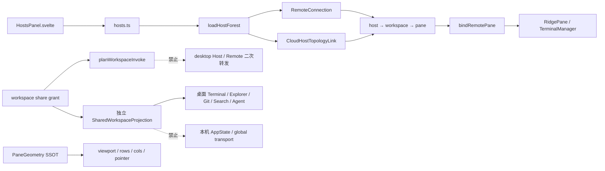
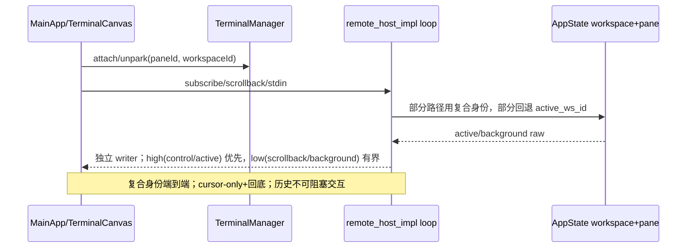

# Ridge 项目状态（唯一 NotebookLM 来源）

状态日期：2026-08-05（iteration 167 已完成稳定 Cloud Pane 绑定、Remote 尾流与 Pane 尺寸代码闸；手机归因、公网/WebView2 长跑、双窗口及双 Host 真机证据待补；正式 release 正在等待修复后的 CI 闸验证）
覆盖仓库：`wind`（`C:\code\wind`）与兄弟仓库 `ridge-cloud`（`C:\code\ridge-cloud`）
用途：人类与 NotebookLM 共用的单一「当前现状 + 愿景 + 差距」来源，辅助规划、取舍与追问。
不含：密钥、生产凭据、用户数据；不把历史计划或未复测功能写成已验证事实。

## Current snapshot (iteration 171, 2026-08-05)

- Remote cloud transport now has two ordered lanes on one authenticated
  PeerConnection: `ridge` for control/input and optional `ridge-pane` for PTY
  bulk output. Lane sessions use independent E2EE counters and chunk IDs;
  legacy peers fall back to `ridge` without a second connection.
- Host/controller routing, pane backpressure, teardown, legacy fallback, and
  focused foreign-pane QoS promotion are covered by deterministic tests. Local
  code is pushed at `e8316548`; foreign-pane subscriptions now replay after a
  full WebRTC reconnect, while discovered-only panes remain unsubscribed;
  mobile transient subscribe failures use bounded exponential retry.
- Verification after the dual-lane, focus-promotion, and reconnect-replay
  changes (including rejected-close rollback and mobile retry): full Vitest 154 files / 1589 passed / 1 skipped; `pnpm check` 0 errors / 0 warnings; mobile PWA and
  desktop Remote builds passed. Online artifact remains `e94d8c5` because the
  2026-08-05 publication cap is exhausted; next artifact must contain
  `e8316548` (including the dual-lane `150272a` fix).
- Public HTTP startup remains route/proxy-sensitive (direct fetch is much
  faster than the configured proxy). This is not evidence about WebRTC data
  channel latency. Cloud source confirms business E2EE DataChannel traffic
  bypasses signaling relay; only a `relay` candidate makes TURN/server egress
  a likely bottleneck. Physical phone/PWA pane-switch and input soak remains
  open.
- Live public fingerprint (2026-08-05) still reports `/_app/version.json` =
  `1785916897644`; its JavaScript assets have no `ridge-pane-probe` or
  `ridge-pane-ready`, while the local mobile build does. Public Remote is
  therefore still on the legacy single ordered lane and cannot yet exercise
  the current input-first dual-lane fix.
- Controlled LAN browser smoke on 2026-08-05 passed for desktop and mobile:
  `canvas/tree/ws` gates, real `write_to_pty` and `resize_pane`, and no browser
  errors. Evidence: `.iteration/artifacts/rdg-remote-e2e/last-result.json`.
  Latest rerun records Desktop `tree=false` in raw detail while the script's
  acceptance gate still passes; no tree-pass is claimed. This does not close
  the physical public WebRTC/PWA gate.

Archive: `docs/iterations/2026-08-05-iteration-171-remote-link-fluidity.md`.

## Current snapshot (iteration 168, 2026-08-05)

- NotebookLM research used the exact notebook `Ridge 项目现状、愿景与规划基线（2026-07-21）`
  (`66919cb9-1329-4ddf-955c-f426d15a9fe6`) and transcript
  `a47d3199-c1f9-47f1-927c-ff2c4875b77d`. NLM was resource-limited after the
  transcript fetch; local CodeGraph/source/tests remain authoritative.
- `REQ-INTERACTION-PARITY-01` and `REQ-AGENT-COMMUNICATION-REGISTRY-01` are
  approved and executable. Pending requirements are empty. The iteration adds
  access/share contract coverage, IME input fallback, mobile TUI touch mouse
  forwarding, free Explorer resize, Agent parity/spacing, narrow file/image
  viewing, and confirmed Agent lifecycle communication preflight. Registry
  entries require a live PTY handle; confirmed auto-discovery repairs the same
  directory and teardown removes the identity.
- Verification: `pnpm check` 0/0; full Vitest 149 files/1560 passed/1 skipped;
  focused interaction Vitest 4 files/33 passed and shared terminal helper
  tests 5 files/46 passed; `cargo check -p ridge --lib` passed; teammate
  profile tests 3 passed and teammate projection tests 8 passed; `cargo test
  -p ridge-term input --quiet` 36 passed; PWA build verification and LAN
  desktop/mobile E2E passed; `git diff --check` passed. Physical notch/PWA,
  public WebRTC, WebView2, and multi-window/Host gates remain explicitly
  external.

Archive: `docs/iterations/2026-08-05-iteration-168-interaction-parity.md`.

## Current snapshot (iteration 167, 2026-08-04)

- New pre-approved `REQ-MOBILE-REMOTE-BACKPRESSURE-01` is active for this
  iteration. The mobile render feed now uses a bounded per-pane FIFO chunk
  queue, a frame-time budget, overflow counters, and teardown cleanup; input
  and control RPC scheduling remain separate and higher priority.
- The former deferred-feed `Infinity` synchronous catch-up and O(n²) backlog
  concatenation path are removed. Focused feed-policy tests pass; full
  TypeScript/Svelte checks remain green.
- New active `REQ-MOBILE-REMOTE-LIVE-TAIL-01` makes the live PTY stream
  authoritative: Cloud Remote wires the listener before a bounded visual seed,
  renders live bytes immediately, retains only a bounded FIFO replay copy for a
  late seed reset, and pages older scrollback only on upward scroll without
  blocking input.
- New active `REQ-REMOTE-PANE-GRID-INVARIANT-01` makes the current pane box the
  local grid source of truth. Stale host `pty-resized` dimensions trigger a
  local refit/claim; manual refresh uses `fitPaneNow` and no longer injects a
  stale smaller shell grid.
- Desktop `v0.1.57` first attempt failed because the Linux Tauri test gate did
  not stage `binaries/rdg-x86_64-unknown-linux-gnu`; the retry then exposed the
  analogous Intel macOS target sidecar gap. Both workflow paths are now fixed:
  Linux test gate builds its target and the macOS x64 job explicitly stages
  `rdg-x86_64-apple-darwin`. The current tag is being retried; no release is
  claimed until the complete matrix and asset audit pass. Remote/cloud
  activation `0.1.57+g7ce4386` remains a prior hash and is recorded separately.

- Cloud Remote pane binding is now persistent and deterministic. `PtyBridge`
  reads `remote-cloud-pane.json` (or the explicit
  `RIDGE_REMOTE_PTY_BINDING_FILE` path), verifies the live PTY/workspace, and
  writes the binding only after its output lease attaches.
- Reconnect selection is exact persisted identity, then the
  `cloud-remote` launch profile, then deterministic same-CWD matching. There
  is no first-live-PTY fallback, so a detached Cloud session cannot steal an
  unrelated pane. A failed binding write detaches the just-created lease.
- Tauri passes the binding path to `rdg remote --daemon`; PTY ownership and
  scrollback remain in the detached kernel. This closes the code portion of
  the previous multi-pane/Cloud binding residual.
- Verification: `cargo test -p ridge-cli --tests --quiet` (134 unit + 3
  integration), `cargo test -p ridge-kernel --lib --quiet` (46), Tauri
  `cargo check --lib`, `pnpm check` (0/0), and `git diff --check` passed.
- Historical entries 165 and 166 remain append-only evidence and are
  superseded, not duplicated as open work. Physical force-kill/phone
  reconnect, public four-path Remote, WebView2 soak, dual-window/Host, and
  full Kernel authority remain external gates.

Archive: `docs/iterations/2026-08-04-iteration-167-cloud-pane-binding.md`.

## Current snapshot (iteration 166, 2026-08-04)

- Remote/WebRTC transport is now process-owned, not merely hidden with the
  Tauri UI. Detached `rdg host` and `rdg remote --daemon` use the
  kernel-owned PTY/workspace domain and survive a force-killed desktop shell.
- Tauri only supervises sidecars, synchronizes credentials, and exposes
  explicit lifecycle commands. Restart reuses live registries; explicit full
  quit stops sidecars before kernel shutdown.
- Kernel PTY leases detach without destroying PTYs. Cross-process boot locking
  prevents desktop/host duplicate kernel launches.
- Verification: `pnpm check` 0/0; focused Vitest 66/66; ridge-kernel 46 tests;
  ridge-cli 130 unit + 3 integration tests; ridge-cli and Tauri `cargo check`
  passed. Packaged Windows force-kill plus
  phone reconnect remains a physical release gate, not yet claimed.

Archive: `docs/iterations/2026-08-04-iteration-166-remote-process-boundary.md`.

## Current snapshot (iteration 165, 2026-08-04)

- Rapid desktop tab switches now serialize backend workspace ownership/switch
  IPC, while cached panes still activate optimistically; stale failures are
  dropped instead of repainting a newer tab or spamming Console.
- Tray `退出桌面端` is Deep Root UI-only hide: kernel PTYs, Remote server,
  teammate control plane, and WebView session remain alive. `彻底退出` remains
  the explicit kernel/process shutdown path. Hide also writes the restore set.
- Desktop restart can reuse the same teammate loopback port/token from app data;
  endpoint sidecars are refreshed by token after a process restart, preserving
  surviving Agent pane negotiation when the kernel remains alive.
- Verification: full Vitest 148 files / 1545 passed / 1 skipped; teammate
  endpoint Tauri tests 3 passed; `cargo check --manifest-path
  src-tauri/Cargo.toml` passed with only pre-existing warnings; `pnpm check`
  passed with 0 errors / 0 warnings. Version `0.1.56` is released with the
  full desktop/CLI matrix. Remote workflow `30892178165` activated
  `0.1.56+g415ee64` and its authenticated status gate confirmed desktop/mobile
  indexes; local shell remains intentionally free of the production secret.

Archive: `docs/iterations/2026-08-04-iteration-165-tab-kernel-deep-root.md`.

## Current snapshot (iteration 163, 2026-08-04)

- All desktop Git mutations and graph/history reads now cross the authenticated
  ridge-kernel Git domain. The Tauri layer retains command compatibility but no
  longer starts these Git children directly.
- Kernel requests are tagged and source-checked; non-Git roots return an
  explicit negative result before a Git child is started. Decoder and domain
  guard tests cover malformed source, success, and non-Git behavior.
- Remote mobile bundle, PWA manifest/service-worker/safe-area checks, LAN
  desktop/mobile E2E, and Chromium mobile keyboard/touch-selection E2E are
  green; the latter is explicitly browser-emulation evidence.
- Windows headless kernel/rdg smoke is green: single-PID ensure/reattach,
  filesystem-root denial, Git status, remote-hosts, MCP discovery, and
  bounded kernel stop all passed.
- Release desktop now declares Tauri `custom-protocol`; a rebuilt binary
  launches through `http://tauri.localhost/` in an isolated WebView2 CDP smoke
  check instead of falling back to Vite port 5173. Shell E2E still cannot
  leave `about:blank` under tauri-driver (including an explicit matching
  EdgeDriver path) before app assertions, so WebDriver shell/performance
  evidence remains external.
- Full Rust/TypeScript matrix and requirements gates are recorded in the
  iteration archive. Physical/public Remote, WebView2, dual-window, Host,
  and mobile clean-profile evidence remain external gates; no release was
  made.

Archive: `docs/iterations/2026-08-04-iteration-163-kernel-git-all.md`.

## Current snapshot (iteration 162, 2026-08-04)

- Remote `git_stash_list` now uses authenticated kernel
  `/v1/domain/git/stashes`; the kernel confirms repository identity before
  starting `git stash list`, returning a typed non-Git negative result.
- Tauri keeps the existing command signature while becoming a bounded kernel
  adapter. `StashEntry` is now a shared serde contract for the response.
- Full Rust/TypeScript matrix: ridge 256, ridge-kernel 44, ridge-core 315;
  Vitest 148 files / 1541 passed / 1 skipped; `pnpm check` 0 errors / 0
  warnings. No version bump or release was made.

Archive: `docs/iterations/2026-08-04-iteration-162-kernel-git-stashes.md`.

## Current snapshot (iteration 161, 2026-08-04)

- Remote `get_scm_status_fast` no longer invokes the Tauri/core Git path
  directly. It now uses authenticated kernel `/v1/domain/git/status?path=…&fast=1`;
  kernel repository detection and the no-numstat fast contract remain intact.
- The normal desktop status query remains unchanged, while the fast route is
  source-checked and guarded against non-Git roots before any Git child.
- Full Rust/TypeScript matrix: ridge 256, ridge-kernel 42, ridge-core 315;
  Vitest 148 files / 1541 passed / 1 skipped; `pnpm check` 0 errors / 0
  warnings. No version bump or release was made.

Archive: `docs/iterations/2026-08-04-iteration-161-kernel-git-fast-status.md`.

## Current snapshot (iteration 160, 2026-08-04)

- Desktop `git_diff_summary` now uses authenticated kernel
  `/v1/domain/git/diff-summary`; PaneGitStatus no longer starts this high-
  frequency Git child in the Tauri shell. Kernel detects non-Git roots before
  spawning `git diff` and returns a typed, source-checked summary.
- Desktop stage, unstage, commit, checkout, push, and push-branch commands now
  use the authenticated, tagged `/v1/domain/git/mutate` kernel route. The
  route rejects non-Git roots before any write and never accepts arbitrary Git
  argv; remaining Git writes and graph/history reads stay explicitly open.
- Full Rust/TypeScript matrix: ridge 256, ridge-kernel 41, ridge-core 315;
  Vitest 148 files / 1541 passed / 1 skipped; `pnpm check` 0 errors / 0
  warnings. No version bump or release was made.

Archive: `docs/iterations/2026-08-04-iteration-160-kernel-git-diff-summary.md`.

## Current snapshot (iteration 159, 2026-08-04)

- Desktop sidebar panels are now first-visit mounted: Git, Search, Remote,
  Agents, Hosts, and Files are guarded by `sidebarVisited`. Hidden panels no
  longer start their queries/listeners/remote projections during first paint;
  visited instances stay alive across tab switches to preserve state.
- Focused sidebar mount contract: 2 passed; `pnpm check`: 0 errors / 0
  warnings. No version bump or release was made.

Archive: `docs/iterations/2026-08-04-iteration-159-sidebar-lazy-mount.md`.

## Current snapshot (iteration 158, 2026-08-04)

- `SettingsPanel` is no longer statically imported by the desktop route. The
  panel module is loaded on first open, then retained for subsequent opens so
  settings drafts and section state are not recreated.
- This removes the settings/theme/icon module graph from the first-load path;
  theme switching remains generation-guarded and wallpaper decode remains
  deferred. Focused settings contract: 5 passed; `pnpm check`: 0 errors / 0
  warnings. No version bump or release was made.

Archive: `docs/iterations/2026-08-04-iteration-158-settings-lazy-load.md`.

## Current snapshot (iteration 157, 2026-08-04)

- Kernel death watching now captures the authenticated endpoint, tolerates
  transient health failures, and exits after three consecutive failures or
  immediate process death. Tray kernel shutdown marks `quitting` first and
  rolls it back if shutdown fails, preventing watcher double-exit races.
- Focused lifecycle tests: 7 passed. Physical tray/restart and health-fault
  evidence remain open; no release was made.

Archive: `docs/iterations/2026-08-04-iteration-157-kernel-watcher-health.md`.

## Current snapshot (iteration 156, 2026-08-04)

- Desktop restart reattach now opens kernel output leases from the bounded
  retained window (`after_seq: None`) instead of dropping all pre-restart
  output. Unmatched kernel PTYs are counted and warned, but not guessed-away
  or destroyed.
- Focused PTY lifecycle contracts: 3 passed. Physical exit/restart, orphan
  recovery UX, and cross-host evidence remain open; no release was made.

Archive: `docs/iterations/2026-08-04-iteration-156-kernel-reattach-history.md`.

## Current snapshot (iteration 155, 2026-08-04)

- Desktop branch-list reads now use authenticated kernel
  `/v1/domain/git/branches`; confirmed non-Git roots are detected before any
  `git branch` child is started. Existing five-minute UI caches and Tauri
  signatures remain unchanged.
- Typed kernel decoding covers source, malformed payload, non-Git, and Windows
  path cases. Focused branch tests: 2 passed; desktop compile: exit 0. Full
  regression and physical/public evidence remain open; no release was made.

Archive: `docs/iterations/2026-08-04-iteration-155-kernel-git-branches.md`.

## Current snapshot (iteration 154, 2026-08-04)

- Desktop `ensure_kernel_running` now uses a process-local single-flight gate
  across detection, spawn, and readiness. Setup and first-Pane startup cannot
  launch duplicate kernels or observe a half-written registry.
- An existing live PID receives the same bounded readiness wait before attach;
  transient kernel health publication no longer becomes an immediate Pane
  failure. Focused lifecycle tests: 6 passed. No version bump or release was
  made.

Archive: `docs/iterations/2026-08-04-iteration-154-kernel-boot-single-flight.md`.

## Current snapshot (iteration 153, 2026-08-04)

- Desktop `get_scm_status` now reads the authenticated kernel Git domain;
  desktop SCM status no longer starts the local `ridge-core` Git path directly.
- Kernel response decoding is source-checked and typed, distinguishes confirmed
  non-Git roots from failures, and URL-encodes Windows paths. Query/slot callers
  keep their existing contract while the domain remains the single read seam.
- Focused kernel Git adapter tests: 2 passed; `cargo check -p ridge --lib` exit 0.
  Full regression and physical/public evidence remain open; no version bump or
  release was made.

Archive: `docs/iterations/2026-08-04-iteration-153-kernel-git-status.md`.

## Current snapshot (iteration 152, 2026-08-04)

- Desktop pane PTY creation is now kernel-authoritative in production. Kernel
  bootstrap/list/create/attach failures surface as errors; no local Tauri PTY
  fallback can hide a split lifecycle or leave an orphan child process.
- The legacy `initial_command` launch is rejected explicitly; structured Agent
  launches must use `StructuredPtyCommand` so argv/env remain bounded and
  restart-safe. The native pending-spawn path is test-only.
- Rust verification: `cargo test -p ridge --lib` 253 passed; focused PTY
  lifecycle contract 2 passed; `cargo check -p ridge --lib` exit 0. No version
  bump or release was made. Physical restart/reattach, public/physical Remote,
  WebView2 heap soak, dual-window/Host, and full Kernel-domain evidence remain
  open.

Archive: `docs/iterations/2026-08-04-iteration-152-kernel-pty-authority.md`.

## Current snapshot (iteration 151, 2026-08-03)

- Remote WorkspaceTree now keeps the last good non-active workspace peek
  snapshot but renders a per-workspace error when listWorkspacePanes fails;
  transport failures no longer look like a healthy empty terminal list.
- Focused Host/Cloud/WorkspaceTree tests: 50 passed. Full Vitest: 147 files,
  1538 passed, 1 skipped; pnpm check reports 0 errors and 0 warnings. No
  release or version bump was made; physical/public Remote, WebView2 heap soak,
  dual-window/dual-host, and full Kernel authority evidence remain open.

Archive: docs/iterations/2026-08-03-iteration-151-remote-peek-error-feedback.md.

## Current snapshot (iteration 150, 2026-08-03)

- LAN legacy `workspace-panes` responses now carry a payload guard. A late
  response for another workspace is ignored instead of resolving the active
  request as an empty list; the pending request waits for its matching reply or
  its bounded timeout.
- Focused LAN scheduler tests: 11 passed. Full Vitest: 147 files, 1537 passed,
  1 skipped; `pnpm check` reports 0 errors and 0 warnings. No release or version
  bump was made; physical/public Remote, WebView2 heap soak, dual-window/dual-host,
  and full Kernel authority evidence remain open.

Archive: `docs/iterations/2026-08-03-iteration-150-remote-legacy-response-guard.md`.

## Current snapshot (iteration 149, 2026-08-03)

- Remote workspace creation now surfaces Cloud Host and mobile Cloud RPC/auth
  failures; an empty returned ID also renders an explicit failure instead of a
  silent no-op. Successful creation keeps the existing switch/refresh path.
- Focused Host/Cloud/WorkspaceTree tests: 44 passed. No release or version bump
  was made; physical/public Remote, WebView2 heap soak, dual-window/dual-host,
  and full Kernel authority evidence remain open.

Archive: `docs/iterations/2026-08-03-iteration-149-remote-workspace-create-feedback.md`.

## Current snapshot (iteration 148, 2026-08-03)

- Cloud Host and mobile Cloud pane projections now retain `isAgent` whenever
  `agent_state` or `agent_id` exists, so idle/starting Agents remain visible
  after runtime-state transitions. Busy remains a state, not identity.
- Focused Cloud topology/Remote tests: 39 passed. No release or version bump
  was made; physical/public Remote, WebView2 heap soak, dual-window/dual-host,
  and full Kernel authority evidence remain open.

Archive: `docs/iterations/2026-08-03-iteration-148-agent-idle-identity.md`.

## Current snapshot (iteration 147, 2026-08-03)

- Cloud Remote Host workspace and pane discovery now preserve RPC failures;
  callers can show loading/error/retry state instead of mistaking a failed
  Host for a healthy empty Host. Regression tests cover both discovery paths.
- Focused Cloud Remote tests: 35 passed. No release or version bump was made;
  physical/public Remote, WebView2 heap soak, dual-window/dual-host, and full
  Kernel authority evidence remain open.

Archive: `docs/iterations/2026-08-03-iteration-147-remote-host-error-visibility.md`.

## Current snapshot (iteration 146, 2026-08-03)

- Remote Agent cards now consume the host topology's live PaneHeader/OSC
  `title` while retaining stable Agent identity for actions/history and the
  real CWD for context.
- Remote/mobile Git sidebar now remembers confirmed non-Git roots for the
  lifetime of the transport session, so tab/provider remounts do not restart
  `git status` and repeat `not a git repository` errors. Keys include the
  normalized root and remote session; the cache is bounded to 128 roots.
- A different CWD still performs fresh detection. Legacy desktop adapters
  without a stable session identity keep provider-local negative state to
  prevent cross-host false positives.
- Focused Remote sidebar tests: 15 passed. No release or version bump was
  made; physical/public Remote, WebView2 heap soak, dual-window/dual-host,
  and full Kernel authority evidence remain open.

Archive: `docs/iterations/2026-08-03-iteration-146-remote-agent-live-title.md`;
`docs/iterations/2026-08-03-iteration-145-remote-git-negative-cache.md`.

## Current snapshot (iteration 144, 2026-08-03)

- Structured Agent launches now try the authenticated `ridge-kernel` PTY
  domain with explicit argv/environment, stable Pane identity, teammate/TMUX
  metadata, and the existing resize-after-real-dimensions contract. Kernel
  success resolves teammate split readiness immediately.
- Kernel launch payloads are bounded (argument count, environment count and
  bytes) before child creation. If Kernel bootstrap or attach fails, the
  existing local pending-spawn path remains available.
- Kernel 33 tests, Tauri 252 tests, full Vitest 1529 passed/1 skipped, and
  `pnpm check` 0/0 are green. No release or version bump was made because
  `v0.1.54` consumed today's allowance.
- Physical tray restart, public/physical Remote, WebView2 heap soak,
  dual-window/dual-host, and full external Kernel authority evidence remain
  open gates.

Archive: `docs/iterations/2026-08-03-iteration-144-kernel-agent-launch.md`.

## Current snapshot (iteration 143, 2026-08-03)

- PTY bridge attach is now single-flight per stable Pane key. A close racing
  asynchronous Tauri listener registration cancels the attach and removes any
  listener already acquired, preventing duplicate Channels and post-destroy
  output callbacks.
- Cloud host raw-pane streaming now registers the Tauri event listener before
  sending `subscribe_pane_raw`; unsubscribe is serialized after an in-flight
  subscribe, and output callbacks/source failures are contained and logged.
- Focused lifecycle tests pass; no version bump or publication was made because
  `v0.1.54` consumed today's allowance. Physical phone/public Remote, WebView2
  heap soak, dual-window/dual-host, and full Kernel-domain authority remain
  external or larger-scope evidence gates.

Archive: `docs/iterations/2026-08-03-iteration-143-pty-cloud-lifecycle.md`.

## Current snapshot (iteration 142, 2026-08-03)

- rdg now answers the legacy Remote sidebar frames `list-files`,
  `list-git-status`, and `search-files`. Responses preserve the historical
  payload shapes, use the same serving-root sandbox as canonical FS methods,
  and run disk/Git work in `spawn_blocking` before asynchronous WS delivery.
  Focused legacy-frame tests pass 12/12.
- Controlled LAN Remote E2E also passes from the current binary: desktop and
  mobile WebSocket sessions connect, input and Resize are sent, and both
  browser runs report no errors (`desktop canvas=true tree=false ws=true`,
  `mobile canvas=true tree=true ws=true`). This is LAN evidence only, not
  public/physical-phone/WebView2 soak evidence.
- No version bump or publication was made because `v0.1.54` consumed today's
  allowance. Physical phone/public Remote, WebView2 heap soak, dual-window /
  dual-host, and full Kernel-domain authority migration remain evidence gates.

Archive: `docs/iterations/2026-08-03-iteration-142-rdg-legacy-sidebar-frames.md`.

## Snapshot (iteration 141, 2026-08-03)

- `rdg` production TUI/LAN-host sessions now use the long-lived
  `ridge-kernel` domain PTY instead of the in-process registry. Stable PaneTree
  UUIDs are assigned before PTY creation; output leases are bounded and
  cancellable, shell proxy drop detaches without destroying the child, and a
  failed first attach cleans up only the newly-created PTY.
- CLI unit tests (127/127), detached Kernel lifecycle tests (3/3),
  `pnpm check` (0 errors/0 warnings), and `git diff --check` pass. No release or
  publication was made because `v0.1.54` consumed today's allowance.
- Physical tray-exit/restart, WebView2 memory soak, public Remote/Cloud, and
  full Kernel domain migration remain evidence gates; desktop startup already
  calls `reattach_kernel_ptys` after workspace restore.

Archive: `docs/iterations/2026-08-03-iteration-141-rdg-kernel-pty-session.md`.

## Current snapshot (iteration 140, 2026-08-03)

- `rdg` LAN now serves the filesystem/search capabilities it advertises:
  `get_file_tree`, `read_file`, `text_search`, `get_directory_children`,
  canonical `search`, and legacy `search_files` all pass through the shared
  `ridge-core`/`fs_reuse` boundary with serving-root sandboxing. The focused
  `rdg` suite is 127/127 and the real-process Kernel PTY lifecycle suite is
  3/3. Runtime fix: `d5da7c2`.
- No version bump, release, Remote cloud publication, or public deployment was
  made. `v0.1.54` consumed today's publication allowance.
- Physical phone/public Remote attribution, WebView2 memory soak,
  dual-window/dual-host evidence, and full Kernel authority migration remain
  external or larger-scope gates; this iteration does not claim them closed.

Archive: `docs/iterations/2026-08-03-iteration-140-rdg-lan-fs-search.md`.

## Previous snapshot (iteration 139, 2026-08-03)

- `wind` now includes the tab-switch black-frame guard and a real ordinary-shell
  PTY reattach path. `ridge-kernel` owns stable pane-keyed PTYs, bounded output
  leases and write/resize/clear/destroy; Tauri proxies them and rebinds them
  after saved or private unsaved workspace restore. The interactive shell launch
  profile restores CWD/title markers after restart. Structured Agent launches remain local because
  their environment/TMUX contract is process-specific.
- Tray `退出桌面端` drops only the desktop proxy; `彻底退出` remains the
  explicit kernel shutdown boundary. Older-build local ConPTY sessions are not
  claimed as retroactively recoverable.
- A real detached Kernel integration test now proves the missing lifecycle
  fact: after the client output lease is detached, the stable PTY still accepts
  input and a replacement lease resumes after the last consumed sequence.
  `cargo test -p ridge-cli --test kernel_lifecycle_e2e --quiet` passes 3/3.
- Full Vitest: 147 files / 1524 passed / 1 skipped; Tauri library tests: 252
  passed; ridge-kernel tests: 31 passed; `pnpm check`: 0 errors / 0 warnings.
  No release or publication was made because `v0.1.54` consumed today's
  allowance.

Archive: `docs/iterations/2026-08-03-iteration-139-kernel-pty-real-process-reattach.md`.

- `wind` `main` is at `6035dc9`; Agent Commune now consumes the same live
  `terminalTitles`, foreground-process, and workspace-scoped CWD stores as
  `PaneHeader`. Agent identity remains stable while displayed titles follow
  OSC/process/CWD changes in real time.
- Agent Pane attention now emits `idle` only on a working-to-idle transition;
  initial idle is neutral. Waiting approval and stopped attention persist until
  the target Pane is focused. A newer higher-priority event can upgrade an
  unacknowledged idle event, never downgrade it. Pane border, Agent button, and
  Commune card use the same attention value.
- Startup kernel bootstrap is asynchronous;
  setup no longer blocks
  the WebView on kernel detect-or-spawn, health polling, or host-topology I/O.
  Settings remain lazy and idle-bound;
  the overlay has no full-window blur, default-CWD sync is latest-value and
  lifecycle-aware, terminal settings notifications deduplicate without
  dropping theme propagation, and theme bridge work coalesces to one frame.
- PTY creation/replacement, resize, clear, delta-mode reframe, shell history,
  scrollback paging, and resync-frame construction now leave the Tauri async
  worker through `spawn_blocking`. Remote migrated core dispatch uses the same
  boundary, including non-Git workspace/filesystem commands.
- Shell/WSL/VS probes retain the shared 2-second process-tree timeout. Wallpaper
  decode is idle-deferred, generation-guarded, and bounded to 4096 px per edge
  / 16 MP to limit WebView2 transient memory.
- Full Vitest: 147 files / 1518 passed / 1 skipped; Tauri library tests: 251
  passed; `pnpm check`: 0 errors / 0 warnings; preflight, requirements, and
  iteration gates pass. No release or publication was made because `v0.1.54`
  consumed today's allowance.

Focused Agent tests: 2 files / 12 passed; `pnpm check`: 0 errors / 0 warnings.
No version bump, release, Remote cloud publish, or public deployment was made;
`v0.1.54` consumed today's publication allowance.

Archive: `docs/iterations/2026-08-03-iteration-137-agent-attention-and-live-title.md`.

## Iteration 137 update (2026-08-03)

The Commune card title is a live projection of the PaneHeader title source.
Attention is transition-based and identity-scoped (`workspaceId:paneId`): idle
is armed only after working becomes idle; waiting approval and stopped remain
visible until focus/activation clears them. Static source contracts and pure
view-model tests guard the shared state and priority rules.

Archive: `docs/iterations/2026-08-03-iteration-137-agent-attention-and-live-title.md`.

## Iteration 133 update (2026-08-03)

- `wind` `main` is pushed at `e466812`. The OSC-8 link grid now joins only
  proven soft-wrapped visual rows, so Ctrl-hover underlines the complete target
  without joining equal-URI links separated by a hard break.
- Controlled LAN desktop/mobile E2E passed (`canvas/tree/ws=true`, desktop and
  mobile input/resize sent, `browserErrors=[]`); Chromium mobile keyboard and
  touch-selection checks also passed. The browser run used an isolated,
  extension-disabled context.
- Focused link tests: 17 passed; `pnpm check`: 0 errors / 0 warnings. The
  clean-profile runtime.lastError probe is attribution-incomplete by design;
  no project Chrome-extension messaging source was found.
- No version bump, release, Remote cloud publish, or public deployment was
  made: `v0.1.54` consumed today's publication allowance. Physical phone,
  public path, WebView2/GPU-adapter, and long-running memory evidence remain
  external gates.

Archive: `docs/iterations/2026-08-03-iteration-133-osc8-link-and-lan-evidence.md`.

## Iteration 132 update (2026-08-03)

- `wind` `main` is pushed (code commits `2079685`, `c9bc7c0`,
  `26b4f42`, `afbfa11`). Desktop terminal now defaults to the main-thread
  WebGPU host; worker Canvas2D is explicit opt-in. Startup listener timing,
  inactive-workspace SCM polling, theme decode/invalidation, duplicate caret,
  and multiline link hover affordance are guarded by source/unit tests.
- Regression evidence: full Vitest 146 files / 1510 passed / 1 skipped;
  `pnpm check` 0/0; ridge-term 398 and ridge-kernel 30 Rust tests passed;
  ridge-kernel binary check passed. Remote RPC coalescing, cached Git panels,
  and PWA safe-area changes are included.
- Kernel HTTP PTY output leases are bounded by a 256-frame/256KiB replay window
  and a 1024-handle map cap. Existing Tauri shell authority is not claimed as
  migrated.
- No version bump, release, Remote cloud publish, or public deployment was
  made: `v0.1.54` consumed today's publication allowance. Physical WebView2,
  GPU-adapter, phone-notch, memory-soak, and public Remote/Cloud evidence remain
  external gates.

Archive: `docs/iterations/2026-08-03-iteration-132-desktop-terminal-performance-and-link-hover.md`.

## Previous snapshot (iteration 131)

- `wind` `main` 已推送至 `43f6c39`（代码基线 `b304ea7`；含 `e22c450` PWA 连接提示安全区隔离与 Kernel PTY 有界输出租约归档）；最近闭环为 PTY 子进程树回收、Host 拖拽取消、上下文 Resize 去重、Remote Agent 状态投影统一。
- 全量 Vitest：145 files / 1,499 passed / 1 skipped；`pnpm check` 0 errors / 0 warnings；Remote mobile PWA build verifier 全部通过。
- LAN Remote desktop/mobile E2E 均通过（`canvas/tree/ws=true`、输入/Resize 可发送、`browserErrors=[]`，浏览器隔离扩展）；证据日志见 `.iteration/artifacts/rdg-remote-e2e-20260803.log`。
- `ridge-cloud` `main` 已推送至 `e6d5715`；admin session duration 对账完成，前端 check/build 通过；Cargo 回归因本机缺 `aws-lc-sys v0.41.0` 且离线无法下载，联网下载仍属环境证据，非代码失败。
- 今日版本发布窗口已由 `v0.1.54` 消耗，后续不得再 bump/release/publish；未完成的公网、真机/WebView2、双窗口/双 Host、Agent 真链与完整 Kernel authority 仍不得宣称完成。

## Iteration 130 update (2026-08-03)

Remote reconnect and failure notices now reserve a separate top safe-area flex
item before their content. `env()`/`constant()` plus the standalone 44px
fallback cover Android WebView and iOS `navigator.standalone`; auth/cloud gate
fallbacks consume the same iOS marker. Source tests, `pnpm check`, mobile PWA
build and verifier pass. Physical notch/WebView2 evidence remains open.

Archive: `docs/iterations/2026-08-03-iteration-130-pwa-connection-safe-area.md`.

## Iteration 131 update (2026-08-03)

Kernel domain PTYs now publish monotonic frames into a bounded 256-frame /
256KiB replay hub. Leases support cursor attach, timeout long-poll, lag and
explicit resync, detach, and fail-closed begin/finish/cancel destroy semantics;
the existing CLI mpsc output path is preserved. Kernel and CLI tests pass.
This is an internal seam only: HTTP lease routes, composite identity,
persistence, Tauri adapter migration, and pure-shell authority remain open.

Archive: `docs/iterations/2026-08-03-iteration-131-kernel-pty-output-lease.md`.

## Iteration 122 update (2026-08-03)

Cross-cutting regression after the PWA safe-area, Host topology refresh, and
terminal-link slices is green: full Vitest 145 files / 1,497 passed / 1 skipped;
Rust Host 59 and ridge-term 398; `pnpm check` 0/0; Remote mobile build and PWA
artifact checks; LAN desktop/mobile smoke; and Chromium mobile keyboard/touch
selection with `browserErrors=[]`. Physical/public/WebView2/dual-window and
authenticated Git push evidence remain external; no release after `v0.1.54`.

Archive: `docs/iterations/2026-08-03-iteration-122-cross-cutting-regression.md`.

## Iteration 123 update (2026-08-03)

The remaining desktop PTY/kernel convergence was audited against the live
Tauri paths. Tauri still owns the AppState PTY handles, parser, output sink,
resize, clear, kill, and scrollback; the kernel PTY domain is an isolated
registry without a shell-visible output stream, lease/attach protocol, or
stable composite-pane mapping. No command was redirected: doing so now would
split PTY identity or drop live output. The next safe work is a versioned lease
plus output/backpressure/cancellation adapter, followed by one-family
migration and lifecycle tests. This audit is an explicit boundary, not a
claim that full Kernel authority is complete.

Archive: `docs/iterations/2026-08-03-iteration-123-kernel-pty-migration-audit.md`.

## Iteration 124 update (2026-08-03)

Tauri Pane replacement and explicit close/reap now share a process-tree kill
guard. The previous `Child::kill()`-only paths could leave descendants such as
tool runners or language servers alive after a Pane disappeared. The guard
captures the recorded child PID, kills the shell, and invokes the shared
`ridge_core::process_guard::kill_process_tree`. Contract and process-guard
tests pass; this closes the internal lifecycle gap without pretending that
full Kernel PTY authority is complete.

Archive: `docs/iterations/2026-08-03-iteration-124-tauri-pty-tree-kill.md`.

## Iteration 125 update (2026-08-03)

Host-session drag now funnels `pointercancel` and window `blur` through one
cleanup path. The drag sentinel, pane hover preview, cursor, and global
listeners are all released, preventing a mobile system gesture or focus loss
from leaving a stuck drag state. The real EventTarget regression test passes;
`871b251` is pushed. No version bump or publication was made.

Archive: `docs/iterations/2026-08-03-iteration-125-host-drag-cancel.md`.

## Iteration 126 update (2026-08-03)

Resize deduplication now compares the full normalized dimensions plus PTY mode
context (`isAlt`/`isInlineTui`) before queueing. Identical contextual Resize
requests coalesce while one is active; real mode changes remain deliverable.
The focused scheduler suite passes 15/15 and `pnpm check` remains clean. No
version bump or publication was made.

Archive: `docs/iterations/2026-08-03-iteration-126-rpc-contextual-resize-dedupe.md`.

## Iteration 127 update (2026-08-03)

Remote Agent cards now use the same shared status projection and labels as the
desktop Commune cards. `Suspended`/`Disappeared` map to the red stopped rail,
pending approval to yellow waiting, and working/idle remain consistent. The
focused Agent model and Remote roster suites pass 14/14; no version bump or
publication was made.

Archive: `docs/iterations/2026-08-03-iteration-127-remote-agent-status-parity.md`.

## Iteration 121 update (2026-08-03)

Installed/Desktop terminal links now preserve a URL when the first visual
row ends in punctuation that the scanner trims. The logical target restores
that punctuation only when the suffix is punctuation-only and the kernel
confirms a soft wrap; hard breaks and ordinary trailing text remain separate.
The existing Rust selection implementation already joins soft-wrapped rows;
new partial-selection coverage proves copy emits no visual newline. The
merged target is exercised through hover underline, Ctrl-click arbitration,
and host-open planning. Link tests pass 23/23, `cargo test -p ridge-term
--lib` passes 398/398, and `pnpm check` is clean. Physical installed-WebView2
evidence remains external; no release after `v0.1.54`.

Archive: `docs/iterations/2026-08-03-iteration-121-terminal-link-wrap-guards.md`.

## Iteration 120 update (2026-08-03)

Remote host workspace save now refreshes the linked topology after the remote
mutation succeeds, so updated names and workspace lists appear immediately in
Hosts instead of waiting for an unrelated poll/reconnect. A deterministic
source contract test guards the ordering. Targeted Vitest passes; this
follow-up remains unreleased because the daily publication window is frozen
after `v0.1.54`.

Archive: `docs/iterations/2026-08-03-iteration-120-host-workspace-save-refresh.md`.

## Iteration 119 update (2026-08-03)

Standalone PWA detection now runs before Svelte mounts and covers iOS's
`navigator.standalone` path, which may not satisfy `(display-mode: standalone)`.
The reconnect/failure banner and mobile header reserve a conservative 44px
portrait top belt (or the larger real safe-area inset); the Remote drawer and
bottom action bar receive matching standalone top/bottom fallbacks. PWA scope
tests (5/5), `pnpm check`, mobile production build, and generated PWA evidence
pass. Physical notch-device proof remains external; no release after `v0.1.54`
due the daily publication freeze.

Archive: `docs/iterations/2026-08-03-iteration-119-pwa-standalone-shell-safe-area.md`.

## Iteration 118 update (2026-08-03)

Source Control passive remounts and filesystem watcher bursts now share a
per-repository successful-status timestamp. Fresh snapshots are not re-polled;
passive status reads are bounded to one per five minutes, with normalized
Windows roots sharing the same gate. Explicit Git actions still refresh
immediately, and status/snapshot timestamps are reclaimed on cwd/non-Git
transitions. `scmCache`/pane Git tests pass 39/39; `pnpm check` is clean.
Current LAN Remote desktop/mobile browser smoke and Chromium mobile keyboard /
selection probe both pass with zero browser errors. Physical/public/heap gates
remain external; no release after `v0.1.54` due the daily publication freeze.

Archive: `docs/iterations/2026-08-03-iteration-118-scm-passive-poll-and-lan-e2e.md`.

## Iteration 117 update (2026-08-03)

Some standalone Android/WebView shells expose a portrait cutout while returning
zero for `env(safe-area-inset-top)`. Remote reconnect/failure banners and both
LAN/Cloud auth fallback screens now reserve a 44px standalone top belt, while
`max()` keeps larger real `env()`/`constant()` insets authoritative. Targeted
PWA tests (7/7), `pnpm check`, mobile production build, and generated CSS/PWA
evidence pass. Physical notch-device proof remains pending; no release after
`v0.1.54` due the daily publication freeze.

Archive: `docs/iterations/2026-08-03-iteration-117-pwa-standalone-top-belt.md`.

## Iteration 116 update (2026-08-03)

Remote `git_status` first paint now uses a fast shared-core snapshot when the
client requests `includeDetails:false`: one porcelain status child, with the
same Git semaphore/timeout/process guard, and no discarded `diff --numstat`
children. Full desktop/compatibility status keeps line counts; Graph/history
remains lazy. Core tests (315/315) and host tests (59/59) pass. Physical/public
latency evidence remains pending and this follow-up remains unreleased because
the daily publication window is frozen after `v0.1.54`.

Archive: `docs/iterations/2026-08-03-iteration-116-remote-git-first-paint.md`.

## Iteration 115 update (2026-08-03)

Remote PWA reconnect/failure notices now reserve top and landscape side
safe-areas, wrap narrow action rows, and carry a legacy WebKit `constant()`
fallback before the modern `env()` path. Auth fallback screens use the same
contract. Target tests (7/7), `pnpm check`, and the mobile PWA build pass;
physical notch-device evidence remains pending. This follow-up remains
unreleased because the daily publication window is frozen after `v0.1.54`.

Archive: `docs/iterations/2026-08-03-iteration-115-pwa-safe-area-compat.md`.

## Iteration 114 update (2026-08-03)

Foreign-pane unsubscribe now cancels queued pane-scoped LAN
`write_to_pty`/`resize_pane` work under the per-host RPC gate before sending
unsubscribe. Other panes' requests remain queued; 59 host tests pass. This
follow-up remains unreleased because the daily publication window is frozen
after `v0.1.54`.

Archive: `docs/iterations/2026-08-03-iteration-114-pane-rpc-cancellation.md`.

## Iteration 113 update (2026-08-03)

Successful host resubscribe now restores `HostStatus::Connected` through the
kernel-authoritative writer before the reconnect supervisor returns to Idle.
If that write fails, Succeeded remains retryable so the UI cannot hide a stale
Disconnected topology. Host tests remain 20/20; this follow-up remains
unreleased because the daily publication window is frozen after `v0.1.54`.

Archive: `docs/iterations/2026-08-03-iteration-113-host-reconnect-status.md`.

## Iteration 112 update (2026-08-03)

User-visible host disconnect now commits `HostStatus::Disconnected` through
the kernel before marking the outbound transport disconnected or clearing live
buffers. Kernel failure leaves the client and Connected projection retryable;
the local test seam is explicit. Host tests are 20/20. This follow-up remains
unreleased because the daily publication window is frozen after `v0.1.54`.

Archive: `docs/iterations/2026-08-03-iteration-112-host-disconnect-kernel-first.md`.

## Iteration 111 update (2026-08-03)

Outbound list ingress now commits sessions plus Connected status/detail in one
kernel-authoritative HostRecord write before the transport is bound. Existing
foreign panes retain `attached=true` across reconnect/list refreshes. A test
seam keeps unit tests local without adding a production fallback, and host
tests are 19/19. This follow-up remains unreleased because the daily
publication window is frozen after `v0.1.54`.

Archive: `docs/iterations/2026-08-03-iteration-111-host-outbound-snapshot.md`.

## Iteration 110 update (2026-08-03)

LAN outbound RPC failures now remove their exact request from `pending_rpc` on
both success and error. Repeated failed `write_to_pty`/Resize/list calls no
longer accumulate as fake backpressure; the bounded queue and counter remain
in force. The LAN transport tests are 6/6, with a regression asserting a
failed write leaves no pending entry. This follow-up remains unreleased
because the daily publication window is frozen after `v0.1.54`.

Archive: `docs/iterations/2026-08-03-iteration-110-lan-rpc-failure-queue-cleanup.md`.

## Iteration 109 update (2026-08-03)

The outbound host client now uses one per-host `rpc_gate` for connect/list,
subscribe/unsubscribe, terminal input, Resize, reconnect reset, and disconnect.
Subscription state is rechecked while the gate is held, preventing writes or
Resize calls from racing pane teardown. A concurrent transport guard proves
the in-flight RPC peak stays at one while all input writes are preserved. The
outbound host tests are 11/11; this follow-up remains unreleased because the
daily publication window is frozen after `v0.1.54`.

Archive: `docs/iterations/2026-08-03-iteration-109-outbound-rpc-gate.md`.

## Iteration 108 update (2026-08-03)

`detach_foreign` now uses the same atomic ridge-kernel session transition as
attach. The kernel detach succeeds before the local foreign mapping, PTY sink,
live buffer, backpressure state, or outbound subscription is removed; a kernel
failure leaves the attachment intact for retry. Attach/detach are serialized
by one session transaction lock, and deterministic tests cover failure and
ordering. Host tests are 18/18, ridge-kernel tests 24/24, and `pnpm check` is
0/0. This follow-up is pushed unreleased because the daily publication window
remains frozen after `v0.1.54`.

Archive: `docs/iterations/2026-08-03-iteration-108-kernel-host-session-detach-transaction.md`.

## Iteration 107 update (2026-08-03)

Remote session attachment flags now use atomic kernel transitions instead of
full `HostRecord` writes. Authenticated attach/detach endpoints validate the
host/session state under the kernel topology lock, persist before swap, and
reject duplicate or unknown transitions without mutation. The desktop checked
path projects only a matching kernel result. Kernel tests are 24/24 and Ridge
host tests are 16/16; this follow-up is pushed unreleased because the daily
publication window remains frozen after `v0.1.54`.

Archive: `docs/iterations/2026-08-03-iteration-107-kernel-host-session-transaction.md`.

## Iteration 106 update (2026-08-03)

Remote host session attach is now a fail-closed transaction. The local foreign
PTY is created before layout/host mutation; subscription happens before split;
split, terminal install, sink, foreign metadata, and outbound subscription are
rolled back together on later failure. Missing workspaces no longer receive a
random pane id; concurrent attaches are serialized and duplicate sessions are
rejected. `session.attached` commits through the kernel-authoritative host
mutation path. Rust host tests are 16/16 and `cargo check -p ridge --lib`
passes with only existing warnings. This follow-up is pushed but unreleased;
the daily publication window remains frozen after `v0.1.54`.

Archive: `docs/iterations/2026-08-03-iteration-106-host-attach-transaction.md`.

## Iteration 105 update (2026-08-03)

The remote-session attach gate now refreshes the kernel-owned host topology
before accepting a session. `ensure_host_connected` projects only a successful
kernel snapshot and rejects missing/disconnected hosts or an unavailable
kernel, preventing stale shell state from routing bytes to an invalid Host.
`forget_host` also retains the outbound transport until the kernel delete
succeeds. Host tests remain 14/14. This follow-up is pushed but unreleased; the
remaining kernel slice is transactional session flags/live PTY status with
local rollback.

Archive: `docs/iterations/2026-08-03-iteration-105-kernel-host-attach-read.md`.

## Iteration 104 update (2026-08-03)

Remote-host command mutations now use the kernel as the authority before the
desktop shell updates its projection. Frontend host registration and TCP probe
states fail closed when the domain endpoint is unavailable; `forget_host` also
deletes kernel-first. Identical records skip duplicate domain writes. A
regression proves a rejected kernel write cannot publish a shell-only host.
`cargo test -p ridge --lib hosts::tests` is 14/14 and `pnpm check` is 0/0.
This follow-up is pushed but unreleased because `v0.1.54` consumed today's
publication allowance. Live-session/status mutation remains the next kernel
authority slice.

Archive: `docs/iterations/2026-08-03-iteration-104-kernel-host-write-first.md`.

## Iteration 103 update (2026-08-03)

Kernel domain SSOT hardening removed a stale-shell fallback from the desktop
remote-host read path. `host_list_snapshot` now returns an explicit error when
the authenticated `ridge-kernel` endpoint is unavailable or rejects the domain
snapshot; it never rehydrates the UI from the process-local `HostRegistry`.
Hosts refresh surfaces that error instead of silently hiding the failure. A
regression proves an unavailable kernel cannot turn a stale shell cache into a
successful projection. `cargo test -p ridge --lib hosts::tests` is 13/13 and
`pnpm check` is 0/0. This is pushed as the next unreleased follow-up; the daily
publication window remains frozen.
Archive: `docs/iterations/2026-08-03-iteration-103-kernel-host-read-fail-closed.md`.

## Iteration 102 update (2026-08-03)

The remaining PWA notch gap was in the pre-`MainApp` reconnect fallback: LAN
`AuthScreen` and cloud `CloudAuthScreen` both render connecting/failure detail in
a fixed full-viewport screen that previously used only `padding:24px`. Both
screens now reserve top, bottom, left, and right display-cutout insets and allow
long diagnostics to scroll. The existing `MainApp` reconnect/failure banner
safe-area contract remains unchanged. Targeted PWA tests (4), full Vitest
(144 files / 1490 passed / 1 skipped), `pnpm check`, remote mobile PWA build,
and LAN desktop/mobile E2E all pass. This follow-up is committed and pushed;
the daily publication window remains frozen after `v0.1.54`.
Archive: `docs/iterations/2026-08-03-iteration-102-pwa-auth-safe-area.md`.

## Iteration 101 update (2026-08-03)

Remote mobile Git first paint is now asynchronous: `git_status` returns only
working-tree state, while branch/history use a separate cancellable Query on
Graph selection. Host data-request dispatch exposes both lazy reads, with
single-flight caching, teardown fencing, and legacy-host fallback. Reconnect and
failure banners reserve the PWA top safe area for notch devices. Full Vitest is
144 files / 1489 passed / 1 skipped; `pnpm check` is 0/0; remote mobile PWA
build passes; Rust Remote Host tests are 12/12. Commits `16a34bf` and `d8ae245` are pushed. The daily publication
window was already consumed by `v0.1.54`, so this follow-up is queued for the
next release; no second artifact publication was attempted.
Archive: `docs/iterations/2026-08-03-iteration-101-remote-git-async-pwa-safe-area.md`.

## Iteration 100 update (2026-08-03)

Remote Query/PWA and Agent Commune parity deterministic slice is complete and
pushed (`1045165`, `89cfeae`). Query-backed Git/File reads now single-flight
with scoped invalidation and explicit refresh; Remote Git/File failures do not
auto-retry. Browser/PWA layout owns dynamic viewport and safe-area insets, with
browser-native installation only. Agent roster carries host-authoritative CWD;
Remote groups support serialized optimistic CRUD, leader, color, and ordering
controls. Full Vitest is 144 files / 1486 passed / 1 skipped; `pnpm check` is
0/0; Rust teammate tests are 8/8; desktop/mobile builds and LAN E2E pass.
Archive: `docs/iterations/2026-08-03-iteration-100-remote-sidebar-agent-parity.md`.
Release `v0.1.54` is formal with 12 matching assets (workflow
`30780114578`); Remote/Cloud workflow `30780128512` succeeded. Physical-device,
public Cloud/WebRTC, WebView2 heap, and dual-window/dual-Host gates remain.

## Iteration 99 update (2026-08-03)

`REQ-TERMINAL-PASTE-ORDER-02` 的现场缺口定位为异步剪贴板读期间未占位：
原 PTY/RPC FIFO 只约束已生成字节，后续键入或 Agent/MCP 写入可先入队。新增
`packages/remote/src/shared/terminal/paneInputGate.ts`，按复合
`(workspaceId,paneId)` 先锁定输入意图，再执行 clipboard/image promise；桌面、LAN、
Cloud、host-topology Remote 共用，既有 PTY/RPC 队列仍负责字节上限、批处理、重试、超时。
关 Pane、裁剪、断连时退休 generation，避免迟到写入复用 Pane。新增 gate 并发、失败续行、
退休与上限测；Agent 成员/编组写入亦汇入同闸。`pnpm check` 0/0，Vitest 143 文件
1479 通过/1 跳过，Remote mobile/PWA 与桌面 production build 绿。归档：
`docs/iterations/2026-08-03-iteration-99-paste-intent-order.md`。
真实 Windows ConPTY、手机与公网 timing 仍待用户轨，不冒充完成。

Release `v0.1.53` is formal with 12 matching assets (workflow
`30777692897`); Remote/Cloud workflow `30777703101` succeeded. Worktree is
clean and `origin/main` is synchronized. Physical Windows ConPTY, phone,
public Remote timing, WebView2 heap, and dual-window/dual-Host evidence remain
external gates.

## Iteration 98 update (2026-08-03)

Desktop terminal link fidelity is now fixed at the native-parser delta boundary.
The delta protocol is version 4 and carries live/scrollback row `wrapped`
metadata, so the WASM mirror preserves logical URLs for copy and Ctrl+click;
wrap-only changes use an empty cell span. Ctrl/Meta keydown and keyup now
refresh the hover hit-test even when the pointer is stationary, and listener
cleanup covers detach/park. The parser-to-mirror regression, 397 ridge-term
tests, 23 parser tests, full Vitest (142 files / 1475 passed / 1 skipped), and
`pnpm check` (0/0) pass. Archive:
`docs/iterations/2026-08-03-iteration-98-terminal-link-delta.md`.
Release `v0.1.52` is formal with 12 matching assets (workflow
`30775237388`); Remote/Cloud workflow `30775243878` succeeded and public
health is HTTP 200 / `ok=true`. No physical WebView2 evidence is inferred.

## Iteration 96 update (2026-08-03)

Git 请求槽生命周期审计发现一处长期稳定性缺口：远程请求所有权已释放后
若仍收到重复取消，旧实现会新建空槽并永久保留；嵌套 Git helper 还会重开
generation，令复合操作的取消身份不一致。`packages/ridge-core/src/commands/git.rs`
现以原子存在性检查处理取消，未知/重复取消不分配槽；同槽嵌套 scope 复用
ambient `(slot, generation)`。新增 128 次重复取消与嵌套 generation 回归。
`cargo test -p ridge-core commands::git --lib` 39/39、`pnpm check` 0/0 通过。
归档见 `docs/iterations/2026-08-03-iteration-96-git-slot-lifecycle.md`。
该切片不替代手机、公网、WebView2、双窗口及完整 Kernel 迁移外部闸门。

## Iteration 97 update (2026-08-03)

继续审计外部进程生命周期：共享 process guard 虽已具 Unix process-group
TERM/KILL，Git 自有 spawn 出口此前未先建立独立 process group，shell/helper
后代可能在超时或 latest-win 取消后残留。现由
`packages/ridge-core/src/commands/git.rs` 在每次 guarded Git spawn 前接入同一
护栏；Windows 仍走 `taskkill /T`。新增 Unix Git 路径 descendant timeout 守卫。
`cargo test -p ridge-core commands::git --lib` 39/39，`process_guard` 3/3。
归档见 `docs/iterations/2026-08-03-iteration-97-git-process-group.md`。

## Iteration 85 update (2026-08-02)

The mobile Remote worker cold-start/lifecycle slice is locally closed. The
worker now installs its control-plane listener before WASM loading, answers
health pings immediately, and returns a bounded structured fallback while the
adapter is loading. The manager suppresses resize during init/bind, cancels
pending handshakes on park/destroy, and rejects stale callbacks after worker
replacement. Targeted tests (63), full Vitest (120 files / 1381 passed /
1 skipped), `pnpm check` (0 errors/0 warnings), direct CDP ping, the isolated
desktop/mobile LAN matrix, and mobile keyboard emulation passed; the probe now
fails on worker timeouts, `resize before init`, and project
`Unchecked runtime.lastError`.

The mobile Remote touch-selection mapping now tracks the stage visual offset
captured with pane geometry. A resize/re-fit while the soft keyboard is open
therefore applies only the offset delta; the new captured/current offset guard
is covered by `paneGeometry.test.ts` (`11` passed). Full Vitest is now `120`
files / `1381` passed / `1` skipped; `pnpm check` remains `0` errors / `0`
warnings, and the LAN desktop/mobile matrix remains green after the change.
The keyboard probe also dispatches a real mobile `TouchEvent` drag after
recovery; `selectionTouch.ok=true` and the copy affordance appeared for the
target rows. Physical-device attribution remains separate.

Follow-up hardening is pushed: `9020bdd` converts workspace-qualified mobile
pane refs to bare `paneId` before `TerminalManager.detach`, preventing closed
Pane kernels/workers from remaining parked; `778bb06` offloads synchronous
Remote JSON-RPC Git reads from the WebSocket executor; `fc2c597` preserves
unknown-Agent history and keeps Claude/Codex discovery caps independent. The
focused guards pass (`paneLifecycle`: 3, `jsonrpc_tests`: 10,
`commands::project::tests`: 24).
The latest full rerun is `pnpm test`: 121 files / 1383 passed / 1 skipped;
the complete Rust library suite is 229 passed.

Iteration-85 evidence is archived in
`docs/iterations/CONTRACT-iteration-85.md`. Release `v0.1.33` is formal with 12
assets (`30726725069`), Remote artifact `0.1.33+gc03675b` is active
(`30729993458`), and ridge-cloud deploy `30727590385` plus health `ok=true`
are green. Physical-phone, public-soak, WebView2-heap, and dual-window /
dual-Host gates remain pending; no external proof is inferred from local CDP.
LAN matrix evidence is `.iteration/artifacts/rdg-remote-e2e/last-result.json`;
keyboard emulation evidence is `.iteration/artifacts/rdg-remote-e2e/mobile-keyboard.json`.

## Iteration 86 intake (2026-08-02)

`INTAKE-20260802-REMOTE-PWA-GIT-AGENT-01` is executable with no Pending
records. Next scope: `REQ-MOBILE-REMOTE-PWA-SAFE-AREA-01` (PWA/browser notch-safe
drawer), `REQ-REMOTE-QUERY-CACHE-01` (Git/File Query single-flight/cache),
`REQ-GIT-INTERACTIVE-PUBLISH-GRAPH-01` (safe commit/push + GitGraph), and
`REQ-AGENT-COMMUNE-REMOTE-PARITY-01` (mobile Agent groups + history Tab and
desktop parity), plus `REQ-MOBILE-REMOTE-PWA-INSTALL-01` (real install prompt,
manifest/service-worker eligibility and accurate installed/unsupported states).
Contract: `docs/iterations/CONTRACT-iteration-86.md`. Order is P0 PWA
installability/safe-area → Query contracts, then P1 Git workflow/Graph → Agent
groups/history parity; release failure must not trigger another version bump.

Iteration 86 P0 progress: `src/remote/lib/pwaInstall.ts` captures and consumes
the browser one-shot install prompt before mount, `PwaInstallAction.svelte`
renders the available/iOS entry, and `RemoteSidebar.svelte` applies top/bottom
safe-area insets. Deterministic PWA/controller tests are green (6), `pnpm check`
is green, and the production mobile artifact contains the manifest, service worker
and install handler. Sidebar File/Git/Search reads now use session/CWD-scoped
Query keys with single-flight/cache and write invalidation; targeted Query tests
are green (6). HTTPS browser install/standalone and real notch-device evidence
remain unverified; Git mutation/Graph and Agent parity packages are not marked done.

Release evidence: `v0.1.34` tag `1901eb0` passed workflow `30730231317`, was
published (not draft) with 12 Windows/Linux/macOS assets. Remote workflow
`30731241075` built latest `main` `b62d94b` and activated
`0.1.34+gb62d94b`; ridge-cloud deploy workflow `30731408697` completed for
`67f7126`, and `https://9527127.xyz/api/v1/health` is `ok=true` (`0.0.7`
cloud service). Artifact status endpoint needs its deployment token; the
Remote workflow log is the retained activation evidence.

### Iteration 83 update (2026-08-02)

Mobile Remote IME-anchor boundary is fixed and pushed as `16d2861`; version
contract `0.1.29` is staged on `b58815e` and published by the completed release
workflow.
`clearInputStart()` clears the stale pre-submit anchor; physical and virtual
Enter share the reset; focused IME geometry is refreshed after keyboard-shift
updates. Deterministic LAN/PTy mobile probe, full Vitest, Svelte check, and
desktop/mobile LAN matrix are green. See
`docs/iterations/CONTRACT-iteration-83.md`. Physical phone clean-profile A/B,
WebView2 heap soak, public long-run, and dual-window/dual-host evidence remain
explicitly unverified.

证据等级：
- **代码事实**：由 2026-07-28 CodeGraph（895 文件 / 37,969 节点 / 177,401 边）与当前源码确认。
- **Git 事实**：由本地分支、HEAD 与提交历史确认。
- **运行事实**：必须有本轮测试/退出码证据；缺证据时明确写「未验证」。
- **文档声明**：若与代码冲突，以代码为当前行为、以协议为应修正目标。

---

## Iteration 84 update (2026-08-02)

Agent history discovery now runs with an independent bounded pass per source;
Claude session volume can no longer starve Codex history. The new filesystem
fixture proves both sources, recorded CWD, latest assistant text, structured
resume arguments, and child-path filtering. Code commit `b88b679` is pushed;
see `docs/iterations/CONTRACT-iteration-84.md`. Worker renderer identity is
now reconciled on restart so stale pane bindings cannot issue resize/bind before
the replacement worker receives init. Commit `859b396` is pushed. Version
`0.1.32` is committed as `ac0a4b1` and formally published with 12 assets.
Release run `30723870060` and Remote run `30723873999` passed; artifact current
activated `0.1.32+gac0a4b1`, and cloud production health returned `ok=true`.
The prior ridge-cloud source deployment remains healthy. Isolated WebView2/CDP
Agent panel, auto-discovery/recovery, and LAN mobile roster/data-plane probes
also passed; the probe emitted no `runtime.lastError`. A separate first-start
attempt failed only because the Rust debug archive exhausted disk (`OS error
112`); after reclaiming rebuildable Cargo package artifacts, the CDP run
completed. Physical phone clean-profile A/B, public long-run, WebView2 heap
soak, and dual-window/dual-host evidence remain unverified.

---

## 当前迭代目标

- `REQ-20260730-01`：按 `CONTRACT-iteration-76.md` 与 `CONTRACT-iteration-77.md` 推进 Remote/桌面稳定性；RPC/输入/Resize、SCM、Pane 生命周期、日志、真清空、Host、Commune、多窗口所有权及窗级 active 核心已落地；仅外部运行证据待补。
- `REQ-MOBILE-REMOTE-RUNTIME-LASTERROR-01`：项目源码无 Chrome Extension Messaging；保持业务零 diff，待受影响手机 clean-profile/扩展 A/B 终局归因。
- `REQ-MOBILE-REMOTE-KEYBOARD-QOS-02` / `REQ-REMOTE-RUNTIME-PERF-MEMORY-02`：键盘视觉偏移稳定、Remote listener/worker/pending/timer 回收；代码与确定性测试已落，真机/WebView2 heap soak 待补。
- 当前发布收敛：Release/Remote 取源 `58c2cb7`（Agent history fairness 与 `0.1.30` 版本合同）；当前 `main` 另含归档提交 `1fe1e69`。Remote run `30719562705` 成功，ridge-cloud run `30719573795` 成功并通过生产健康检查；`v0.1.30` Release run `30719551852` 全矩阵成功，12 个资产已核验并正式发布，URL `https://github.com/MySetsuna/ridge/releases/tag/v0.1.30`。

## 已验证代码事实

- `origin/main@f62133c` 已合入；本地实现基线 `a9023f3`，未推送。
- `RpcClient` 现有 256 在途硬上限、超时 `$/cancel` 与 queue/timeout diagnostics（`5eece08`）。
- 手机 Cloud Resize 现为每 Pane 一在途加一 latest pending；重复尺寸去重，close/prune/disconnect 清 lane（`45355db`）。
- Cloud 输入现为每 Pane 一在途、4 ms 聚合、序列/摘要去重、指数退避及阈值暂停（`9904b53`）。
- SCM 已有共享非 Git negative cache；status/branch/stash/watch/heartbeat 共用仓库真值（`fc6a73b`、`a01f7db`）。
- Pane destroy 先 abort pending RPC，再清 lane/listener；dead pane fail-closed，重连新生（`826e3a1`）。
- 终端、RPC 与 SCM 重复错误按指纹聚合，保留首错并周期汇总（`20d7be3`、`2052753`）。
- `ScrollbackClear` 协议贯通 grid/kernel/renderer/backend；右键经权威 Tauri command 真清空并释放 replay blocks（`c1ec8a2`）。
- Host 接入弹窗即时关闭，面板显示阶段进度；foreign pane attach 后按实测尺寸立即 Resize（`7b7daee`、`c290143`）。
- Host topology 逐 Host settled 发布，慢源不再阻塞快源；代际/Abort/last-good 与拖拽统一入口已落（`0d273c3`）。
- Agent's Commune 入口不再受隐式 setting 隐藏（`2b53650`）。
- Agent history discovery now bounds Claude/Codex sources independently and
  preserves cross-CWD structured resume (`b88b679`; iteration-84 fixture).
- 普通二次启动现创建独立 WebView；原子工作区认领、冲突聚焦、关闭/销毁/删除释放已落（`5723828`）。
- 每个桌面窗口现有独立 selected-workspace SSOT；native active/layout/ratio 按窗口解析，Pane/Terminal 关键变更按唯一 pane id 定位，Remote/CLI 保留全局语义（`a9023f3`）。
- 1,000 RPC/input/resize burst、100 次非 Git/共享 repo、126 次重复日志均已有量化回归钉（`3e967a1`）。
- owned Node localStorage 与 Vite chunk 配置告警已修（`74cb80d`）。
- 手机 Remote 项目源码及构建输入无 Chrome Extension Messaging；`service-worker.ts` 的 PWA `Client.postMessage` 非 Extension Messaging。项目归属已排除，环境注入器/第三方扩展仍待真机隔离。
- `MainApp` transport unsubscribe、Cloud late-callback guard、workspace generation guard 与 Worker pane pending cancellation 已落；Pane destroy 会拒绝 pending 并忽略有界 late reply（`367c053`、`0207319`、`b402f75`）。
- kernel Git discovery/status 已移出 async executor 且支持 ancestor repo；MCP bridge 默认仅接当前 kernel、无 kernel fail-closed（`66d51f0`、`1475abc`）。
- Windows kernel host smoke 已真实验证 detect-or-spawn、二次 attach、FS/Agent/Git/MCP、stop；脚本现具墙钟超时、精确进程树回收与 finally 清理（`5a67044`）。
- Scrollback worker 已补 Pane-scoped cancel 回归：销毁 Pane 只取消目标 decode，其他 Pane 保持 pending，dispose 后全部归零（`bce506a`，5/5）。
- Release workflow 已补 Intel macOS `ridge-cli --target x86_64-apple-darwin` 构建与上传，避免跨平台 CLI 资产缺失（`c06cff0`）。

## 相关模块与 symbol

- RPC/Resize:`RpcClient.request/settle/diagnostics`、`CloudRemoteConnection._invokePane/_resize/_drainResizeLane/sendStdin`。
- SCM:`SourceControl.discoverRepos/refreshStatus`、shared non-Git cache、`get_scm_status(slot)`。
- Clear/Host:`GridDelta::ScrollbackClear`、`clear_pane_terminal`、`hostConnectProgress`、`claimPaneSize`。
- 待处理:外部证据——手机 clean-profile/禁注入器、公网 Remote/双 Host E2E、WebView2 长跑、双窗口桌面 E2E、Agent/Headless 真链、Explorer 跨卷权限及原生 PowerShell/PTY 录制；Grok 仍待真实原生历史格式。

## 最近完成与当前 diff

- 最近完成:`367c053`/`0207319`/`b402f75` Remote 生命周期与 Pane pending；`66d51f0`/`1475abc` kernel/MCP；`5a67044` smoke 进程护栏；`bce506a` Scrollback Pane cancel 测试；`c06cff0` Release CLI 资产护栏。
- 当前 diff:本状态与迭代合同更新；`.iteration` 和既有本地生成目录保持未跟踪。

## 验证状态

- 需求闸、preflight、Notebook 冷循环准入：退出码 `0`；NLM live `https://notebook.google.com/` 代理验证成功，`nlm login --check` 与 `nlm notebook list` 均 exit `0`，notebook 数量 `20`；最新查询仅作策略建议。
- 三个只读 worker 结果经 `agent_dispatch.py validate-batch`：`valid=true`。
- 聚焦验证：输入/Remote 105/105；生命周期 54/54；SCM 26/26；日志 3/3；foreign binding 2/2；`pnpm check` 0 errors / 0 warnings。
- 第二波集成：Host/drag/paneTree 69/69；Rust ownership/release/auth-launch 3/3。
- 本轮量化稳定性四文件套件 70/70：RPC 1,000 → 256/744；非 Git 100 → 1；共享 repo 100 pane → 1；重复日志 126 → 2 条；输入 1,000 → 1 RPC；失败 5 次暂停 30 s；Resize 1,000 → 2 RPC。
- 窗级 active：新增 Rust selection/race 2/2；`paneTree` 60/60；`cargo check --lib` 完成，仅 38 条既存 warning；`pnpm check` 0 errors / 0 warnings。
- `ridge-term` 全量 395 + protocol smoke 33；Tauri 输入序列、clear parser 与 Arc-release 聚焦测试均绿。
- `ridge-term` release WASM 已重建并实例化验证 protocol v3；桌面/手机 Remote bundle exit 0；consumer 46/46。
- iteration 77 复核：关键 Remote/SCM/Host/Worker/RPC 测试 12 files / 253 tests 通过；`pnpm build:remote` exit `0`（140.4 s）；构建仅保留既有动态导入、chunk-size 与空 PWA glob 非阻塞警告。
- 2026-07-31 只读公网 health：`https://9527127.xyz/api/v1/health` HTTP `200`，服务自报版本 `0.0.7`；缺 `RIDGE_ARTIFACT_TOKEN`，Remote artifact current 未验证。此证据不证明公网 WebRTC/TURN、产物新鲜度或用户链路。
- 公网、手机真机、WebView2 长时性能 A/B、双窗口与双 Host 物理 E2E 尚未运行；不得宣称总体目标完成。
- 本轮新增验证：定向 Remote/Worker 48/48；完整 Vitest 120 files / 1374 passed / 1 skipped；`pnpm check` 0 errors / 0 warnings；`cargo test -p ridge-kernel --lib` 15 passed；`cargo test -p ridge-mcp-bridge --lib` 8 passed；kernel-host-smoke 全绿。
- 发布验证：`30714934091` completed/success；`v0.1.28` `draft=false`、`prerelease=false`、`publishedAt=2026-08-01T20:15:54Z`，12 个资产齐全（Windows setup/MSI/CLI、Linux deb/AppImage/CLI、macOS arm/x64 dmg/app tar/CLI）。

## 当前失败信号与风险

- 失败信号:手机 `runtime.lastError` 尚无首条 warning script URL/Frame/注入器 owner；公网/WebView2/物理设备证据尚未采集；公网服务健康但 Remote artifact current 未获授权核验。
- 发布风险：`v0.1.28` 已完成正式发布并通过资产核验；后续版本仍须保持 macOS x64 CLI 资产检查。
- 风险:自动测试不替代双窗口桌面、双 Host、手机、公网 Remote 与 WebView2 长跑；Remote build 尚有既存 dynamic-import 警告。

## 架构边界

- 目标/非目标:`先完成统一 RPC/PTY 生命周期和观测，再跨窗口/Host；不发布、不推送、不删用户数据、不作无关重构。`
- 锁定决策:`窗口可多开；Remote 工作区跨窗口全局单例。输入不丢、不乱、不盲重放。NotebookLM 不裁决代码事实。`
- 基线依据:`main@a81674a`；两项稳定性 REQ；guidance 64/65 与三日历史；三个 worker 审计结果；`CONTRACT-iteration-77.md`。
- 模块与落点:`packages/remote transport`、`cloudRemote`、`SourceControl`、terminal manager、Hosts、Tauri window ownership、Agent Center。
- 关键接口/直接路径:`write_to_pty` 序列确认、`resize_pane` latest-win、SCM shared detection、Pane destroy cancellation。

## 需求—代码—测试追踪

| Active REQ | 状态 | 代码证据 | 测试/质量证据 |
| --- | --- | --- | --- |
| `REQ-20260730-01` | implementation complete / external proof pending | `5eece08` 至 `a9023f3`；`CONTRACT-iteration-76.md` | TS/Rust/build 闸绿；公网、长跑、双窗、双 Host 待补 |
| `REQ-MOBILE-REMOTE-RUNTIME-LASTERROR-01` | project source excluded / environment proof pending | 全源码与构建输入无 Chrome Messaging；`2026-07-30-mobile-runtime-lasterror-audit.md` | worker valid；手机 clean-profile/禁注入器 A/B 待补 |

## Known failed approaches

- 直接在旧 `PROJECT-STATE` 骨架生成冷循环快照：确定失败，`state_snapshot.py` 报缺八个固定标题。

## 下一项已批准工作

- 执行 iteration 77 清单：手机 clean-profile/禁注入器归因、公网 Remote/双 Host、WebView2 长跑、双窗口桌面、Agent/Headless、Explorer 跨卷权限、原生 PowerShell/PTY 录制。未获这些外部证据前不宣称总体运行验收完成。
- `v0.1.28` 四平台资产与 Remote/cloud SHA 对账已完成；下一步仅补手机 clean-profile/WebView2/公网/双窗口/Agent 真链证据，仍以代码、测试、运行事实三者闭环。

## 本轮 delta

- 变更:`RpcClient`、Cloud 输入/Resize、SCM、Pane 生命周期、错误聚合、终端真清空、Host 全链、Commune、多窗口所有权与窗级 active；量化 burst 回归与 owned warning 清理。
- 直接影响:`RPC 有界且超时取消；输入保序退避；Resize 合并；非 Git 停轮询；销毁 Pane 不再收请求；重复 Console 错误聚合；clear 释放 retained blocks；双窗关键 Pane/Terminal 变更不串 workspace。`
- 验证:`requirements/notebook/dispatch 闸绿；第二波 69/69；量化稳定性 70/70；paneTree 60/60；多窗口 Rust 3/3 + 新增 2/2；ridge-term 全量与 Svelte check 绿。`
- 质量:`Sonar scanner 仍缺；WASM/Remote 正式构建绿；公网/内存/物理设备 A/B 待补。`
- Agent 编排:`native 三 worker，只读、全结果 valid；Ridge profile capability 未暴露，未猜测 pane 启动参数。`
- Worker 回收:`3/3 completed，无越界写。`
- Token:`子 worker 无逐会话可信计量，记 0 而不伪造节省；同任务 baseline 尚无。`

## 历史状态正文（截至 iteration 75）

## 1. 产品愿景与北极星（稳定段，少改）

Ridge 要成为**本地优先、随处可接入的人机协作开发控制平面**：人能看见每个开发智能体在做什么，能在关键时刻拦截、接管和恢复；多个智能体在同一工作空间协作；工作上下文不因终端、设备、模型或会话切换而丢失。

差异化在四个结果：
- **可见**：Agent 身份、状态、任务、改动与故障可被理解。
- **可控**：危险动作可审批，单个 Agent 可暂停、恢复、接管和回滚。
- **可续**：工作区记住目标、约束、决策、任务和运行状态。
- **可协作**：多个本地 CLI Agent 经可见 Pane、tmux 与 MCP 共同工作，人始终拥有最终裁决权。

入口定位：桌面 = 主控制室；手机/浏览器 Remote = 随身控制台（roster、切 Pane、HITL 审批、弱网恢复，不复制完整桌面 IDE）；`rdg`/SSH = 终端原生入口（与桌面一致的工作区/Pane/Remote 核心语义）。Remote 与 `rdg` 是「控制平面的随处入口」，不是通用 VNC。

明确非目标：通用远程桌面/VNC/多显示器；万能 AI IDE 或 VS Code 功能表对标；托管用户模型密钥或绑定单一 Agent CLI；聊天窗口/动画/插件市场作为核心竞争力；Agent 自治凌驾于人类审批、数据安全和可恢复性；为假想端一次性大重构；手写重复协议与不断增长的 handoff 墓地。

决策过滤器（提案先答）：是否明显增强可见/可控/可续/可协作之一？用户能否在真实工作流感知价值？能否先复用现有能力？是否引入新协议副本、状态源或不可恢复写路径？有无低成本证伪实验？删除或简化是否更接近目标？前两问为否则不进路线图。

## 2. 锁定决策与安全不变量（稳定段）

- 协议 SSOT 唯一：`C:\code\ridge-cloud\docs\ridge-cloud-protocol.md` 为权威全文；`wind` 侧只保留 canonical 入口 + 自动守卫（iteration 1 后已收敛，双 SSOT 债务关闭）。协议变更先改权威契约，再改服务端与所有客户端。
- relay 不读取终端业务明文；业务帧只在端侧 E2EE 加解密。
- 公网完整 host 接入要求 host/controller 同账户；LAN 不施加账户归属限制，以 LAN TOTP/session/E2EE 为边界；跨账号仅可经「单工作区分享」能力接入，且不得把 host/remote 能力二次转发。role 匹配 JWT scope 与分享授权；房间/配额/付费权限用已验证身份 + 数据库实时状态（不信任长寿命 JWT plan claim）。
- TOTP/受信设备验证必须在业务帧门控前完成；**business-ready = transport connected + authorized**（iteration 3 修复后锁定：E2EE connected 但 TOTP 未授权时不得发送 hello/pane recovery）。
- 远控 resize、输入、Pane 订阅与 scrollback 语义跨 desktop/LAN/cloud/CLI 一致；能力必须先协商宣告，未宣告入口显式拒绝而非静默分叉（iteration 2 起由跨入口合同测试守卫）。
- migration 只追加；日志不得输出 token、TOTP seed、私钥、`RIDGE_ARTIFACT_TOKEN`。
- 发布有两条独立版本线：`ridge-cloud` 代码 SHA 与 Remote artifact version，必须分别验证，不混为一个版本。
- 授权阶梯 Level 2（Draft）：改动在独立分支形成可审查提交，人工验证后合并，不自动合并或发布。

## 3. 当前架构（CodeGraph 勾勒）

### 3.1 wind 桌面与终端主链路

```
Svelte 页面/组件 → Tauri invoke/事件 → src-tauri commands / ridge-core dispatch
  → 工作区状态 + PTY engine → pane 输出/GridDelta
  → @ridge/remote TerminalManager → ridge-term WASM Kernel + Renderer → Canvas
```

- `src/routes/+page.svelte` 组装工作区、侧栏、远控与 Agent Center；`SplitContainer.svelte` / `RidgePane.svelte` 管 Pane 布局与交互。
- `packages/remote/src/shared/terminal/manager.ts::TerminalManager` 统一终端实例生命周期，桌面与 Remote 复用。
- `packages/ridge-term` 为终端语义 SSOT（parser/grid/scrollback/selection/search/增量渲染/WASM 绑定）；渲染为 **WebGPU-first + Canvas2D 自动回退**（`default=["webgpu"]` 生产默认特性，运行时 GPU 探测驱动，2026-05-05 用户反馈钦定「不设 build flag/opt-in」）——非实验代码，**不得删除**；真机收益测量属用户轨（E1）。
- `packages/ridge-core` 承接 workspace/pane/Git 命令与异步 dispatch；Tauri 保留宿主状态、平台资源与事件桥。
- `packages/ridge-cli/src/main.rs`：`tui` / `login` / `remote`（公网 host daemon）/ `connect`（LAN controller）/ `tmux`。
- Teammate/MCP：tmux shim + Ridge MCP server → teammate server / ridge-tmux → 工作区变更 → `AgentCenterPanel.svelte`。iteration 61 后 Agent Center 跨全部工作区聚合 roster，并显示 Claude/Codex JSONL 最近助手回复与 Agent 所创 native 无头会话；OSC 标题优先、前台进程兜底自动登记/释放 pane Agent 状态。桌面有 `resolve_hitl_request`；该能力刻意不在 Remote allowlist。
- Agent 当前状态：`rosterChanged` 已进入前端 DTO，并触发 roster/layout 刷新；Agent Tab 与 pane header 已共用运行态映射。`AgentCenterPanel.svelte` 已具备成员/编组/历史三 tab，控制、HITL、文档入口已移至内容底部；历史按 Agent identity 跨 CWD 分组、按会话折叠，并以结构化 `executable+argv+cwd+sessionId` 恢复；真 CLI 接收仍属用户轨证据。

### 3.2 远控三入口

| 入口 | 控制面 | 数据面 |
| --- | --- | --- |
| 本地桌面 | Tauri 进程内命令/事件 | 本机 PTY |
| LAN Web | host 内置 HTTPS/WSS（TOTP/session 鉴权） | 局域网 WS，共享 Remote 协议 |
| 公网 Web | ridge-cloud 认证/信令 | WebRTC DataChannel + E2EE |

公网链路（代码确认）：

```
host: RidgeCloudHost(device JWT) ↔ ridge-cloud /ws（认证、授权、房间、SDP/ICE 转发）
controller: ControllerCloudProvider(user JWT) ↔ WebRTC DC ↔ E2EE ↔ CloudHostBridge ↔ 本机 invoke/Pane 输出
```

iteration 62 当前边界：



关键符号与行为（均有确定性测试守卫，见 §5）：
- `packages/remote/src/shared/cloud/controllerCloudProvider.ts::ControllerCloudProvider`（:114）：退避重连；RTC `disconnected` 15 秒 watchdog → ICE restart；restart 后 12 秒 deadline 未恢复 → 升级整体重建（旧 PC/DC/WS 关闭）；重建后重新 E2EE + TOTP，hello/pane recovery **恰好一次**，timer 清零；`disconnected` <15 秒自愈不触发任何重建/重复恢复。`reconnect`（:684）。
- `packages/remote/src/shared/cloud/cloudHostBridge.ts::CloudHostBridge`（:202）：验证完成前门控 invoke 与 Pane 订阅；TOTP、信道绑定 TOTP、trusted-controller、E2EE 临时公钥绑定钩子；Pane 背压 drain 后每受影响 Pane 恰好重同步一次、不串 Pane。注意：若某些 verifier 未注入，桥为兼容旧路径可能默认放行——「代码支持安全钩子」不自动证明每个生产入口已启用（→ 差距 S1）。
- 1 房间 = 1 host + N controller，controller 有随机 `cid` 定向寻址；同 `cli` 新连接顶替旧连接。
- Pane 历史：首屏小预算 + 滚顶懒加载；DataChannel 分片/重组 + 发送缓冲背压上限。
- Mobile/LAN：复合 `PaneRef` 已覆盖主路径；Host 对缺失 workspace 的订阅/历史请求 fail-closed。遗留跨端真实 E2E 尚待量测，不把 fixture 当真机证据。
- 键盘：`TerminalCanvas` 已以 `scrollToBottom → cursor/fallback center → focus` 处理显式软键盘，pointer/touch 仅用于 TUI mouse/selection。
- 发送：LAN sink 已移至独占 writer task，reader 不再直接 await socket；background/scrollback 走有界 low lane，active/control 走 high lane。



### 3.3 ridge-cloud

单 Rust/Axum 服务：API + WebSocket relay + 多 SPA 托管（主域账户/设备、`admin.{base}` 管理端、`{device}-{username}.{base}` 租户 controller 按 UA 分桌面/移动产物）。
- `src/router.rs::build_router` / `spa_fallback`；`src/middleware.rs::tenant_resolver`。
- JWT `user`/`device` scope，新签发 EdDSA(Ed25519)、迁移期兼容 HS256；父域 `ridge_sso` HttpOnly cookie + 短时 access token；DB 只存 refresh hash。
- `src/ws/handler.rs::ws_upgrade` 升级前后校验租户/token/scope/设备归属/parked/订阅/连接上限；房间 key 用已验签 `user_id`+设备名。host 与 controller 均按数据库实时用户组计算设备配额；配额停放以 `parked_by_quota` 区分人工禁用，故恢复配额不会误启人工关闭设备。
- `GET /api/v1/ice-servers` 恒返 STUN；配置 `TURN_HOST`+`TURN_STATIC_AUTH_SECRET` 才追加 coturn 时效凭据。
- Remote artifact 独立发布线：`wind` 构建 desktop/mobile 两套产物 → `RIDGE_ARTIFACT_TOKEN` 上传 `/api/v1/remote-artifacts` → 持久卷 `releases/<version>` → current 指针激活，保留最近 3 个回滚。
- PostgreSQL + SQLx，15 个顺序迁移；统一 `{ok,data}`/`{ok:false,error}` 信封；CORS/体限/限流/安全头/脱敏外层防线。

## 4. 仓库快照

| 项 | wind |
| --- | --- |
| 分支 / 功能与发布基线 | `main` / `28898b34c3ef`，与 `origin/main` 同步；该基线已发布 `v0.1.10`，工作树含 iteration 75 已批实现 |
| 应用版本 | 0.1.10（`v0.1.10` 安装资产已发布；iteration 75 尚未另起版本 tag） |
| CodeGraph | 895 文件 / 37,969 节点 / 177,401 边（2026-07-28 sync/status exit 0） |
| 工具链 | iteration 63 曾有 Vitest/Rust/build/LAN E2E 绿证据，但用户真机否决其体验，故旧闸只证明 fixture 通过，不证明本轮需求闭合；改后须补同构竞态/背压/E2E |

`ridge-cloud`：`main` / `a5e2be6`，与 `origin/main` 同步；CodeGraph 已获用户授权初始化（160 文件 / 3,623 节点 / 12,264 边）。Remote artifact current 已由 run `30284595465` 激活为 `0.1.6+g5f7433d`；生产 Dokku SHA、TURN 可达性仍**未实测**。

### 4.1 质量遥测

| 能力 | 状态 | 证据/限制 |
| --- | --- | --- |
| CodeGraph | healthy | 895 files / 37,969 nodes / 177,401 edges；`codegraph sync/status` exit 0 |
| Vitest coverage | 已配置 | `@vitest/coverage-v8`；当前阈值仅覆盖既有 `paneTree.ts` 基线，不冒充整仓覆盖率 |
| Playwright | 已配置 | iteration 63 真 LAN 脚本为 `scripts/remote-state-e2e.mjs` |
| Sonar | 本机与项目配置完成，尚未上传 | 全局 `@sonar/scan` 5.0.0；`sonar-project.properties` key=`MySetsuna_ridge`；缺 `SONAR_HOST_URL`/`SONAR_TOKEN`，故 quality gate 未运行 |

## 5. 迭代闭环成果（iteration 1–4）与确定性证据

- **iteration 1**：校准陈旧基线；修复 Cloud TS capability mirror（缺 `get_workspace_snapshot`、mutating mirror 少 11 项）；固定计数测试改为 Rust canonical 逐项 parity。事后经用户授权同步 `ridge-cloud`，wind 陈旧协议全文收敛为 canonical 入口 + 自动守卫（**T2 关闭**）。
- **iteration 2**：建立 Controller-facing 最小 capability→RPC 合同与跨入口测试；补齐 rdg `get_file_tree/read_file/text_search` 路由；Remote Files/Git/Search、workspace 管理与 theme UI 按能力协商隐藏/收敛（**A2 主体落地**）。
- **iteration 3**：建立 provider→adapter→RpcClient 与 Host 背压的确定性 fault-injection 门禁（100 周期无 pending RPC/重复恢复/timer 泄漏）；修复 business-ready 门控缺陷（E2EE connected 但未授权时提前 hello/pane recovery，Host 丢弃不补发）。
- **iteration 4**（2026-07-23 收口）：
  - 新增两条 watchdog 升级时序门禁：`disconnected <15s` 自愈零副作用；`watchdog 15s → ICE restart → deadline 12s → rebuild` 后恰好恢复一次。
  - 新建聚焦真机 runbook `docs/plans/cloud-remote-physical-smoke-runbook.md`、evidence JSON Schema + 示例 + 校验脚本 `scripts/validate-remote-smoke-evidence.mjs`；证据目录 `/artifacts/remote-smoke/` 已 gitignore。
  - 自动验收全绿（2026-07-23 运行）：faultInjection 7/7；Cloud 定向回归 5 文件 156/156；增量 svelte-check 70 files / 0 errors / exit 0；evidence 校验脚本对示例 exit 0。
  - **真机双平台证据仍为空**：iOS Safari 与 Android Chrome 的换网/后台/token 跨窗场景须由人持真机按 runbook 执行并产出 evidence JSON。停机条件未触发；不以自动测试宣称双平台通过。
- **iteration 5**（2026-07-23，可信基线固化）：
  - S1 审计落地：构造点×校验器矩阵 `docs/security/cloud-fallback-matrix.md`（回落面 F1–F6 + 退役条件）；3 条钉死测试（含审计发现：**无 bindTranscript 时 trust-proof 非「直接失败」而是退化为无信道绑定签名 + 信任库裁决**，源注释已更正）；遥测/退役设计文档（零行为变更）。
  - T3 代码侧闭合：ridge-cloud `activate()` 写 `current.json` + 新增 token 守卫只读 `GET /api/v1/remote-artifacts/status`（+3 测试，124 全绿，分支待合并）；wind `scripts/check-prod-status.mjs` 一键两线汇总（桩验四径）。生产实跑待用户。
  - T1 绿灯：wind `cargo test --workspace --exclude ridge` 882 绿 + `-p ridge --bins` 27 绿 + ridge-cloud 124 绿；唯 `-p ridge --lib` 宿主载败（loader 级，先于本轮，Q4）。
  - A2 闭合：`docs/capability-matrix.json`（7 能力 × 6 入口，rdgHost 列由 `CLI_CAPABILITIES` 推导）+ 6 条一致性测试防矩阵成第二事实源（13/13 绿）。
  - A1 示范减法：删 state.rs 死 pane-output 通道面（净 −45 行，rustc dead_code + 全仓 grep 双证）；审计报告确认 git 面已薄委托、`commands/workspace.rs` 只读三件套是真双路径（下切片候选）。
  - 计划外：修复 signaling drift 门禁 Windows 误报（autocrlf 把 vendored 副本涂 CRLF；`.gitattributes` 钉 LF），vitest cloud+transport 全伞 382 绿 / 1 skipped。
- **iteration 6**（2026-07-23，P1 控制台 MVP）：
  - 新协商能力 **`teammate`**（唯一方法 `get_teammate_topology`，只读、轮询）六处同步宣告（Rust/TS allowlist、合同、client/LAN/cloud host 能力表、矩阵）；rdg 无头 host 刻意不宣告（denied）。共享 controller 新增 Team roster 面板（状态点/Leader 冠标/点按切 pane），桌面与移动同码。投影脱敏由 Rust 测试钉死（仅 id/name/paneId/paneIndex/role/status/capability）；HITL 裁决保持不可远达。
  - S1 遥测第一阶段落地：bridge F1（trust-proof transcript 在/缺）与双 provider F2（enforced/relay-trust）进程内计数 + 测试钉死，无新持久面。
  - A1 切片：workspace 列表投影同源化（删平行 `WorkspaceInfo`，net −12 行）；`get_active_workspace_id`/`get_workspace_snapshot` 审计确认本已单源。
  - 证据：vitest shared 全伞 558 绿 / 1 skipped；svelte-check 71 files 0 errors；cargo check + `--lib --no-run` 0 errors；bins 27 绿。
- **iteration 7**（2026-07-23，证据与固化轮，冻结新功能）：
  - **T1 完全关闭——loader 载败根修**：根因为依赖树引入 `comctl32!TaskDialogIndirect`（仅 common-controls v6 导出）；cargo lib 单测宿主无 manifest，加载器绑 WinSxS 5.82 → `STATUS_ENTRYPOINT_NOT_FOUND (0xc0000139)`。修法：`build.rs` 注入 `/DELAYLOAD:comctl32.dll`（绑定推迟到首次真实调用，测试从不弹框故永不绑定；`rustc-link-arg-tests` 不覆盖 lib 单测宿主、`/MANIFEST:EMBED` 与 tauri-build RT_MANIFEST 冲突，均不可用）。结果：`cargo test -p ridge --lib` **92/92 本机首次全绿**（teammate 投影脱敏等安全断言首次真实执行）；`cargo test --workspace` **首次整仓 exit 0**；附 boot smoke 集成测试防回归。
  - R1 实验室轨关闭：抽共享 `__faultRig.ts`；`weakNetLab.test.ts` 九场景参数化扫描（脉冲 [1s,5s,14s] 自愈零副作用、28s 越 watchdog+deadline 升级链恰一次恢复、fail/recover [10,50] 周期零泄漏、背压 [1,8+ε,12]MiB×3 pane 丢帧后每 pane 恰一次 resync）；`scripts/run-weaknet-lab.mjs` 触发 + metrics.json 结构校验 exit 0；产物含「实验室确定性模型，非真机结论」disclaimer。
  - A1 审计：`Teammate` 六字段全被消费（role/status/capability 各有 grep 实证），**无死字段**，NotebookLM 删字段建议驳回。
  - 固化：`docs/plans/user-verification-checklist.md` 四件用户必办单页；README_CN 补能力协商 + Team 面板段；WORKFLOW 补双轨制段。
  - 证据：vitest shared 全伞 567 绿 / 1 skipped（37 文件）；svelte-check 0 errors；weaknet-lab 脚本 exit 0。
- **iteration 8**（2026-07-23，P2 阶段 1 + 支线）：
  - **P2 阶段 1 关闭（只读可见）**：`hitl.rs` PENDING 注册表加宽存脱敏元数据（原先发事件即弃）；新只读方法 `list_hitl_pending`（`teammate` 能力下，六处宣告同步）投影仅 `{id, initiator, level, reason, createdAt}`——**绝不含 `action` 命令全文**（Rust 测试钉死）；Team 面板只读 Pending approvals 区；裁决通道（`resolve_hitl_request`）保持不可远达。裁决/nonce/单次消费语义属阶段 2，未做。
  - S1 遥测第二阶段：F3 计数（controller `tofuChanged`，合法 0x02+指纹变化测试）、F4 计数（host `fallback0x01`，含签名失败降级）；**F5 退役删除**（`keyBindingVerifier` 钩子生产零接线双证后整链删除，矩阵行改已退役）；计划外根修 deviceTrust localStorage 探针 + 模块级内存回退（Node 残缺对象地雷）。
  - A1 切片：pane.rs 全量读写分类审计（报告在迭代文档）；rustc dead_code 扫出并删真死码二处（pane_tree `first_leaf/last_leaf`、parser `full_reframe_with_scrollback`，net −60 行）。
  - G1 设计文档（零代码）：`docs/specs/2026-07-23-agent-suspend-resume-design.md`——三层边界、Windows 无 SIGSTOP 三候选（Job Object 冻结目标态）、顺序不变量、HITL fail-closed 计时不暂停。
  - 证据：`cargo test --workspace` exit 0；vitest shared 全伞 559 绿 / 1 skipped（删 9 增 1 帐目符）；svelte-check 0 errors；`-p ridge --lib` 93 绿。
- **iteration 9**（2026-07-23，G1 阶段一 + 审查闭环，零协议面变更）：
  - **G1 阶段一关闭（软暂停/恢复）**：`teammate/suspend.rs` 进程级注册表；agent 写路径四所归一（send-keys/delegate/MCP/exec → `agent_pty_write` 唯一收口，suspended 明确拒）；人类输入与断路器 Ctrl-C 刻意不门控（接管/刹车语义）；拓扑双路径 status 覆写 `Suspended`（无新字段）；Agent Center Pause/Play；`suspend_agent`/`resume_agent` 仅桌面 IPC + 不可远达负断言。OS 级冻结属阶段二未做。
  - C1 清单化：`scripts/rdg-gap-report.mjs` 派生缺口报告（3 supported / 5 denied，teammate 刻意排除，余待人工判定补路由或声明永久缺口）。
  - 审查辅助：`scripts/generate-review-pack.mjs` → `docs/review/branch-review-guide.md`（全提交分组 + 协议面/安全面标注 + 计数自校验）。
  - A1 审计新发现：**LAN host `close_workspace` 第三副本实分歧**——漏发 `WorkspacesChanged`/`WorkspaceListChanged`（LAN 关区不通知他端）+ 多删 `workspace_names`；同源化候选以 close 为首、升级缺陷修复级（`docs/audits/workspace-write-paths.md`）。
  - E1/E2 簿记校正见 §6。
  - 证据：`cargo test --workspace` exit 0；`-p ridge --lib` 96 绿（+3）；vitest 全伞 559 绿 / 1 skipped；svelte-check 0 errors；双脚本 exit 0。
- **iteration 10**（2026-07-23，A1 主线 + 簿记清偿，零协议面变更）：
  - **A1 写路径同源化 + 缺陷修复**：`close_workspace_core`/`rename_workspace_core` 唯一实现，三/双调用方委托；**修实缺陷**——LAN 副本漏发 `WorkspacesChanged`/`WorkspaceListChanged`（关区不通知他端）、names 残条泄漏三方对齐；broadcast 订阅测试钉死；净删 ~80 行副本（提交本身 −4 净行）。
  - M1 设计定稿（零代码）：sidecar json 落点（与 .ridge 布局解耦；清理挂 `close_workspace_core` 单点）、6 字段与首个读写方、隐私边界（决策只存风险分类+摘要）、三切片序（切片一 = suspended panes 持久化 + 启动恢复）。
  - C1 判定收口：五 denied 缺口逐项判定入脚本 `JUDGMENTS`（teammate 刻意排除；theme/invoke 语义完备永久缺口；git/workspace 补路由候选待需求），报告零「待人工判定」残留。
  - 节律固化：WORKFLOW 每轮闭环必刷审查导读；积压期不扩协议面。
  - 证据：cargo workspace exit 0；workspace::tests 2 绿；vitest 559/1skip；svelte-check 0 errors；双脚本 exit 0。
- **iteration 11**（2026-07-23，M1 切片一 + P2 阶段 2 设计，零协议面变更）：
  - **M1 切片一关闭（暂停态跨重启）**：sidecar `{app_data}/workspace-memory/{wid}.json`（仅 suspendedPanes+updatedAt，原子写、空集删文件）；启动载入重挂；全写方钩落盘；`close_workspace_core` 单点清理；IO 全程 fail-open（损坏 json 跳过不 panic）。dir 注入单测 3/3（重启恢复/不复活/损坏容忍/关区同清）。
  - **P2 阶段 2 设计定稿**：一次性裁决票据（nonce 随挂起项生成，恒时比对、取出即毁=单次消费防双裁决）；**远端 modify 永不开放**；120s fail-closed 不变不延；多 controller 首达生效+败者入审计（接 M1 decisions，不存命令全文）；传输面选 `teammate` 新方法（弃 CONTROL 混层）。**实现被红线冻结待用户轨**。
  - 证据：cargo workspace exit 0；suspend 3/3；vitest 559/1skip；svelte-check 0 errors。
- **iteration 12**（2026-07-23，收敛轮）：30 分钟核验会动线文档（用户轨一次清偿动线，覆盖 checklist 全部条目）；G1 阶段二/M1 余切片/M2 簿记归档（待证据/解冻重开）；维护态定型入 WORKFLOW（验收=门禁绿+导读刷新+零回归；解冻=用户轨首份证据）。
- **iteration 13**（2026-07-23，用户指令解冻，P2 阶段 2 实现）：一次性裁决票据落地——`PendingEntry`+=nonce（uuid v4 不可猜）、投影六字段（+`resolutionNonce`，仍无 action）、`resolve_remote` 同锁恒时比对+取出即毁（单次消费原子）、verdict 仅 approve/reject（**modify 永不开放**）、四态结局；`resolve_hitl_remote` 六处宣告 + `MUTATING_METHODS` 双侧归类；桌面版裁决/网关开关/暂停命令不可远达负断言维持；Team 面板 Approve/Reject 双按钮 + 结局反馈。**P2 全闭**。
- **iteration 14**（2026-07-23，M1 切片二 + M2，存量终轮）：`memory.rs` 单源 doc 级 RMW（互斥+原子写+updatedAt 元数据+空删；suspend 持久化改经之，DIR OnceLock 单点注入）；三消费点裁决审计落盘（桌面/远端含 nonce-mismatch 败者尝试/超时 fail-closed；条目 `{ts,source,initiator,verdict,riskLevel,reasonSummary,outcome}` 无命令全文、环形 50）；**M2 归因**：initiator 升级为稳定 agent_id（pane 反查回落）；读方 `list_hitl_decisions`（仅桌面 IPC）+ Agent Center 审批历史区。
- 证据（13+14）：`cargo test --workspace` exit 0×2；teammate:: 25 绿；vitest 559/1skip×2；svelte-check 0 errors×2。
- **iteration 15**（2026-07-24，开放愿景清单 11 项）：见 `CONTRACT-iteration-15.md` + `2026-07-24-open-vision-checklist.md`。V-H1 TCP；V-G1-OS/RB；V-M1-S3；V-B6A/B/B3；V-DISC；V-MOB-CP；V-TUI-CLK 核查；V-PASTE。证据：`cargo test -p ridge --lib` 114；ridge-term/remote 相关绿；vitest 5。

## 6. 差距组合现状（愿景 − 现状，含最新裁决）

| ID | 差距 | 优先级 | 当前状态 |
| --- | --- | --- | --- |
| R62-HOST-TREE | 公网/LAN host→workspace→pane 统一管理树 | P0 | **代码已实现，真链 E2E 待补**（`0e71da6`）：`loadHostForest` 聚合既有 RemoteLink；LAN/Public 独立连接；工作区打开/新增/重命名/保存/分享/关闭与 pane 接入/Agent/shell/删除已接 UI；远端 pane 本地绑定；删失败不减引用、第二 pane 保持、最后 pane 断连一次。双 host/引用计数/协议边界测试绿 |
| R62-WS-SHARE | 跨账号单工作区分享 | P0 | **代码已实现，真链 E2E 待补**（`08eeff6`）：不可委派 scoped token 驱动独立内存投影；桌面 Terminal/Files/Git/Search/Agent 共用显式 provider；接入树投影真实 pane 并随推送更新；不写本机 workspace/global transport；workspace 管理关闭且 Host/Remote 二跳全拒 |
| R62-GEOMETRY | 桌面浏览器 LAN/public pane 网格、画面与指针一致 | P0 | **代码已实现，真实浏览器 E2E 待补**（`96ce9fc`）：共享 `PaneGeometry` 统一 content rect、padding、cell、DPR、grid 与 pointer clamp；纯函数/manager/合同回归绿 |
| R62-SAVED | 已保存工作区重开、删除、滚动条统一 | P1 | **关闭**（`fe37599`）：关闭清 pane runtime；默认目录直接 `.ridge` 受限删除；确认后原位刷新；弹层使用 `rg-scroll`；相关 Vitest/Rust/svelte-check 绿 |
| R63-MOBILE-CONTINUITY | Mobile Query/store、跨 workspace pane 保活、弱网 active QoS、键盘 transform、scrollback 连续分页/loading 与 pane 行纯 icon | P0 | **代码已修，真机验收待补**：cursor-only+回底、复合 PaneRef、host fail-closed、后台保活与 high/low writer 已落地并有定向测试；仍缺真实手机/浏览器切换、弱网与长 scrollback 证据 |
| R64-AGENT-HISTORY | Agent 历史会话按类型分组折叠，以原始结构化参数恢复；运行中会话复用成员/编组交互项；扩展 CLI adapter | P1 | **代码已修，真 CLI 证据待补**：按原生 session id 一 session 一行；标题/id/cwd/latest assistant 分区展示，结构化 `executable+argv+cwd` 恢复；未知 CLI/Grok 诚实禁用，不发明跨命名 ID |
| R65-AGENT-COMMUNE | 控制/文档区移底；成员/编组/历史连续；Agent Tab 与 pane header 同状态 | P0 | **代码已修，真实接收待复验**：控制/文档移底、三 tab、attention/status 同源、历史与结构化 resume 已落地；Commune MCP send 默认以 CR 提交，目标 Agent 真机接收属 user-track |
| R65-REMOTE-SMOOTH | 复合 pane 身份、后台保活、cursor-only 键盘回底、非阻断 scrollback | P0 | **代码已修，深研与真机验收中**：复合身份、fail-closed、worker scrollback、独立高低优先级 writer、WebGL context restore/visibility 重绘已落地；仍需真实桌面 RemoteTab/移动端 E2E |

### 2026-07-29 iteration 65 实施证据

- `PaneRef` 已成为 Cloud/Mobile Remote 的业务帧身份；`MainApp`、Cloud link 与 Host 订阅均携带 `(workspaceId,paneId)`，Host 对缺失 workspace 的 `subscribe-pane`/`scrollback-before` fail-closed，不再回退当前 workspace。
- `src/remote/lib/scrollbackWorker.ts` 以可转移 `ArrayBuffer` 在 Worker 完成 seq 范围验证和 UTF-8 解码；主线程仍拥有 TerminalManager/kernel 与 cursor commit。`MainApp` 仅在 Worker 返回、目标 pane 未过期且 prepend 成功后提交分页 cursor。
- LAN `handle_ws` 已把 WebSocket sink 移到独占 writer task；control/active 走 high lane，background raw/scrollback 走 bounded low lane。low 帧入队失败仅标记 pane desync，不能阻塞 reader/stdin/control；writer 每次先检查 high lane。
- 证据：本轮 `pnpm check` 0 error / 0 warning；定向 Vitest 17 tests passed（含 FIFO PTY queue、teammate model），相关 Remote/keyboard/scrollback/live-backpressure 套件此前 111 tests passed；Rust multiline-order、explicit-workspace、active-lane 测试各通过；`cargo check -p ridge` 与 `cargo check -p ridge-cli` 通过。真实手机/浏览器 E2E 尚无可复核证据，不宣称闭环。

- NLM 深研（65 来源，29 个临时引用源已在查询后删除）给出待验证排序：RemoteTab 卡死优先检查 WebGL/Canvas context-loss 与不可见尺寸恢复，再查 visualViewport/resize 竞态；workspace 串挂与 writer 背压属协议级高风险；历史最小模型应为 `AgentType -> HistoryDTO[]`，仅对具备 executable/argv/cwd/session capability 者开放 resume。上述为研究假设，须以本地符号、确定性测试及真实设备证据逐项证伪，不作为已完成事实。
- 真机门禁尝试：`node scripts/remote-state-e2e.mjs` 因 `https://127.0.0.1:9527` 未启动而 `ERR_CONNECTION_REFUSED`；故 RemoteTab/移动端仍不得标闭环，需启动受控 LAN host 后重跑。
- 后端历史验证：`commands::project::tests::parses_` 2 tests passed，确认 Claude/Codex `resume` 结构含 executable、argv、cwd、sessionId；`pnpm check` 仍 0 error / 0 warning。
- native session 验证：`cargo test -p ridge-tmux --lib` 11 tests passed；摘要现含 active pane cwd，前端仅对 `session.name === sessionId` 的精确匹配显示“接入”，不以 cwd 猜测执行身份。
| T1 | 开发门禁可运行性 | P0 | **关闭**（iteration 7：loader 根修后 `cargo test --workspace` 首次整仓 exit 0，全部门禁本机可运行） |
| T2 | Cloud 协议双 SSOT | P0 | **关闭**（iteration 1 收敛 + 自动守卫；EOL 误报已根治） |
| T3 | 生产两条版本线状态证据 | P0 | **代码侧关闭**（status 端点 + 一键脚本）；生产实跑与分支合并部署待用户 |
| S1 | 兼容安全回落可观测退役 | P0/P1 | **审计 + 遥测两阶段关闭**（F1–F4 计数已实施；F5 已退役删除；F6 由 S1 门禁测试守构造纪律）；逐面 fail-closed 翻闸待真实数据窗口（用户轨） |
| P1 | Remote / Desktop Agent 控制台 | P1 | **代码侧关闭**（iteration 6 Remote roster；iteration 61 桌面跨工作区 roster、最近回复、自动 pane 状态、无头会话唤醒）；真机 UI 人工核验待用户 |
| P2 | Remote HITL/接管闭环 | P1 | **全闭**（iteration 13：远端裁决通道实现——票据单次消费、modify 永不开放、审计接 M1）；真机核验待用户 |
| G1 | 单 Agent 暂停/恢复/接管/回滚 | P1 | **暂停/恢复/软接管 + OS 冻结 + 回滚关闭**（iteration 15：soft gate + Unix SIGSTOP/Win NtSuspend fail-open；git worktree 补丁 checkpoint/rollback） |
| A1 | 共享内核减法审计 | P1 | **关闭**（iteration 10：close/rename 同源化落地 + LAN 漏广播缺陷修复；历史切片累计五处、净删 200+ 行；后续减法随日常纪律进行，不再占差距行） |
| A2 | 跨入口能力矩阵 + conformance | P1 | **关闭**：机器可读矩阵 + 一致性测试互证（新增能力必须声明矩阵） |
| R1 | 弱网与恢复证据化 | P1 | **实验室轨关闭**（fault 门禁 + iteration 7 九场景参数化扫描 harness）；真机轨待用户执行 runbook |
| M1 | Workspace Memory | P2 | **切片一+二+三关闭**（iteration 11/14/15：暂停态 + 裁决审计 + goal/constraints/tasks API/UI） |
| M2 | Agent 归因事件 | P2 | **关闭**（iteration 14：审批/裁决审计归因至稳定 agent_id） |
| H1 | 远端 host live PTY | P2 | **代码侧 LAN 出站闭合**（22–24/29–30：Transport+Mock+LAN 相位机、subscribe/write/resize/detach、**pump_host_output 生产命令**、Hosts 轮询泵、live cap；真机 OS WebSocket 读循环仍可接 `LanOutboundTransport::inject_socket_ready`）；真机双端联调用户轨 |
| C1 | rdg 行为一致性 | P2 | **关闭**（iteration 61：LAN/public Remote 显式手动启停，LAN 根 URL 与桌面路由语义一致） |
| E1 | WebGPU 收益测量 | P3/用户轨 | **重定义**（iteration 9 簿记校正）：WebGPU 为生产默认路径非实验（历史措辞误导致 NotebookLM 提删除建议，已驳回留档）；剩余工作 = 真机 GPU 收益测量，属用户轨 |
| E2 | 高级自动编排 | P3/实验 | **已关闭**（iteration 9）：待真实多 Agent 瓶颈证据重开；不占活跃清单 |

**历史终态声明（iteration 14 后）**：当时存量自动化项皆毕。2026-07-27 用户新增并审批 R62 四项，故退出低频维护态；以 §6 R62 行为当前实施范围。

**iteration 15–16（2026-07-24）**：15：H1 TCP、G1-OS/RB、M1s3、B6A/B3/DISC/MOB-CP、TUI/resize/paste。16：V-G1-JOB + V-H1-LIVE 最小闭环。应用版本 **0.0.18**。

**iteration 17（2026-07-24 深研弧）**：NLM deep research（交互/健壮/协作/多 host/同工作区/容错）→ **只导入报告**（豁免清理至愿景全实现）。对抗评审后落地：R17-CTX 上下文文件扫描、R17-HOST-* foreign attach/list/output、R17-RECONN 退避策略、R17-TEAM-HEALTH/HITL-BADGE。**开放愿景 open=0**；报告源已删，来源恒 1。完整 WS 出站客户端仍为后续里程（非本报告硬门槛）。

**iteration 18（2026-07-24 双报告闭合）**：笔记本再入两份报告（Actionable Brief WI 1.1–5.2 + Architectural Blueprint F1–F8）。本地双表 `docs/iterations/2026-07-24-open-vision-checklist-dual-report.md` **open=0**。对抗 residual：Job freeze 产品入口接线（`suspend_with_os`→`job_object::try_freeze_primary`）。研究源删除后来源恒 **PROJECT-STATE**。完整 WS 出站 PTY 仍为下一里程。

**iteration 19（2026-07-24 Remote 弧）**：重点 remote dual-end、multi-host team、agent 监控面板、手机触屏/滑屏→TUI。库存见 `docs/iterations/2026-07-24-remote-multihost-agent-inventory.md`。落地：`mobileTouchScroll`（alt-screen 箭头 + mouse wheel + 本地 scroll；release btn=3）；`get_orchestration_health` 入 REMOTE_ALLOWLIST + Remote Team badges；roster Suspended 可见。清单 `…-r19-remote.md` **open=0**。完整出站 WS PTY 仍下一里程。

**iteration 20a（2026-07-24 Explorer free-follow）**：文件树分隔条 free-follow — 上界=栈顶→explorer 底（挤后续 cwd）；无 pane 插件不挂空 lower（禁 50/50）；body `flex:0 1 H` + RO reclamp。`resolveExplorerStackLayout` / `computeBodyHeightFromDrag`（11 测）。清单 `…-explorer-resize.md` **open=0**。

**iteration 20b（2026-07-24 Git 进程硬护栏）**：本机观测 Ridge 父进程下 `git.exe` 堆积/重生风暴（杀 git 即重生，需提权杀 ridge）。根因：仅有 semaphore+前端 `mapLimit`，**无超时杀子进程**；卡死 `git` 占满/阻塞后外部杀进程 → permit 释放 → 重生。落地（`packages/ridge-core/src/commands/git.rs`）：
- 统一 `git_output` / `run_command_with_timeout`：墙钟超时 + Windows `taskkill /T` 进程树回收；
- `spawn_git_blocking` 许可 **acquire 超时**（默认 60s）失败关闭；
- 活跃子进程计数 + peak；`RIDGE_GIT_TIMEOUT_MS` / `RIDGE_GIT_MAX_CONCURRENT` / `RIDGE_GIT_BIN`；
- 前端 `GIT_CONCURRENCY_MIN/MAX=2/12` 与后端常量对齐；
- 确定性：`guard_tests` 4 绿（cap / semaphore 峰值 / 超时杀挂起子进程 / `get_scm_status` 真 git 冒烟）；`ridge-core --lib` 328 绿；vitest pLimit+paneGit 13 绿。
- 版本 **0.0.19** 带资产 Release（见 LOG）。合同 `CONTRACT-iteration-20.md`。

**AC4 大弧（2026-07-24 · 诚实账）**：开放规划 Note 驱动 **CONTRACT-40…49 = C1–C10（AC4 唯一 10 分）**。原标注 C50–C59 的模块**并入 C1–C10 产品路径加厚**，禁止双计为第二组 10×约 2 日。产品接线：`linkOpenHost`→manager 开链；`livePumpPolicy`/`outboundLifecycle`/`foreignHistory`→`hosts.ts`+HostsPanel；`hostSessionIsolation`→hostReconnect；`admit_*`→remote_host_impl/dispatch；AgentCenter 绑 HITL filter/orch/git 策略。Skill 硬规矩 5（升值）/ 6（约 2 日）。门禁：`gates-credit-C1`…`C10`；hosts:: 40；vitest 产品路径；protocol/matrix/process/orch/hitl。规划 **open=0**（代码侧）。sole 来源仍为本文件。

**iteration 22–31（2026-07-24 开放规划大弧 · 约 2 日×10）**：综合 NLm 三次对话 + 待实现 notes 成开放规划清单（本地 `2026-07-24-open-planning-note-from-nlm-conversations.md`）。对抗默认 **reframe 升值落地**（skill 硬规矩 5–6）。落地摘要：
- **22–24 / 29–30 H1 完整 LAN 出站**：`hosts/outbound.rs` Transport+Mock；subscribe/write/resize/detach/重订；`write_to_pty_async` foreign 漏路由修复；live 输出 cap；foreign UI 状态机；reconnect_policy 延迟。
- **25 OP-TERM-LINK**：`linkAffordance` + manager Ctrl-hover 下划线/`dataset.linkUnderline` + TUI 点击仲裁。
- **26 OP-GIT-BYPASS**：timeout/acquire 计数 + 生产 spawn 静态门禁。
- **27 OP-AGENT-CP**：orch_health `degraded`/`generation`。
- **28 OP-CAP-PARITY**：orch admit + multi-host 出站命令禁止进 REMOTE_ALLOWLIST。
- **31 OP-USER-RAIL**：`scripts/check-user-rail-gates.mjs` 假凭据 fail-closed；notes 标 implemented。
- Skill 仓库 + 本机三端：`不简单驳回/升值落地` + `约 2 日大迭代禁糊弄`。

**iteration 61（2026-07-27，Remote × Agent Center 整合）**：
- `rdg` TUI 不再启动即自动开放 LAN；LAN 与公网 Remote 均为显式启停，LAN 展示根 URL（无 `/login`）。
- Web Remote 依据 host/query 先判 LAN/cloud；LAN 直入 `startWebRemoteBoot`，不再先打云端 bootstrap，消除桌面白壳等待。
- ridge-cloud 修 host 角色误按 free quota 的根因；新增 `parked_by_quota`，只自动恢复配额所停设备，人工禁用不复活。
- 移动端工作区与保存弹层经 portal 挂 `body`；Team 统一 Bot 图标；pane Agent 动作为无尾文图标；弹层右侧动作无边框。
- Agent Center 标题栏只留标题，控制项迁入内容；roster 跨工作区聚合并标工作区；读取 Claude/Codex session JSONL 的 assistant 内容显示最近回复。
- PTY 注入 `RIDGE_PANE_ID`，tmux shim 回传创建工作区/pane，ridge-tmux native session 保存并投影 creator；Agent Center 显示未接入无头会话并可唤醒回创建工作区。
- `RidgePane` 以 OSC 标题 + 前台进程识别 Claude/Codex/Gemini/OpenCode/Aider/Copilot，幂等登记/周期对账/退出释放，统一 pane 标题态与 Agent roster。
- 提交：wind `367b293`、`0b1985e`、`3bde775`、`f110dd0`；ridge-cloud `beb87ea`。自动门禁见 §4。

**iteration 63（2026-07-28，Mobile Remote 连续性；自动闸曾绿，用户体验验收失败）**：
- Query/store：`@tanstack/svelte-query` 管 workspaces/panes/capabilities；push 原位合并，刷新与短错保留最近成功值；高频 PTY bytes/kernel/DOM 仍走既有直达链。
- pane：session registry 以 `(workspaceId,paneId)` 保留 visited pane；普通 pane/workspace 切换不退订、不清 parked kernel、不重放全量。LAN host 将当前 cwd 与订阅集合分离；Cloud/LAN 重连恢复全部，当前 pane 最后恢复。
- active QoS：同一认证链路双逻辑 lane；LAN 有界高/低队列每个低帧后重查高队列，Cloud background 仅在 low watermark 下准入，active 可用保留容量；dirty pane 切回经一次有界 canonical recovery。
- 键盘与历史：visual viewport 仅驱动 `.term-stage` 有界 `translateY`，不改容器/canvas/grid/PTY；scrollback 页用 seq 邻接、单飞、parked kernel 原子 commit，shell 顶部 loading 光条不占布局。
- UI/RPC：pane Agent/Shell 为纯 icon；LAN legacy data-request 与 invoke 两路均允许 `git_stash_list`，消除桌面 Remote `RpcRemoteError`。
- 旧运行证据：Vitest 108 文件 1257 绿 / 1 skip；svelte-check 0 errors / 2 既有 warnings；Rust lib 189/189；desktop+mobile production build exit 0；隔离 LAN E2E exit 0。用户真机指出工作区串挂、后台不保活、scrollback 阻塞输入、键盘锚点/回底错误，故结论从“关闭”撤回；详见 `docs/iterations/2026-07-28-iteration-63.md`，仅作旧 fixture 证据。

## 7. 开放问题

**当前无 Pending。** `REQ-AGENT-COMMUNE-CONTINUITY-01` 与 `REQ-REMOTE-SMOOTH-STATE-02` 已获用户“批准所有”。本轮 NLM 定夺：已落地高/低优先级 writer、Worker scrollback、复合 `(workspaceId,paneId)` 后，桌面 RemoteTab 卡死与移动端真机连续性的剩余根因、可证伪验收矩阵，以及 R64 历史分组/结构化 resume 的最小实现。不得把 fixture 绿灯或 `delivered` 回执误称真实终端执行。

## 8. NotebookLM 评审要求（沿用）

对任何下一迭代建议必须输出：对应差距 ID；当前代码证据或需补查符号；价值/风险降低/解锁力/成本/可逆性；至少一个减法方案；可判定验收信号与停止条件；是否引入新状态源、协议副本、不可恢复写路径或生产运维负担。不能映射到 §6 差距的建议默认不进近期计划。不把历史日期、旧完成度、旧测试数当作当前运行证据。

## 9. 刷新规则

发生以下任一事件时覆盖式更新本文件，并在 NotebookLM 中**替换**旧来源（不叠加版本）：跨仓协议/身份/安全边界/Remote 数据流改变；ridge-core/ridge-remote/ridge-term 所有权边界改变；发布架构改变；某「部分/未验证」能力获得或失去确定性证据；P0/P1 差距关闭、新增或优先级变化。普通 bug 修复与局部 UI 调整不写入。

## 10. NotebookLM 存量 note 愿景对账（2026-07-24）

归档路径：`docs/iterations/2026-07-24-notebook-notes-archive/`。下列每一行在状态上均为**已实现**或**已关闭—待用户轨**（知识以本文件 + git 归档为准，不再靠 note 常驻）。

| 来源 note | 主题 | 落点 | 终态 | 证据摘要 |
| --- | --- | --- | --- | --- |
| 终端架构优化… | Bug4 Git 防抖/堆积 | 工程护栏 | **已实现（iteration 20 补硬护栏）** | watcher debouncer + `git_output` 超时杀进程树 + semaphore 许可获取超时 + 前端 `GIT_CONCURRENCY_MIN/MAX` 对齐；证据 `guard_tests` 4 绿 |
| 终端架构优化… | Bug1 多行粘贴时序 | 终端 I/O | **已实现** | `TerminalManager.paste` + bracketed paste |
| 终端架构优化… | Bug6a rdg staticassets | T3 | **已关闭—待用户轨** | status/publish 脚本代码侧；产物实跑用户轨 |
| 终端架构优化… | Bug5 Clear 一致化 | ridge-term SSOT | **已实现** | `clear_scrollback` API + 单测；iteration 1 |
| 终端架构优化… | Bug6b WSL reflow | R1 真机 | **已关闭—待用户轨** | 需 WSL 真机缩放验证 |
| 终端架构优化… | Bug2 Agent 状态/编组 UI | P1 | **已实现** | iteration 6 teammate roster |
| 终端架构优化… | Bug3 图片/文件夹外部刷新产品化 | 连续性旁支 | **已关闭—待用户轨** | `fs_watch` 基建在；1s 预览自动刷新无合同，不伪实现 |
| 第五迭代周期规划 | P1 Roster / 侧栏 | P1 | **已实现** | iteration 6 |
| 第五迭代周期规划 | H1 远端 live PTY | H1 | **已关闭—待用户轨** | iteration 10 簿记 |
| 第五迭代周期规划 | T1 cargo 全绿 | T1 | **已实现** | iteration 7 |
| 第五迭代周期规划 | HITL/Header 可见性 | P2/P1 | **已实现** | iteration 8/13 |
| 第五迭代周期规划 | CLI Agent 自动发现 | M2 旁支 | **已关闭—待用户轨** | 无独立合同；拓扑靠注册非热发现 |
| 第五迭代周期规划 | 分享安全/E2 | E2/S1 | **已关闭**（E2）；S1 代码侧关闭 | iteration 5/8/9 |
| 架构同源化策略 | A1 减法 / 同源 | A1 | **已实现/关闭** | iteration 5–10 |
| 架构同源化策略 | A2 能力矩阵协商 | A2 | **已实现/关闭** | matrix + 一致性测试 |
| 架构同源化策略 | 全局滚动条/主题变量 | UI 归一 | **已实现** | `app.css` `rg-os-theme` / `--rg-scrollbar` |
| 远程终端质量指南 | 移动端复制粘贴 | R1 | **已关闭—待用户轨** | 真机触屏 |
| 远程终端质量指南 | Scrollback/Clear | ridge-term | **已实现** | clear_scrollback；§3.2 懒加载架构 |
| 远程终端质量指南 | scrollback 硬上限 | 渲染护栏 | **已实现** | `DEFAULT_SCROLLBACK = 5000` |
| 远程终端质量指南 | `git_diff_file` 远端放行 | A2 | **已实现** | allowlist + host 路由 + 合同测试 |
| 远程终端质量指南 | TUI 可点击/鼠标报告 | 增强 | **已关闭—待用户轨** | 待产品定义，非自动轨存量 |

## 2026-07-28 公网 Remote 几何现场证据

- LAN E2E 真测（桌面 Chromium，DPR 1）：pane `1100×820`，Canvas 实为 `x=530,y=250,w=1100,h=820`，pane 为 `x=340,y=80,w=1100,h=820`；`left=190px;top=170px` 残留而 `resize()` 将宽高重置为 `100%`，故 shell 网格偏移、区域不连续。
- `5d20854` 已修调用顺序并发布 `0.1.6+g5d20854`；公网仍需真实 E2E 复验，未据此宣称关闭。
- 下一步须采集公网真实控制器 backend、pane/canvas DOM rect、kernel rows×cols、cell CSS 尺寸、DPR、PTY resize delta；未完成矩阵前禁再次发布几何改动。
- 复核发现 `fitPane(claim=true)` 在共享 Canvas2D 分支调用 `handle.resize()` 后未重投影；该调用会恢复 `100%/100%`，故补 `_recomputeViewport()`，待公网 E2E 证明后方可入版。
- 独立能力错误：`git_stash_list` 漏入 TS/Rust `REMOTE_ALLOWLIST`；`864e2d0` 已补齐并发布 `0.1.6+g864e2d0`。

## 2026-07-28 NLM 下一迭代：Remote 统一产物（ACTIVE）

- NLM 评审结论：公网与 LAN 必须共用 `packages/remote` 几何/协议 SSOT；当前 `web-remote-dist` 与 `static/remote` 为两条构建产物线，先做兼容迁移，不直接删除桌面产物。
- 迁移顺序：统一入口与 Provider 注入 → 统一几何 E2E fixture → 双产物字节/行为对账 → 公网/LAN 矩阵全绿 → 再评估移除 `web-remote-dist`。
- 发布闸门：DPR 1/1.25/1.5/2、LAN WS/公网 WebRTC、WebGPU/Canvas2D、初挂/分屏/侧栏/窗口缩放/重连；DOM pane/canvas、rows×cols、pointer-to-cell、resize 有界均须有证据；任一失败禁发。
- 本轮几何修复提交 `281bf62`；桌面 `web-remote-dist` 重建后本地真实 E2E：pane `1100×820`，Canvas2D canvas `720×480`，`left=190px;top=170px`，CSS 与 DOM rect 一致；公网真实租户仍待凭据/会话验收。

### 2026-07-28 实施进展

- 几何根因已在共享 `TerminalManager` 修复：以 pane 内容区重算 rows/cols，host resize 后立即按本地 kernel 重投影；LAN 真实桌面浏览器 E2E 得 pane `1100×820`、canvas `1098×820`、kernel/PTY `122×41`，1px 水平余量来自整 cell 取整。公网真实租户仍为发布硬闸。
- `web-remote-dist` 与 `static/remote` 物理分叉已移除：单次 `pnpm build:remote` 生成 `remote-dist/{desktop,mobile}`；Rust 仅一份 `RustEmbed` 根，Tauri 仅一项 resource，云 bundle 仅 `remote-app/{desktop,mobile}`，ridge-cloud 仅一枚 `remote-app` current 指针。
- 回归：Remote 统一构建通过；`ridge-remote --features embed-ui` 31 单测 + 7 socket E2E 通过；artifact bundle 4 测通过；ridge-cloud artifact 11 测、router 13 测通过；桌面与 rdg `cargo check` 通过。
- 未闭项：公网 Remote 几何真实 E2E、双形态 PWA 清缓存后验证、全量发布。未绿不得发布。
- 中间 E2E 曾证实共享 Canvas2D 停在默认 `80×24`；`8e6ec6f` 补齐按 container 重算与 resize 后重投影，随后 LAN E2E 已得 `122×41`。公网仍未验，故需求保持 ACTIVE。

## 2026-07-29 iteration 66 · Remote 复合身份回调

- `TerminalCanvas` 的 stdin、resize、near-top 回调改为携自身 `PaneRef`；`MainApp`
  不再于回调执行时回读活动工作区。异步剪贴板粘贴亦捕获触发时 canvas，避免切换后错投。
- 聚焦 Vitest：8 文件、45 测通过；Remote Svelte-only 编译：13 文件、0 错误。
- 全量 `pnpm check`、Remote build 与 Rust 聚焦测受同机并行构建影响，60–124 秒内无结果；
  本轮自产子进程树已回收，未触碰宿主 Ridge。真实 LAN/公网/移动设备仍属用户轨。

## 2026-07-29 iteration 67 · Explorer 连续性与菜单身份

- 首次打开未在 tab 中的树文件前，先拉取父目录完整分页并以新清单返回路径解析；文件消失或变为
  目录则不打开陈旧节点，并刷新根树。既有 tab 仍走原 dirty/clean 保护逻辑。
- FileTree 复制、相对复制、搜索与 reveal 改用菜单打开时捕获路径；递归节点补传 paste；
  cwd 与 pane header 菜单统一绝对/相对/reveal。pane header 捕获
  `{workspaceId,paneId,cwd}`，动作执行不再回读 active workspace。
- Explorer resize 在 pointerup/cancel/onDestroy 后释放 pointer capture、window listeners、
  状态与 dragging class；拖中仍只写内存，结束仅持久化一次。
- 聚焦 Vitest：3 文件、46 测通过；Svelte 分段诊断：components 35 文件、routes 2 文件，
  均 0 error / 0 warning。全仓 Svelte 诊断同机负载下 64 秒超时，未追杀任何既有进程。
- 自动轨完成；60Hz 手感、Windows shell reveal 及用户卷上的权限/跨卷矩阵仍属用户轨证据。

## 2026-07-29 iteration 68 · Agent 交互与原生会话

- Agent 成员名可按显式 workspace/pane 跨工作区定位；仅在真实终端 DOM 获焦后确认红/黄暂态。
  成员卡与 pane header 机器人图标读取同一 `agentPaneAttentionStore`；等待审批为黄、停止为红，
  且均保留文字与 aria 语义。动态标题继续由 topology 注入的 OSC title 同源投影。
- 首次进入 Agent's Commune 时，旧持久化侧栏宽度不足会一次夹至 288px，无需切 tab 自愈。
- Agent history 后端改为按原生 session id 聚合：一 session 一行，保留稳定标题、id、Agent、
  cwd、最近活动与最新 assistant 输出；同 session 多回复仅取最新。Grok 因无已验证原生格式，
  UI 明示未启用，不猜路径/字段。
- 恢复不再拼 shell 字符串：新 pane 调 `launch_agent_session`，以既有
  `StructuredPtyCommand { program, args, cwd }` 直启；失败回收本次新 pane。
- 前端聚焦测 2 文件、44 测通过；teammate/components/routes 分段 Svelte 诊断均 0 error。
  Rust 聚焦 session 聚合测试复跑 1/1 通过并完成 `ridge` lib 编译；独立
  `cargo check -p ridge --lib` 仍于 64 秒超时，未清锁、未触碰宿主 Ridge。

## 2026-07-29 iteration 69 · History overlay 与渲染证据

- History overlay 新增 pane-local `viewport_cols/viewport_rows`；共享纯几何先按光标侧锚定，空间
  不足则翻向、减行、夹紧。过窄时以 pane cell rect 水平居中；WebGPU 与此前缺失实现的
  Canvas2D 共用几何、宽度及截断规则。
- 几何单测覆盖 DPR `1/1.25/1.5/2`、右下角翻向、窄宽居中及双侧不足减行；wasm32 编译通过，
  故双 backend 代码路径已静态验收。真实分屏、侧栏与缩放观感仍属用户轨。
- Raster 审计确认两 backend 已共用 `procedural_box`，但缺原生 PowerShell 对照矩阵；未猜改
  字体/hinting/atlas。Codex render 审计确认 feed→dirty→compose→present 顺序与单焦点光标
  护栏既存，但缺 Codex/Claude PTY 录制及逐帧 trace；未改 blink 或刷新策略。
- 自动对比度研究裁决：只建议静态 token WCAG 2.2 lint + forced-colors fixture；全局运行时
  DOM/像素采样与终端 ANSI 改色 deferred。见 `docs/research/auto-contrast-2026-07-29.md`。
- 全程未启动、终止或干预宿主 Ridge。

## 2026-07-29 iteration 70 · 单 host 重试与无头能力边界

- topology 失败不再把最后成功 workspace/pane 树清空；保留树并投影首因。错误 host 从 5 秒
  自动轮询中退出，须在该 host 行显式重试，故不再无限重放。
- 同 host 重试复用既有 in-flight；组件卸载可取消等待并阻止陈旧提交。鉴权/TOTP/401/403
  不盲重试，按钮改为“重新接入”；其他 host 不刷新、不清空。
- 聚焦 Host forest 5 测通过；全仓 Svelte/TypeScript 0 error / 0 warning。
- 无头链审计：`new_headless_session` → Ridge-owned `headless` socket，
  `list_native_sessions` → `native::list_all_sessions`，Hosts/Agent Center 只投影该 DTO，
  `summon_native_session` 以显式 workspace 接入。任意外部 OS PID 无 PTY master，继续不展示、
  不伪造可召唤。按用户禁令未启动宿主，真进程链保留用户轨。

## 2026-07-29 iteration 71 · Commune MCP 提交语义

- 根因确认：`ridge_send_to_teammate` 虽名为发送，却默认 `submit=false`，故只把提示词留在目标
  Agent 输入框；旧 `delegate-task`、`send-keys` 与 split 初始命令另以 LF 模拟 Enter，
  Claude/Codex raw-mode TUI 不一定提交。
- `ridge_send_to_teammate` 现默认真提交，仅显式 `submit:false` 留草稿；
  `ridge_send_and_submit` / `ridge_delegate_task` 继续强制提交。桌面 MCP 与 tmux MCP 原有
  `enter_terminated` 路径保持不变。
- legacy delegate、send-keys、HITL 修改及 split 初始命令统一复用 `enter_terminated`：
  去尾随 CR/LF 后仅追加单一 CR。回执仍不把 PTY 接受冒充 Agent 已确认。
- `ridge-mcp` 60 测、Ridge teammate server 5 测通过；`git diff --check` 通过。全仓 fmt check
  因大量既有格式漂移失败，未借机改写。按禁令未启动、终止或干预宿主 Ridge；目标 Agent
  真机接收留用户轨复验。

## 2026-07-29 iteration 72 · Explorer 部分 cut 恢复

- 对 NLM 残项作代码复核：Explorer 已逐路径执行 copy/move、聚合
  `source path: error` 并刷新源/目标列，故“仅通用 Error”不成立。
- 真缺口为部分 cut 成功时旧逻辑清空整个内部剪贴板；失败路径虽显示，却无法直接重试。
  新纯函数按原顺序仅保留失败路径；全成功清空，全失败全留，copy 不受影响。
- `fileExplorer.test.ts` 33 测通过；`Explorer.svelte` 编译通过。全仓与 components
  `svelte-check` 分别于 184/124 秒超时，已按精确 PID 回收本轮自产检查树，未触碰宿主 Ridge。
  Windows 权限/跨卷真实用户卷矩阵仍属 user-track。

## 2026-07-29 iteration 73 · 已批残项终审

- NLM 初审提出稳定 UUID registry、OS PID/PTy 探测、Explorer 批量 DTO 与粘贴 telemetry；
  逐项对照合同与 CodeGraph 后，前三者分别违背原生 session id、PTY master 能力边界或既有逐路径
  诊断事实，telemetry 仅属“假设/待确认”，均不扩张实现。
- iteration 72 闭合唯一真实代码缺口后，以最新两源再次对抗复核，结论为“无代码侧残项，仅余
  user-track”。故修正 R64/R65 旧状态，删除“跨命名稳定 ID 持久化”等伪缺口。
- 余项仅可由真实环境给证：Windows ConPTY/PowerShell/用户卷、Codex/Claude PTY 录制、
  真实分屏与 60Hz 手感、真实 Agent/无头链、LAN/public/WebRTC、跨账号分享及 iOS/Android。
  按禁令不启动或干预宿主 Ridge，不发布，不以 fixture 冒充。

## 2026-07-30 iteration 75 · Mobile 连续性与 Commune 跨工作区

- Cloud `panes` snapshot 绑定请求发起时的 workspace；稳态拒绝无作用域快照。workspace/pane
  切换仅在 host 确认后原子提交，失败保留旧 frame、焦点与订阅。
- Mobile 输入顺序固定为 `scrollToBottom → cursor/fallback anchor → focus`；系统 IME 与虚拟
  键盘按钮分离；scrollback 错误/retry 属 pane 本地，重试事件不穿透终端。
- 支持 `Worker + OffscreenCanvas` 时，单例 render Worker 为唯一 painter；raw PTY bytes 进入
  worker kernel 后绘制。park 仅释放 canvas，rebind 立即画当前 kernel；崩溃/超时回退主线程并
  清空 pending。Dev/CDP 真 Worker 跑通 ping/init/feed/bind/resize/release/parked-feed/rebind/
  destroy，末态 pending=0。
- Commune MCP 新增 workspace 枚举、launch capability/profile、显式复合身份 create/send；
  model/effort 由宿主白名单决定，命令走 argv。checkpoint 替换先建新 pane，成功后方停止精确
  旧 Worker；显式 workspace 不匹配时 fail-closed。
- `ridge-mcp` companion 进入 Tauri external binary 与 release matrix；`--print-config` 不落
  endpoint/token，连接失败会重发现 endpoint。构建脚本按 target/version 生成并核验 sidecar。
- 自动证据：Vitest 110 文件、1286 通过/1 跳过；Svelte 0 error/0 warning；MCP 65、bridge 5、
  desktop host 2 测通过；Windows sidecar `--check --require-built` 通过；mobile production
  build 含独立 render Worker、WASM 与 term chunks。完整 `build:remote` 的旧 desktop 子构建
  曾超时，精确回收本轮 3 个孤儿 Node；未触碰宿主 Ridge。
- 未冒充完成：iOS/Android 真实键盘与 60Hz pane 手感、macOS/Linux/Windows clean-install
  包体矩阵仍待对应设备/CI 证据；本轮代码与 Dev 验收已闭合。

## 2026-08-02 iteration 86 · Remote PWA/Git/Agent 收口

- `75f53dd` 已推送 `main`。Remote Git 面板完成 Changes/Graph、受能力门保护的
  stage/commit/push、确认/取消/进度及 Query 失效；Git commit parents 贯通远端 Graph。
- Remote Agent Commune 增加成员/编组/历史三 Tab；编组写入 workspace-memory 并经
  LAN/Cloud capability/workspace scope 门控；历史按 Agent 跨 CWD 聚合且保留
  `sessionId`/`cwd`，旧 Host 不支持时停止重复请求。
- PWA 保留 manifest、Service Worker、standalone 元数据与抽屉 safe-area；Remote 不渲染
  “添加到主屏幕/安装”按钮，安装交由浏览器原生入口；仍待实体 standalone/刘海机证据。
- 质量闸：Vitest `126 files / 1403 passed / 1 skipped`，`pnpm check` 0/0，Rust
  编组校验 1 passed，`cargo check` passed（仅既有 warnings）。Remote workflow
  `30732001054` 成功并激活 `0.1.34+g75f53dd`；桌面 `v0.1.34` 资产仍完整。
- 未声明完成：公网长稳、WebView2 heap soak、双窗口/双 Host 实机、真实远端 Git
  凭据推送及实体手机 PWA 安装。

## 2026-08-02 iteration 86 post-checkpoint

- `64eff8d`：Remote 手机 Agent roster/history 纳入共享 Query，按 session/workspace 隔离，30 秒 stale、single-flight、mutation 失效与旧响应取消；重开抽屉不在缓存窗内重复 RPC。
- `c424fe2`：standalone/PWA 底部功能条按动态 viewport 与 safe-area 贴底；`d779f07`：主题变量原子应用并同步 html/body 与 PWA `theme-color`，消除边缘闪烁；`ae67e11`：Agent 抽屉图标/文案对齐守卫。
- 本地验证：Vitest `128 files / 1402 passed / 1 skipped`，`pnpm check` 0/0。上述提交均已推送；Remote workflow `30732961345` 成功并激活 `0.1.34+g3d10a9c`，桌面 `v0.1.34` 不升版。

## 2026-08-02 iteration 86 hardening checkpoint

- `87abb3b` + `ea39897`：SCM 结果 TTL 缓存有界，status/diff/branches/stashes
  跨组件 single-flight/失效，并以 generation fence 防旧响应回填。
- `71678e3`：LAN `closePane` 先撤销 Pane 调度器，再销毁 PTY；确认关闭后清理
  output/history，待发 write/resize RPC 不再回灌已销毁 Pane。
- `86f0c29`：前端、process-spawn registry、ridge-core Git 并发上下限统一为
  `2..12`，监控与实际 semaphore 策略一致。
- `0d10e2c`：PTY 临时 feed 内存设 `8 KiB` 合并上限、`2 MiB` deferred 上限；
  RAF 被节流时施加同步 backpressure，clear 时释放队列字节与 timer。
- 验证：Vitest `129 files / 1409 passed / 1 skipped`；`pnpm check` 0 errors/0
  warnings；RPC/SCM 定向 `47 + 36`、terminal feed `9`、ridge-core 外部进程守卫
  `4` 测试通过。桌面 `v0.1.34` 不升版；Remote 须从 `0d10e2c`（或后续文档提交）
  重建并原子激活。真机 PWA/刘海、公网长稳、WebView2 heap、双窗口/双 Host、真实
  Remote Git push、扩展归因仍待外部证据。
## 2026-08-02 iteration 86 publish checkpoint

- Remote workflow `30733546603` succeeded from `12662ac`; artifact
  `0.1.34+g12662ac` was uploaded and atomically activated. `remote-dist` built
  both desktop/mobile bundles and PWA assets; desktop `v0.1.34` remains unchanged.
- Workflow warnings are non-blocking: PWA optional font/media globs are empty and
  GitHub reports Node 20 action deprecation. No build, upload, or activation step
  failed. Cloud health remains `ok=true`; no cloud source changed, so no version
  bump or separate cloud release was fabricated.

## Iteration 86 final Remote Agent/cursor checkpoint (2026-08-02)

See [`docs/iterations/2026-08-02-iteration-86-final-remote-agent-cursor.md`](iterations/2026-08-02-iteration-86-final-remote-agent-cursor.md).
The final Remote artifact is `0.1.35+g2bce084` from workflow `30736163197`;
GitHub Release `v0.1.35` is formal with 12 assets. Local checks are green:
`pnpm check` 0/0 and Vitest 131 files, 1,418 passed, 1 skipped. External
physical-device, soak, dual-window/host and authenticated-push gates remain
explicitly unclaimed.

## Iteration 87 current audit (2026-08-02)

See [`docs/iterations/2026-08-02-iteration-87-current-audit.md`](iterations/2026-08-02-iteration-87-current-audit.md).
The latest user correction is authoritative: Remote renders no in-app PWA
install control and does not own `beforeinstallprompt`; browser-native install
UI remains outside business code. Remote Agent cards now expose true pane CWD
through stable `paneId` mapping. `c692781` adds a cross-process
`KernelInstanceGuard` probe; `0cbb636` guards browser-native PWA scope. The
remaining phone attribution, physical-device, public soak, WebView2 heap,
authenticated-push and no-Tauri deep-root gates remain unclaimed.

### Iteration 87 correction — transient Agent intervention border

The Pane border is now an ephemeral human-intervention hint only. Desktop
`SplitContainer` reads `agentPaneAttentionStore` (`waiting`/`stopped`) for the
inset ring; runtime `working`/`idle` status remains diagnostic and never paints
a border. Remote follows the same rule through `agentNeedsAttention`; focus,
Agent selection, stdin, resize or pane claim acknowledges and clears the hint.
Remote GitGraph transport/selected-commit metadata is local-verified in
`0e608b9` and `c421c83`; these commits require Remote artifact republish, not a
desktop version bump (republish now satisfied below).

Remote workflow `30737121593` subsequently built and atomically activated
`0.1.35+g42b55dd`; `desktopIndex` and `mobileIndex` checks passed. The workflow
emitted only existing Node 20/empty optional glob/submodule cleanup warnings.

### Iteration 87 continuation — current local evidence

`e41e733`/`cea02b9`/`ab01e66` release terminal Scrollback/link-span memory on
clear and settle invalid or failed Worker decode requests immediately;
`4c7fb4f` clears the transient Agent Pane border when the mobile terminal input
actually receives focus. `b20ea58`/`144a467` isolate LAN probe ownership and
exercise real browser `write_to_pty` plus `resize_pane` on desktop and mobile;
the latest matrix and mobile-keyboard emulation both pass with no browser errors.
Kernel deep-root evidence is recorded in
`.iteration/agents/result-kernel-deep-root.json`; full desktop domain migration
is intentionally still open. Public WebRTC four-path, physical-device, heap
soak, authenticated Git push and affected-phone extension-attribution gates
remain unclaimed.

Final local rerun: full Vitest `137 files / 1,439 passed / 1 skipped`,
`pnpm check` 0/0, ridge-term Scrollback 48, ridge-kernel 17,
ridge-mcp-bridge 8, and `cargo check --manifest-path src-tauri/Cargo.toml`
exit 0 (39 existing warnings).

Remote artifact workflow `30738272039` then succeeded from `15b4063` and
activated `0.1.35+g15b4063` with desktop/mobile indexes. Cloud health remained
HTTP 200 (`version=0.0.7`); desktop Release `v0.1.35` stayed unchanged with
its existing 12 assets.

### Iteration 87 final release and Remote activation

The first `v0.1.36` release attempt failed before the build matrix because of
an invalid `tracing-core` lock resolution. The tag was removed, `Cargo.lock`
was corrected in `f7ba0f5`, and the annotated tag was rebuilt. Release workflow
`30738592676` passed the test gate and all four platform jobs; formal Release
`v0.1.36` is published with 12 matching Windows/Linux/macOS assets.

Remote workflow `30739703846` succeeded from `f7ba0f5` and atomically activated
`0.1.36+gf7ba0f5`; both desktop and mobile indexes passed. Cloud health remains
HTTP 200 (`version=0.0.7`), with no cloud source/version change in this slice.

### Iteration 87 runtime warning isolation evidence

`scripts/rdg-remote-e2e.mjs` now runs the controlled Chromium comparison with
extensions and component-extension background pages disabled, and persists the
isolation mode in `.iteration/artifacts/rdg-remote-e2e/last-result.json`. The
latest desktop/mobile matrix passed with `browserErrors=[]`,
`write_to_pty`/`resize_pane` observed on both clients, and
`browserIsolation.extensionsDisabled=true`. Repository source still contains no
Chrome Extension Messaging API; affected-phone source URL and one-by-one
extension/injector A/B remain the only attribution evidence missing.

`src/remote/runtimeMessagingScope.test.ts` is the deterministic source guard:
Remote entrypoint and service worker contain no Chrome Extension Messaging API
and keep one-way Service Worker `Client.postMessage` semantics. This guard does
not replace the affected-phone source URL and clean-profile/one-extension A/B.

### Iteration 87 kernel read seam

`06bfcd2` adds typed, source-checked `read_domain_workspaces` and
`read_domain_agent_roster` adapters in `packages/ridge-kernel/src/client.rs`;
error and non-kernel-source responses fail closed. The seam does not replace
desktop AppState reads: kernel workspace projections lack names/window claims,
and kernel Agent roster identity is not the desktop `(workspaceId, UUID)` model.
Full Tauri-shell domain migration remains open pending one canonical composite
identity and persistence path.

The attempted `v0.1.37` release was rolled back after CI caught a
platform-dependent Git test assumption. The tag was deleted, the version bump
reverted, and no failed release is treated as published. The temporary bare
remote now explicitly denies non-fast-forward updates (`149d085`).

Kernel convergence diagnostics: `087cfd8` adds a read-only,
source-checked `DomainConvergenceReport` comparing exact workspace and Agent
identity sets, with explicit stable-key mismatch records and fail-closed empty,
duplicate, or malformed identities. It does not switch desktop AppState
authority or persist a second projection; the current kernel and shell identity
models still require a canonical composite key before migration.

Release retry audit: workflow `30741669936` again failed only in the focused
real Git push guard because the Linux bare-remote fixture accepted the stale
push. The `v0.1.37` tag and version bump were deleted/reverted immediately.
`f7ee232` makes the fixture deterministic with a temporary rejecting
`pre-receive` hook and verifies the remote head is unchanged after the failed
push. Version remains `0.1.36` until a full release gate succeeds.

The following `v0.1.37` retry (`30742032341`) found a second fixture-only
assumption: Linux clone did not guarantee the competing push targeted
`refs/heads/main`. Tag and version were removed again; `8fa19b6` uses the
explicit `HEAD:refs/heads/main` setup refspec, while the final stale push still
uses the shared interactive handler. Version remains `0.1.36` pending a green
full matrix.

The fourth `v0.1.37` retry (`30742240439`) exposed the remaining clone-default
assumption: the bare remote's missing default branch could produce a detached
fixture unrelated to `main`. Tag and version were removed again; `cbada57`
uses `git clone --branch main` plus explicit `HEAD:refs/heads/main` setup. The
final stale push still exercises `git_push_sync`; version remains `0.1.36`.
Release/Remote closure: `30742422090` passed test gate plus Windows/Linux/macOS
arm64/x64 builds. Formal GitHub Release `v0.1.37` is published with 12
matching installer/CLI assets. Remote workflow `30743623499` passed its build,
upload and index checks and activated `0.1.37+ge4e0f91` for desktop/mobile;
cloud health is HTTP 200 (`version=0.0.7`).

Iteration 87 is archived with the remaining external gates carried forward;
no physical-device, public-WebRTC, WebView2-soak, authenticated-push or full
Kernel-domain-migration claim is implied by the successful release.
Pane-border clarification (2026-08-02): border is transient HITL feedback only;
normal `working`/`idle` panes stay border-free, and focus/claim/input clears the
pending ring. Desktop and Remote focused regression slice: 16/16 passed.
Iteration 87 performance/kernel continuation (2026-08-02): `b6d22df`,
`1256d1d`, and `55af1e2` add real WebView2 heap/resource and worker-pending
sampling plus fail-closed RSS/process guards; unavailable heap is `null`, never
zero. `67e5b54` exposes read-only desktop `get_domain_convergence_report` over
typed Kernel workspace/Agent reads. Local checks pass; sustained device/public
soak and full domain migration remain external.
Perf soak timeout continuation: `7c5fddc` derives the WebDriver timeout from
`RIDGE_PERF_STRESS_SEC` plus bounded headroom (maximum 24 hours), so long runs
are not truncated and detached drivers cannot hang indefinitely. Physical and
public soak evidence remains external.
Remote refresh closure (2026-08-02): workflow `30744331190` succeeded from
main SHA `08919b675c62804d866b17a57110b2c1904baa56`; cloud health HTTP 200.
Remote now tracks latest main artifact hash while desktop Release remains the
verified `v0.1.37` package set.
Runtime attribution continuation (2026-08-02): the Remote probe now performs
clean-profile then one-extension-at-a-time runs, captures unsuppressed browser
logs, and reports `attributionComplete:false` unless a complete A/B is proven.
The clean data-URL smoke is intentionally `clean-profile-only`; a headed local
installed-extension run loaded five of six candidates without the warning, one
remained load-unverified, and a single Google Translate A/B completed cleanly.
Physical-phone source attribution remains open. `3593a84` scans every shipped
`src/remote` implementation file for Chrome extension messaging APIs. Kernel
remote-host reads now use the typed, source-checked seam, and
`scripts/kernel-host-smoke.ps1` passed the real no-Tauri ensure/attach/domain/MCP
path.
Remote/cloud refresh (2026-08-02): workflow `30745144695` published current
`main` as `0.1.37+g8dfe261`; cloud health remained HTTP 200. Desktop `v0.1.37`
was not version-bumped for docs-only changes.
Remote/cloud refresh (2026-08-02): workflow `30745585264` rebuilt commit
`166a575` and activated `0.1.37+g166a575`; build/upload/activation passed and
cloud health stayed HTTP 200. Desktop `v0.1.37` remains unchanged.
Kernel client-exit guard (2026-08-02):
`detached_kernel_survives_client_process_exit_and_second_attach` now kills a
real waiting `rdg` client after detached kernel health, then verifies a second
client reattaches to the same PID; both `kernel_lifecycle_e2e` cases pass (2/2).
This is local process-detachment evidence only; deep-root shell termination and
public/physical host gates remain open.
Kernel shell-adapter convergence (2026-08-02): `ef70b3c` routes rdg Agent,
FS, Git, and MCP domain calls through shared authenticated
`ridge_kernel::client::request_json`, removing duplicated raw socket clients;
HTTP/JSON failures remain visible and Windows query paths are fully encoded.
Focused CLI tests, lifecycle E2E, and `scripts/kernel-host-smoke.ps1` passed.
Desktop AppState/PTY/window-claim/root-authority migration remains open.
Kernel client HTTP guard (2026-08-02): `40fa39f` adds loopback assertions for
non-2xx and malformed-JSON failures in shared `request_json`; `cargo test -p
ridge-kernel --lib` passes 22/22. No desktop authority migration is implied.
NLM refresh (2026-08-02): authenticated query confirms the latest live
NotebookLM conversation is TUI-focused (PTY physical fidelity and
Answer/Reasoning presentation). Its statement that Remote/PWA lacks active
code and that Pane Border is only a TUI rail is stale/contradicted by local
CodeGraph and tests; retained only as strategy input, with no duplicate TUI
syntax-highlighting implementation.
Remote/cloud latest-main refresh (2026-08-02): workflow `30746571058`
activated `0.1.37+g26241f2` from the literal latest `main` SHA (233 files /
21.78 MiB), with cloud health HTTP 200. Desktop `v0.1.37` remains unchanged;
post-runtime commits are tests/docs only.
Pane header Git-pill guard (2026-08-02): `a1d816a` asserts Repo/Branch/Diff
pills each occur once at one sibling layer; desktop + Remote/mobile focused
slice passes 17/17. This is a static layout guard, not physical-device proof.
Remote/cloud refresh closure (2026-08-02): workflow `30746141772` published
`ef70b3c` as artifact `0.1.37+gef70b3c` (233 files / 21.78 MiB), with cloud
health HTTP 200. Desktop Release `v0.1.37` remains unchanged; subsequent
`65700ea` is documentation-only.

## 2026-08-02 iteration 88 — Foreign Host Resize coalescing

`de001bb` adds a per-host Resize admission gate to `OutboundClient`. Identical
acknowledged dimensions are suppressed and counted; subscribe/unsubscribe,
reconnect, and disconnect clear the applied snapshot; failed transport calls
remain retryable. A second subscription check after gate acquisition prevents
stale Resize delivery after Pane detach. Tauri outbound tests pass 10/10.
This is a runtime change, so Remote must be rebuilt from `de001bb`; desktop
version stays `0.1.37` until a versioned Release is actually green.

Remote publish closure: workflow `30747286348` built from `25d525b` and
activated `0.1.37+g25d525b` after successful build/upload/index checks (233
files, 21.78 MiB). Cloud health is HTTP 200. Desktop Release `v0.1.37` is
formal with 12 assets; no version bump was made for this runtime fix.

### Iteration 88 versioned release + Remote/cloud closure (2026-08-02)

Commit `2346f5b` aligned the package, Tauri, Cargo, and lockfile versions at
`0.1.38`. Release workflow `30747757222` passed the test gate and all four
platform build jobs. `v0.1.38` is now a formal non-draft, non-prerelease
release with the 12 matching Windows/Linux/macOS installer and `rdg` CLI
assets; no empty tag was accepted.

Remote workflow `30748970383` rebuilt that same commit and passed build,
upload, activation, and desktop/mobile index checks. Current artifact is
`0.1.38+g2346f5b` (233 files / 21.78 MiB); `https://9527127.xyz/api/v1/health`
returned HTTP 200. Release and Remote/cloud publication are closed for this
iteration. Physical phone/runtime attribution, device PWA geometry/keyboard/
touch, public WebRTC soak, authenticated Git push, WebView2 long-run heap, and
full deep-root Kernel authority migration remain external gates.

## Current main continuation (2026-08-02)

`81acf20` closes the deterministic Remote PWA build/verification gap: catch-all
precache, manifest/service-worker/standalone/safe-area checks, and no in-app
install prompt owner. `3fc0073` recursively guards shipped Remote sources
against Chrome Extension Messaging APIs; clean-profile and LAN probes remain
green, while physical-phone attribution is still open.

`7199ead` adds `rdg kernel remote-hosts`, a no-Tauri authenticated read through
the typed `source=ridge-kernel` seam; `kernel-host-smoke.ps1` passes. `08ffb50`
propagates explicit `is_git_repo` through desktop and Remote Git status, so a
clean repository is not mistaken for a non-Git directory; Remote provider 7/7
and ridge-core Git 33/33 tests pass. The current formal release is `v0.1.39`
and the latest published artifact is `0.1.39+gc772085`.

Current deterministic gates: `pnpm check` 0/0, Remote Vitest 19 files/96
tests, kernel CLI 3/3, kernel-host smoke green, and mobile keyboard LAN
emulation with `browserErrors=[]`. WebView2 CDP was unavailable, so heap/RSS
long-run evidence is not claimed. External gates remain physical phone
`runtime.lastError` source attribution, physical PWA geometry/keyboard/touch,
public WebRTC and authenticated Git push, dual-window/dual-Host device E2E,
WebView2 heap/RSS soak, and full desktop AppState/PTY/filesystem-root Kernel
authority migration.

Versioned publication closure (2026-08-02): `c772085` prepared `v0.1.39`;
release workflow `30749879814` passed test gate plus Windows/Linux/macOS
arm64/x64 builds, and `gh release view v0.1.39` confirms 12 matching assets,
`draft=false`, `prerelease=false`. Remote workflow `30749958058` activated
`0.1.39+gc772085` (233 files / 21.78 MiB), and cloud health returned HTTP 200.
This is the latest code publication; external physical/public/WebView2 and
full Kernel authority gates remain open.

## Latest continuation (2026-08-02)

The formal desktop release is now `v0.1.40` (`c0d7bce`), with 12 matching
assets; Remote activation `30752469369` succeeded at `0.1.40+gc0d7bce`, and
Cloud health returned HTTP 200. The current main documentation head is
`aac8cb1`; runtime changes below are the next publish candidate.

This continuation closes a local Remote Query/Agent Commune slice:

- sidebar keys carry session/host, workspace, pane, CWD/path, and optional
  branch scope; mutations invalidate only that scope;
- pane/workspace snapshots clean listeners on abort/error/success and bounded
  timeout; `WsDataProvider` clears and rejects pending requests on transport
  loss or send failure;
- desktop history resume is single-flight, Agent rows show status rails, and
  Remote Agent history scans occur every five minutes.

Deterministic evidence: targeted Remote/Agent/transport tests 20/20 passed;
`pnpm check` 0 errors/0 warnings; LAN desktop/mobile E2E passed with
`browserErrors=[]`, input/resize true. These do not prove physical phone
`runtime.lastError` attribution, public WebRTC, WebView2 heap soak, real
authenticated Git push, dual-window/Host singleton, or full Kernel domain
authority migration. Those remain active requirements and are not hidden by a
successful local release.

### Publication closure for the latest changes (2026-08-03)

Commit `22e6e2933d9adfd8d413134052eff9cbac17e1d9` contains the continuation
slice and version `0.1.41`. Release workflow `30755076173` completed
successfully across test, Linux, macOS ARM/x64, and Windows jobs. Release
`v0.1.41` is published (`draft=false`, `prerelease=false`) with 12 matching
installer/CLI assets. Remote workflow `30755719992` completed successfully
from the same commit; Cloud health returned HTTP 200 (`version=0.0.7`).

Final release cleanliness check passed: `git diff`, `git diff --cached`, and
non-ignored untracked-file checks are empty, and `HEAD` matches `origin/main`.
Remaining external gates listed above are intentionally still open and are not
claimed closed by this publication.

### Post-v0.1.41 Agent resume guard (2026-08-03)

Remote `resume_agent_session` now binds the request to an exact `(agent,
sessionId)` row from host history, uses that recorded CWD, canonicalizes both
paths, and rejects a mismatch before PTY creation. Authority lookup is not
limited by the UI's 100-row history cap. Rust command tests pass (project
25/25, pane 13/13) and `pnpm check` remains 0/0. This is the next versioned
publish candidate; it is not represented as part of `v0.1.41`.

### v0.1.42 publication closure (2026-08-03)

The Agent resume CWD guard was released in commit
`bd60f82c8d88ae0322708cc602ccfbb66f142cea`. Desktop workflow `30756926992`
passed test, Linux, macOS ARM/x64, and Windows jobs. GitHub Release `v0.1.42`
is published (`draft=false`, `prerelease=false`) with 12 matching assets.
Remote workflow `30756944271` succeeded from the same commit; Cloud health
returned HTTP 200 (`version=0.0.7`).

The release cleanliness gate was satisfied before tagging; the follow-up
archive change is docs-only and is pushed separately, so no version mismatch
or empty Release exists.

### Iteration 89 runtime closure candidate (2026-08-03)

`d14c812` is pushed on `main` and contains the Remote roster scope/generation
fence, Query abort observer, non-Git SCM negative cache/error classification,
WebSocket Git mutation cancellation propagation, and the desktop shared-
workspace QueryClient boundary. Full Vitest, `pnpm check`, LAN desktop/mobile
E2E, and PWA verification are green. The detailed record is
`docs/iterations/2026-08-03-iteration-89-remote-roster-scm-lifecycle.md`.

Physical/public/WebView2/dual-window/full-Kernel authority gates remain open;
the release notes must retain those limits. The next versioned release must
pass the clean-worktree gate and include matching Desktop, Remote, and Cloud
publication evidence.

### Iteration 89 publication closure (2026-08-03)

The first v0.1.43 tag was rejected by the release version contract because the
root Cargo.lock remained at 0.1.42. That tag was removed and its version bump
reverted. Corrected commit `6ca6f6d` aligned all four version sources and was
retagged as `v0.1.43`.

Release workflow `30759507144` passed test, Linux, macOS ARM/x64, and Windows;
the formal GitHub Release has 12 matching installer/CLI assets. Remote workflow
`30759691020` activated `0.1.43+g6ca6f6d` and passed desktop/mobile index checks.
Cloud health returned HTTP 200 (`version=0.0.7`). Final clean-worktree and
`HEAD == origin/main` gates passed. Physical/public/WebView2/dual-window and
full Kernel-authority evidence remain open as documented residuals.

### Iteration 90 sidebar request-lifecycle closure (2026-08-03)

Commit `d7c614d` adds generation and AbortSignal fences to the shared file
tree, search, and file/diff viewer. Remote Query observers now carry a signal
without cancelling a shared QueryClient request needed by another observer;
destroyed or superseded components cannot commit stale results. Focused tests
passed 17/17, the full suite passed 1468 tests with one skip, and `pnpm check`
reported 0 errors and 0 warnings.

This is a new publish candidate after `v0.1.43`; it is not part of that
release. Residual physical-phone, WebView2 heap, public WebRTC/authenticated
Git, dual-window/Host singleton, production branch identity, protocol-level
host cancellation, and full Kernel-authority evidence remain open.

### Iteration 90 publication closure (2026-08-03)

Version commit `24420a4` aligned package, Tauri, Cargo, and root lockfile to
`0.1.44`; the clean release gate passed before the annotated `v0.1.44` tag.
Release workflow `30761202858` passed test plus Linux, macOS ARM/x64, and
Windows builds. GitHub Release `v0.1.44` is formal with 12 matching assets.
Remote workflow `30762473570` completed successfully and activated the
desktop/mobile artifact set. Cloud health returned HTTP 200
(`version=0.0.7`). This follow-up is documentation-only and does not alter
the released runtime.

### Iteration 91 runtime closure candidate (2026-08-03)

The next runtime slice adds Git status Abort/generation fences to shared and
Remote panels, threads optional signals through the SidebarProvider contract,
and makes kernel watcher thread-spawn failure observable. Deterministic
evidence: frontend full suite 141 files / 1470 passed / 1 skipped, `pnpm check`
0/0, and kernel lifecycle tests 5/5. The detailed record is
`docs/iterations/2026-08-03-iteration-91-git-kernel-lifecycle.md`.

Branch-aware Remote Query keys and true host-side cancellation remain
protocol-level residuals; no local test reclassifies them as complete. This
runtime candidate requires a new versioned release after the `v0.1.44` tag.

### Iteration 91 publication closure (2026-08-03)

Version commit `cd76e12` aligned package, Tauri, Cargo, and root lockfile to
`0.1.45`; the clean release gate passed before the annotated tag. Release
workflow `30762940271` passed test plus Linux, macOS ARM/x64, and Windows
builds. GitHub Release `v0.1.45` is formal with 12 matching assets. Remote
workflow `30764190990` completed successfully and activated the desktop/mobile
artifact set. Cloud health returned HTTP 200 (`version=0.0.7`). This follow-up
is documentation-only and does not alter the released runtime.

### Iteration 92 runtime closure candidate (2026-08-03)

Remote legacy `data-request` now runs behind a bounded per-connection task
registry. Abort, timeout, provider disposal, and socket teardown send a
`data-cancel` frame; the Host aborts the matching task, invalidates its Git
latest-win slot, and drops a result that races with cancellation. The queue is
capped at 32 and pre-cancelled IDs are bounded and one-shot. `git_status` thus
reclaims a live Git child through the existing process-tree guard. Deterministic
evidence: `ws.test.ts` 6/6, full frontend 1472 passed + 1 skipped, `pnpm check`
0/0, Host registry 11 passed, and ridge-core Git 33 passed.

This is a new runtime candidate after `v0.1.45`; it requires a new versioned
release and Remote/Cloud publication. Git mutation methods using unslotted core
APIs retain timeout/tree-kill protection and are not claimed as instant cancel.
Physical/public/WebView2/dual-window/full-Kernel authority gates remain open.

### Iteration 92 publication closure (2026-08-03)

Version commit `fa3f4d3` aligned package, Tauri, Cargo, and root lockfile to
`0.1.46`; the clean release gate passed before the annotated `v0.1.46` tag.
Release workflow `30765004487` passed test, Linux, macOS ARM/x64, and Windows
jobs. GitHub Release `v0.1.46` is formal (`draft=false`, `prerelease=false`)
with 12 matching installer/CLI assets. Remote workflow `30766365105` rebuilt
and activated `0.1.46+gfa3f4d3`; its desktop/mobile index checks passed. Cloud
health returned HTTP 200 (`version=0.0.7`). This follow-up is documentation-only
and does not alter the released runtime.

### Iteration 93 runtime closure candidate (2026-08-03)

Git cancellation context now propagates through every async Git helper used by
legacy Remote `data-request`. One request owns one fixed `(slot, generation)`;
later steps cannot reopen a canceled generation, and idle slot registry entries
are released. Deterministic ridge-core tests now cover 36 cases, including a
real hanging child, cancel/complete cleanup, and cancellation between
sequential Git steps. Host JSON-RPC tests remain 11/11 green. The detailed
record is `docs/iterations/2026-08-03-iteration-93-git-request-slot-propagation.md`.

This is a new runtime candidate after `v0.1.46`; it requires a new versioned
Desktop release plus Remote/Cloud publication. JSON-RPC invoke cancellation,
physical/public/WebView2/dual-window/full-Kernel authority gates remain open.

### Iteration 94 runtime closure candidate (2026-08-03)

Unix guarded commands now create and kill a dedicated process group, proven by a
real shell-plus-descendant test under WSL; Windows process-tree behavior stays
on `taskkill /T`. Remote legacy `invoke-request` and native JSON-RPC now share a
bounded task registry with `$/cancel`/`invoke-cancel`, stale-result suppression,
disconnect cleanup, and one-shot browser cancellation on timeout/Abort/scope
teardown. Native synchronous core Git dispatch preserves the outer request
generation. Evidence: ridge-core Git 37/37, Host JSON-RPC 12/12, Remote 26/26,
`pnpm check` 0/0. Detailed record:
`docs/iterations/2026-08-03-iteration-94-process-and-invoke-cancellation.md`.

This candidate follows `v0.1.46` and must publish as a new version with
Desktop/Remote/Cloud evidence. Physical/public/WebView2/dual-window/branch-
identity/full-Kernel authority gates remain open.

### Iteration 94 publication closure (2026-08-03)

Version commit `3106880` aligned package, Tauri, Cargo, and root lockfile to
`0.1.48`; the clean release gate passed before the annotated `v0.1.48` tag.
Release workflow `30768599304` passed test, Linux, macOS ARM/x64, and Windows;
the formal GitHub Release has 12 matching assets. Remote/Cloud workflow
`30770018373` succeeded from the exact tag; Cloud health returned HTTP 200
(`version=0.0.7`). This closes Iteration 94. The terminal-link candidate below
is newer runtime work and is not part of `v0.1.48`.

### Iteration 95 runtime closure candidate (2026-08-03)

Commit `06f5f74` fixes installed/Desktop terminal links: soft-wrapped URL and
path spans now carry their full target across visual rows; Ctrl/Cmd-click opens
that complete target; Ctrl/Cmd-hover paints a real DOM underline instead of
writing an unconsumed dataset only. Rust selection keeps soft-wrap copies free
of inserted newlines while preserving hard breaks. Evidence: full Vitest
142 files / 1475 passed / 1 skipped, `pnpm check` 0/0, ridge-term 397/397,
and a successful WASM rebuild. Detailed record:
`docs/iterations/2026-08-03-iteration-95-terminal-link-navigation.md`.

This candidate follows `v0.1.48` and requires a clean `v0.1.49` Desktop
release plus Remote/Cloud publication. Physical/WebView2 visual confirmation
and earlier public/dual-window/branch/Kernel residuals remain open.

### Iteration 95 publication closure (2026-08-03)

`v0.1.49` is formal with 12 matching Desktop installer/CLI assets; release
workflow `30770188146` passed test, Linux, macOS ARM/x64, and Windows.
Remote/Cloud workflow `30771421397` succeeded from exact tag commit
`c163ed4`, and Cloud health returned HTTP 200 (`version=0.0.7`). The wrapped
link/copy and Ctrl/Cmd-hover underline slice is closed. Physical WebView2
visual confirmation and the previously listed public/dual-window/branch/
Kernel residuals remain environment-gated and are not falsely marked done.

### Iteration 170 publication closure (2026-08-05)

Remote mobile input and Pane switching now use a bounded switch-gap FIFO,
pre-attach input admission, renderer retention with pressure reclamation, and
an input-first RPC path. Agent attention is edge-triggered and sticky until
real terminal focus on both desktop and Remote; a hidden live roster monitor
keeps the Remote Pane rail current while the drawer is closed. The detailed
record is `docs/iterations/2026-08-05-iteration-170-remote-fluidity-attention.md`.

`v0.1.60` is formal with 12 matching Desktop installer/CLI assets; release
workflow `30974528483` passed test, Linux, macOS ARM/x64, and Windows.
Remote/Cloud workflow `30977176806` succeeded and atomically activated
`0.1.60+g42680ca`; its Desktop/Mobile index health checks passed. The public
Remote entrypoint returns the new build. Worktree and origin are clean.

### Iteration 171 publication closure (2026-08-05)

Remote direct-link activation now bypasses keyboard focus on validated URL/path
hits, including mobile touch/mouse. Pane switching caps synchronous catch-up at
128 KiB, requests a bounded resync after overflow, and retains the latest live
tail/input path. Cloud subscriptions register in the background first, then
promote through a latest-wins serialized active lane.
Bounded stage telemetry now separates input/resize RPC, transport send/receive,
WebRTC candidate/RTT/bitrate/loss stats, raw feed, pane switch, and first paint;
scheduler diagnostics expose p50/p95 latency and input queue high-water bytes.
Details:
`docs/iterations/2026-08-05-iteration-171-remote-link-fluidity.md`.

Focused Remote tests (now 102 transport/cloud tests), full Vitest (154 files/
1582 passed/1 skipped), `pnpm check` (0 errors/0 warnings), and Remote
production builds pass.
Online artifact commit `e94d8c5` is active: Remote/Cloud workflow `30987238096`
succeeded from that exact SHA and the public bundle contains `openLinkAt` plus
the new direct-link hint. The unshipped priority transport follow-up is pushed
as `67417a9`; it is not online until the next allowed artifact publish.
Desktop remains formally `v0.1.60`; physical phone/PWA soak with the stage
trace is the remaining performance evidence gate.

Public-path baseline: direct HTTPS fetches of the deployed 531 KiB Remote
chunk measured `200–259 KB/s` and `2.05–2.65s`; the configured HTTP proxy
measured only `9.3–10.5 KB/s` and `50.59–57.38s`. This identifies a severe
proxy/route bottleneck on the test host, but does not by itself classify the
WebRTC DataChannel; its `bufferedAmount`/stage trace and real phone soak remain
the authority for relay versus device attribution.
With browser gzip enabled, the chunk is 163,215 bytes; direct fetch was `1.72s`
versus `16.60s` through the proxy at `9.8 KB/s`, confirming compression is not
the bottleneck. A remaining protocol risk is that Cloud control/input and pane
output share one ordered `ridge` DataChannel. The follow-up is now implemented
locally: pane bursts split into 32 KiB frames, control/input frames use a
priority queue, and the active output guard is 256 KiB with a 64 KiB drain
watermark. This bounds single-channel head-of-line delay while preserving E2EE
counter ordering. It is not in today's online artifact because the daily
release cap is exhausted; the next Remote/Cloud artifact must include it and
pass the physical phone/PWA soak.
