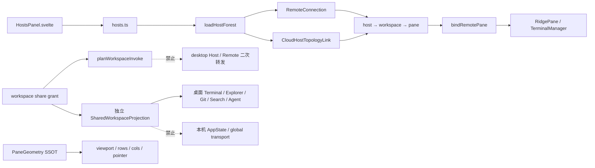
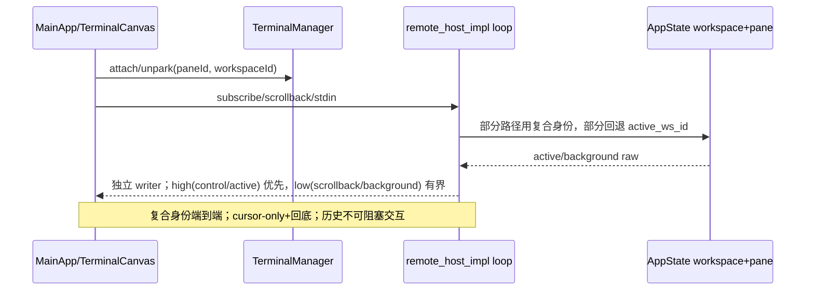

# Ridge 项目状态（唯一 NotebookLM 来源）

状态日期：2026-08-02（iteration 84 已完成代码与三线发布；手机归因、公网/WebView2 长跑、双窗口及双 Host 真机证据待补）
覆盖仓库：`wind`（`C:\code\wind`）与兄弟仓库 `ridge-cloud`（`C:\code\ridge-cloud`）
用途：人类与 NotebookLM 共用的单一「当前现状 + 愿景 + 差距」来源，辅助规划、取舍与追问。
不含：密钥、生产凭据、用户数据；不把历史计划或未复测功能写成已验证事实。

## Iteration 85 update (2026-08-02)

The mobile Remote worker cold-start/lifecycle slice is locally closed. The
worker now installs its control-plane listener before WASM loading, answers
health pings immediately, and returns a bounded structured fallback while the
adapter is loading. The manager suppresses resize during init/bind, cancels
pending handshakes on park/destroy, and rejects stale callbacks after worker
replacement. Targeted tests (63), `pnpm check` (0 errors/0 warnings), direct
CDP ping, and the LAN mobile probe passed; the probe now fails on worker
timeouts, `resize before init`, and project `Unchecked runtime.lastError`.

Iteration-85 evidence is archived in
`docs/iterations/CONTRACT-iteration-85.md`. Release `v0.1.33` is formal with 12
assets (`30726725069`), Remote artifact `0.1.33+gc07f931` is active
(`30727576307`), and ridge-cloud deploy `30727590385` plus health `ok=true`
are green. Physical-phone, public-soak, WebView2-heap, and dual-window /
dual-Host gates remain pending; no external proof is inferred from local CDP.

### Iteration 83 update (2026-08-02)

Mobile Remote IME-anchor boundary is fixed and pushed as `16d2861`; version
contract `0.1.29` is staged on `b58815e` and published by the completed release
workflow.
`clearInputStart()` clears the stale pre-submit anchor; physical and virtual
Enter share the reset; focused IME geometry is refreshed after keyboard-shift
updates. Deterministic LAN/PTy mobile probe, full Vitest, Svelte check, and
desktop/mobile LAN matrix are green. See
`docs/iterations/CONTRACT-iteration-83.md`. Physical phone clean-profile A/B,
WebView2 heap soak, public long-run, and dual-window/dual-host evidence remain
explicitly unverified.

证据等级：
- **代码事实**：由 2026-07-28 CodeGraph（895 文件 / 37,969 节点 / 177,401 边）与当前源码确认。
- **Git 事实**：由本地分支、HEAD 与提交历史确认。
- **运行事实**：必须有本轮测试/退出码证据；缺证据时明确写「未验证」。
- **文档声明**：若与代码冲突，以代码为当前行为、以协议为应修正目标。

---

## Iteration 84 update (2026-08-02)

Agent history discovery now runs with an independent bounded pass per source;
Claude session volume can no longer starve Codex history. The new filesystem
fixture proves both sources, recorded CWD, latest assistant text, structured
resume arguments, and child-path filtering. Code commit `b88b679` is pushed;
see `docs/iterations/CONTRACT-iteration-84.md`. Worker renderer identity is
now reconciled on restart so stale pane bindings cannot issue resize/bind before
the replacement worker receives init. Commit `859b396` is pushed. Version
`0.1.32` is committed as `ac0a4b1` and formally published with 12 assets.
Release run `30723870060` and Remote run `30723873999` passed; artifact current
activated `0.1.32+gac0a4b1`, and cloud production health returned `ok=true`.
The prior ridge-cloud source deployment remains healthy. Isolated WebView2/CDP
Agent panel, auto-discovery/recovery, and LAN mobile roster/data-plane probes
also passed; the probe emitted no `runtime.lastError`. A separate first-start
attempt failed only because the Rust debug archive exhausted disk (`OS error
112`); after reclaiming rebuildable Cargo package artifacts, the CDP run
completed. Physical phone clean-profile A/B, public long-run, WebView2 heap
soak, and dual-window/dual-host evidence remain unverified.

---

## 当前迭代目标

- `REQ-20260730-01`：按 `CONTRACT-iteration-76.md` 与 `CONTRACT-iteration-77.md` 推进 Remote/桌面稳定性；RPC/输入/Resize、SCM、Pane 生命周期、日志、真清空、Host、Commune、多窗口所有权及窗级 active 核心已落地；仅外部运行证据待补。
- `REQ-MOBILE-REMOTE-RUNTIME-LASTERROR-01`：项目源码无 Chrome Extension Messaging；保持业务零 diff，待受影响手机 clean-profile/扩展 A/B 终局归因。
- `REQ-MOBILE-REMOTE-KEYBOARD-QOS-02` / `REQ-REMOTE-RUNTIME-PERF-MEMORY-02`：键盘视觉偏移稳定、Remote listener/worker/pending/timer 回收；代码与确定性测试已落，真机/WebView2 heap soak 待补。
- 当前发布收敛：Release/Remote 取源 `58c2cb7`（Agent history fairness 与 `0.1.30` 版本合同）；当前 `main` 另含归档提交 `1fe1e69`。Remote run `30719562705` 成功，ridge-cloud run `30719573795` 成功并通过生产健康检查；`v0.1.30` Release run `30719551852` 全矩阵成功，12 个资产已核验并正式发布，URL `https://github.com/MySetsuna/ridge/releases/tag/v0.1.30`。

## 已验证代码事实

- `origin/main@f62133c` 已合入；本地实现基线 `a9023f3`，未推送。
- `RpcClient` 现有 256 在途硬上限、超时 `$/cancel` 与 queue/timeout diagnostics（`5eece08`）。
- 手机 Cloud Resize 现为每 Pane 一在途加一 latest pending；重复尺寸去重，close/prune/disconnect 清 lane（`45355db`）。
- Cloud 输入现为每 Pane 一在途、4 ms 聚合、序列/摘要去重、指数退避及阈值暂停（`9904b53`）。
- SCM 已有共享非 Git negative cache；status/branch/stash/watch/heartbeat 共用仓库真值（`fc6a73b`、`a01f7db`）。
- Pane destroy 先 abort pending RPC，再清 lane/listener；dead pane fail-closed，重连新生（`826e3a1`）。
- 终端、RPC 与 SCM 重复错误按指纹聚合，保留首错并周期汇总（`20d7be3`、`2052753`）。
- `ScrollbackClear` 协议贯通 grid/kernel/renderer/backend；右键经权威 Tauri command 真清空并释放 replay blocks（`c1ec8a2`）。
- Host 接入弹窗即时关闭，面板显示阶段进度；foreign pane attach 后按实测尺寸立即 Resize（`7b7daee`、`c290143`）。
- Host topology 逐 Host settled 发布，慢源不再阻塞快源；代际/Abort/last-good 与拖拽统一入口已落（`0d273c3`）。
- Agent's Commune 入口不再受隐式 setting 隐藏（`2b53650`）。
- Agent history discovery now bounds Claude/Codex sources independently and
  preserves cross-CWD structured resume (`b88b679`; iteration-84 fixture).
- 普通二次启动现创建独立 WebView；原子工作区认领、冲突聚焦、关闭/销毁/删除释放已落（`5723828`）。
- 每个桌面窗口现有独立 selected-workspace SSOT；native active/layout/ratio 按窗口解析，Pane/Terminal 关键变更按唯一 pane id 定位，Remote/CLI 保留全局语义（`a9023f3`）。
- 1,000 RPC/input/resize burst、100 次非 Git/共享 repo、126 次重复日志均已有量化回归钉（`3e967a1`）。
- owned Node localStorage 与 Vite chunk 配置告警已修（`74cb80d`）。
- 手机 Remote 项目源码及构建输入无 Chrome Extension Messaging；`service-worker.ts` 的 PWA `Client.postMessage` 非 Extension Messaging。项目归属已排除，环境注入器/第三方扩展仍待真机隔离。
- `MainApp` transport unsubscribe、Cloud late-callback guard、workspace generation guard 与 Worker pane pending cancellation 已落；Pane destroy 会拒绝 pending 并忽略有界 late reply（`367c053`、`0207319`、`b402f75`）。
- kernel Git discovery/status 已移出 async executor 且支持 ancestor repo；MCP bridge 默认仅接当前 kernel、无 kernel fail-closed（`66d51f0`、`1475abc`）。
- Windows kernel host smoke 已真实验证 detect-or-spawn、二次 attach、FS/Agent/Git/MCP、stop；脚本现具墙钟超时、精确进程树回收与 finally 清理（`5a67044`）。
- Scrollback worker 已补 Pane-scoped cancel 回归：销毁 Pane 只取消目标 decode，其他 Pane 保持 pending，dispose 后全部归零（`bce506a`，5/5）。
- Release workflow 已补 Intel macOS `ridge-cli --target x86_64-apple-darwin` 构建与上传，避免跨平台 CLI 资产缺失（`c06cff0`）。

## 相关模块与 symbol

- RPC/Resize:`RpcClient.request/settle/diagnostics`、`CloudRemoteConnection._invokePane/_resize/_drainResizeLane/sendStdin`。
- SCM:`SourceControl.discoverRepos/refreshStatus`、shared non-Git cache、`get_scm_status(slot)`。
- Clear/Host:`GridDelta::ScrollbackClear`、`clear_pane_terminal`、`hostConnectProgress`、`claimPaneSize`。
- 待处理:外部证据——手机 clean-profile/禁注入器、公网 Remote/双 Host E2E、WebView2 长跑、双窗口桌面 E2E、Agent/Headless 真链、Explorer 跨卷权限及原生 PowerShell/PTY 录制；Grok 仍待真实原生历史格式。

## 最近完成与当前 diff

- 最近完成:`367c053`/`0207319`/`b402f75` Remote 生命周期与 Pane pending；`66d51f0`/`1475abc` kernel/MCP；`5a67044` smoke 进程护栏；`bce506a` Scrollback Pane cancel 测试；`c06cff0` Release CLI 资产护栏。
- 当前 diff:本状态与迭代合同更新；`.iteration` 和既有本地生成目录保持未跟踪。

## 验证状态

- 需求闸、preflight、Notebook 冷循环准入：退出码 `0`；NLM live `https://notebook.google.com/` 代理验证成功，`nlm login --check` 与 `nlm notebook list` 均 exit `0`，notebook 数量 `20`；最新查询仅作策略建议。
- 三个只读 worker 结果经 `agent_dispatch.py validate-batch`：`valid=true`。
- 聚焦验证：输入/Remote 105/105；生命周期 54/54；SCM 26/26；日志 3/3；foreign binding 2/2；`pnpm check` 0 errors / 0 warnings。
- 第二波集成：Host/drag/paneTree 69/69；Rust ownership/release/auth-launch 3/3。
- 本轮量化稳定性四文件套件 70/70：RPC 1,000 → 256/744；非 Git 100 → 1；共享 repo 100 pane → 1；重复日志 126 → 2 条；输入 1,000 → 1 RPC；失败 5 次暂停 30 s；Resize 1,000 → 2 RPC。
- 窗级 active：新增 Rust selection/race 2/2；`paneTree` 60/60；`cargo check --lib` 完成，仅 38 条既存 warning；`pnpm check` 0 errors / 0 warnings。
- `ridge-term` 全量 395 + protocol smoke 33；Tauri 输入序列、clear parser 与 Arc-release 聚焦测试均绿。
- `ridge-term` release WASM 已重建并实例化验证 protocol v3；桌面/手机 Remote bundle exit 0；consumer 46/46。
- iteration 77 复核：关键 Remote/SCM/Host/Worker/RPC 测试 12 files / 253 tests 通过；`pnpm build:remote` exit `0`（140.4 s）；构建仅保留既有动态导入、chunk-size 与空 PWA glob 非阻塞警告。
- 2026-07-31 只读公网 health：`https://9527127.xyz/api/v1/health` HTTP `200`，服务自报版本 `0.0.7`；缺 `RIDGE_ARTIFACT_TOKEN`，Remote artifact current 未验证。此证据不证明公网 WebRTC/TURN、产物新鲜度或用户链路。
- 公网、手机真机、WebView2 长时性能 A/B、双窗口与双 Host 物理 E2E 尚未运行；不得宣称总体目标完成。
- 本轮新增验证：定向 Remote/Worker 48/48；完整 Vitest 120 files / 1374 passed / 1 skipped；`pnpm check` 0 errors / 0 warnings；`cargo test -p ridge-kernel --lib` 15 passed；`cargo test -p ridge-mcp-bridge --lib` 8 passed；kernel-host-smoke 全绿。
- 发布验证：`30714934091` completed/success；`v0.1.28` `draft=false`、`prerelease=false`、`publishedAt=2026-08-01T20:15:54Z`，12 个资产齐全（Windows setup/MSI/CLI、Linux deb/AppImage/CLI、macOS arm/x64 dmg/app tar/CLI）。

## 当前失败信号与风险

- 失败信号:手机 `runtime.lastError` 尚无首条 warning script URL/Frame/注入器 owner；公网/WebView2/物理设备证据尚未采集；公网服务健康但 Remote artifact current 未获授权核验。
- 发布风险：`v0.1.28` 已完成正式发布并通过资产核验；后续版本仍须保持 macOS x64 CLI 资产检查。
- 风险:自动测试不替代双窗口桌面、双 Host、手机、公网 Remote 与 WebView2 长跑；Remote build 尚有既存 dynamic-import 警告。

## 架构边界

- 目标/非目标:`先完成统一 RPC/PTY 生命周期和观测，再跨窗口/Host；不发布、不推送、不删用户数据、不作无关重构。`
- 锁定决策:`窗口可多开；Remote 工作区跨窗口全局单例。输入不丢、不乱、不盲重放。NotebookLM 不裁决代码事实。`
- 基线依据:`main@a81674a`；两项稳定性 REQ；guidance 64/65 与三日历史；三个 worker 审计结果；`CONTRACT-iteration-77.md`。
- 模块与落点:`packages/remote transport`、`cloudRemote`、`SourceControl`、terminal manager、Hosts、Tauri window ownership、Agent Center。
- 关键接口/直接路径:`write_to_pty` 序列确认、`resize_pane` latest-win、SCM shared detection、Pane destroy cancellation。

## 需求—代码—测试追踪

| Active REQ | 状态 | 代码证据 | 测试/质量证据 |
| --- | --- | --- | --- |
| `REQ-20260730-01` | implementation complete / external proof pending | `5eece08` 至 `a9023f3`；`CONTRACT-iteration-76.md` | TS/Rust/build 闸绿；公网、长跑、双窗、双 Host 待补 |
| `REQ-MOBILE-REMOTE-RUNTIME-LASTERROR-01` | project source excluded / environment proof pending | 全源码与构建输入无 Chrome Messaging；`2026-07-30-mobile-runtime-lasterror-audit.md` | worker valid；手机 clean-profile/禁注入器 A/B 待补 |

## Known failed approaches

- 直接在旧 `PROJECT-STATE` 骨架生成冷循环快照：确定失败，`state_snapshot.py` 报缺八个固定标题。

## 下一项已批准工作

- 执行 iteration 77 清单：手机 clean-profile/禁注入器归因、公网 Remote/双 Host、WebView2 长跑、双窗口桌面、Agent/Headless、Explorer 跨卷权限、原生 PowerShell/PTY 录制。未获这些外部证据前不宣称总体运行验收完成。
- `v0.1.28` 四平台资产与 Remote/cloud SHA 对账已完成；下一步仅补手机 clean-profile/WebView2/公网/双窗口/Agent 真链证据，仍以代码、测试、运行事实三者闭环。

## 本轮 delta

- 变更:`RpcClient`、Cloud 输入/Resize、SCM、Pane 生命周期、错误聚合、终端真清空、Host 全链、Commune、多窗口所有权与窗级 active；量化 burst 回归与 owned warning 清理。
- 直接影响:`RPC 有界且超时取消；输入保序退避；Resize 合并；非 Git 停轮询；销毁 Pane 不再收请求；重复 Console 错误聚合；clear 释放 retained blocks；双窗关键 Pane/Terminal 变更不串 workspace。`
- 验证:`requirements/notebook/dispatch 闸绿；第二波 69/69；量化稳定性 70/70；paneTree 60/60；多窗口 Rust 3/3 + 新增 2/2；ridge-term 全量与 Svelte check 绿。`
- 质量:`Sonar scanner 仍缺；WASM/Remote 正式构建绿；公网/内存/物理设备 A/B 待补。`
- Agent 编排:`native 三 worker，只读、全结果 valid；Ridge profile capability 未暴露，未猜测 pane 启动参数。`
- Worker 回收:`3/3 completed，无越界写。`
- Token:`子 worker 无逐会话可信计量，记 0 而不伪造节省；同任务 baseline 尚无。`

## 历史状态正文（截至 iteration 75）

## 1. 产品愿景与北极星（稳定段，少改）

Ridge 要成为**本地优先、随处可接入的人机协作开发控制平面**：人能看见每个开发智能体在做什么，能在关键时刻拦截、接管和恢复；多个智能体在同一工作空间协作；工作上下文不因终端、设备、模型或会话切换而丢失。

差异化在四个结果：
- **可见**：Agent 身份、状态、任务、改动与故障可被理解。
- **可控**：危险动作可审批，单个 Agent 可暂停、恢复、接管和回滚。
- **可续**：工作区记住目标、约束、决策、任务和运行状态。
- **可协作**：多个本地 CLI Agent 经可见 Pane、tmux 与 MCP 共同工作，人始终拥有最终裁决权。

入口定位：桌面 = 主控制室；手机/浏览器 Remote = 随身控制台（roster、切 Pane、HITL 审批、弱网恢复，不复制完整桌面 IDE）；`rdg`/SSH = 终端原生入口（与桌面一致的工作区/Pane/Remote 核心语义）。Remote 与 `rdg` 是「控制平面的随处入口」，不是通用 VNC。

明确非目标：通用远程桌面/VNC/多显示器；万能 AI IDE 或 VS Code 功能表对标；托管用户模型密钥或绑定单一 Agent CLI；聊天窗口/动画/插件市场作为核心竞争力；Agent 自治凌驾于人类审批、数据安全和可恢复性；为假想端一次性大重构；手写重复协议与不断增长的 handoff 墓地。

决策过滤器（提案先答）：是否明显增强可见/可控/可续/可协作之一？用户能否在真实工作流感知价值？能否先复用现有能力？是否引入新协议副本、状态源或不可恢复写路径？有无低成本证伪实验？删除或简化是否更接近目标？前两问为否则不进路线图。

## 2. 锁定决策与安全不变量（稳定段）

- 协议 SSOT 唯一：`C:\code\ridge-cloud\docs\ridge-cloud-protocol.md` 为权威全文；`wind` 侧只保留 canonical 入口 + 自动守卫（iteration 1 后已收敛，双 SSOT 债务关闭）。协议变更先改权威契约，再改服务端与所有客户端。
- relay 不读取终端业务明文；业务帧只在端侧 E2EE 加解密。
- 公网完整 host 接入要求 host/controller 同账户；LAN 不施加账户归属限制，以 LAN TOTP/session/E2EE 为边界；跨账号仅可经「单工作区分享」能力接入，且不得把 host/remote 能力二次转发。role 匹配 JWT scope 与分享授权；房间/配额/付费权限用已验证身份 + 数据库实时状态（不信任长寿命 JWT plan claim）。
- TOTP/受信设备验证必须在业务帧门控前完成；**business-ready = transport connected + authorized**（iteration 3 修复后锁定：E2EE connected 但 TOTP 未授权时不得发送 hello/pane recovery）。
- 远控 resize、输入、Pane 订阅与 scrollback 语义跨 desktop/LAN/cloud/CLI 一致；能力必须先协商宣告，未宣告入口显式拒绝而非静默分叉（iteration 2 起由跨入口合同测试守卫）。
- migration 只追加；日志不得输出 token、TOTP seed、私钥、`RIDGE_ARTIFACT_TOKEN`。
- 发布有两条独立版本线：`ridge-cloud` 代码 SHA 与 Remote artifact version，必须分别验证，不混为一个版本。
- 授权阶梯 Level 2（Draft）：改动在独立分支形成可审查提交，人工验证后合并，不自动合并或发布。

## 3. 当前架构（CodeGraph 勾勒）

### 3.1 wind 桌面与终端主链路

```
Svelte 页面/组件 → Tauri invoke/事件 → src-tauri commands / ridge-core dispatch
  → 工作区状态 + PTY engine → pane 输出/GridDelta
  → @ridge/remote TerminalManager → ridge-term WASM Kernel + Renderer → Canvas
```

- `src/routes/+page.svelte` 组装工作区、侧栏、远控与 Agent Center；`SplitContainer.svelte` / `RidgePane.svelte` 管 Pane 布局与交互。
- `packages/remote/src/shared/terminal/manager.ts::TerminalManager` 统一终端实例生命周期，桌面与 Remote 复用。
- `packages/ridge-term` 为终端语义 SSOT（parser/grid/scrollback/selection/search/增量渲染/WASM 绑定）；渲染为 **WebGPU-first + Canvas2D 自动回退**（`default=["webgpu"]` 生产默认特性，运行时 GPU 探测驱动，2026-05-05 用户反馈钦定「不设 build flag/opt-in」）——非实验代码，**不得删除**；真机收益测量属用户轨（E1）。
- `packages/ridge-core` 承接 workspace/pane/Git 命令与异步 dispatch；Tauri 保留宿主状态、平台资源与事件桥。
- `packages/ridge-cli/src/main.rs`：`tui` / `login` / `remote`（公网 host daemon）/ `connect`（LAN controller）/ `tmux`。
- Teammate/MCP：tmux shim + Ridge MCP server → teammate server / ridge-tmux → 工作区变更 → `AgentCenterPanel.svelte`。iteration 61 后 Agent Center 跨全部工作区聚合 roster，并显示 Claude/Codex JSONL 最近助手回复与 Agent 所创 native 无头会话；OSC 标题优先、前台进程兜底自动登记/释放 pane Agent 状态。桌面有 `resolve_hitl_request`；该能力刻意不在 Remote allowlist。
- Agent 当前状态：`rosterChanged` 已进入前端 DTO，并触发 roster/layout 刷新；Agent Tab 与 pane header 已共用运行态映射。`AgentCenterPanel.svelte` 已具备成员/编组/历史三 tab，控制、HITL、文档入口已移至内容底部；历史目前仅聚合后台终端与最近回复，按类型分组、折叠及结构化 resume 仍缺。

### 3.2 远控三入口

| 入口 | 控制面 | 数据面 |
| --- | --- | --- |
| 本地桌面 | Tauri 进程内命令/事件 | 本机 PTY |
| LAN Web | host 内置 HTTPS/WSS（TOTP/session 鉴权） | 局域网 WS，共享 Remote 协议 |
| 公网 Web | ridge-cloud 认证/信令 | WebRTC DataChannel + E2EE |

公网链路（代码确认）：

```
host: RidgeCloudHost(device JWT) ↔ ridge-cloud /ws（认证、授权、房间、SDP/ICE 转发）
controller: ControllerCloudProvider(user JWT) ↔ WebRTC DC ↔ E2EE ↔ CloudHostBridge ↔ 本机 invoke/Pane 输出
```

iteration 62 当前边界：



关键符号与行为（均有确定性测试守卫，见 §5）：
- `packages/remote/src/shared/cloud/controllerCloudProvider.ts::ControllerCloudProvider`（:114）：退避重连；RTC `disconnected` 15 秒 watchdog → ICE restart；restart 后 12 秒 deadline 未恢复 → 升级整体重建（旧 PC/DC/WS 关闭）；重建后重新 E2EE + TOTP，hello/pane recovery **恰好一次**，timer 清零；`disconnected` <15 秒自愈不触发任何重建/重复恢复。`reconnect`（:684）。
- `packages/remote/src/shared/cloud/cloudHostBridge.ts::CloudHostBridge`（:202）：验证完成前门控 invoke 与 Pane 订阅；TOTP、信道绑定 TOTP、trusted-controller、E2EE 临时公钥绑定钩子；Pane 背压 drain 后每受影响 Pane 恰好重同步一次、不串 Pane。注意：若某些 verifier 未注入，桥为兼容旧路径可能默认放行——「代码支持安全钩子」不自动证明每个生产入口已启用（→ 差距 S1）。
- 1 房间 = 1 host + N controller，controller 有随机 `cid` 定向寻址；同 `cli` 新连接顶替旧连接。
- Pane 历史：首屏小预算 + 滚顶懒加载；DataChannel 分片/重组 + 发送缓冲背压上限。
- Mobile/LAN：复合 `PaneRef` 已覆盖主路径；Host 对缺失 workspace 的订阅/历史请求 fail-closed。遗留跨端真实 E2E 尚待量测，不把 fixture 当真机证据。
- 键盘：`TerminalCanvas` 已以 `scrollToBottom → cursor/fallback center → focus` 处理显式软键盘，pointer/touch 仅用于 TUI mouse/selection。
- 发送：LAN sink 已移至独占 writer task，reader 不再直接 await socket；background/scrollback 走有界 low lane，active/control 走 high lane。



### 3.3 ridge-cloud

单 Rust/Axum 服务：API + WebSocket relay + 多 SPA 托管（主域账户/设备、`admin.{base}` 管理端、`{device}-{username}.{base}` 租户 controller 按 UA 分桌面/移动产物）。
- `src/router.rs::build_router` / `spa_fallback`；`src/middleware.rs::tenant_resolver`。
- JWT `user`/`device` scope，新签发 EdDSA(Ed25519)、迁移期兼容 HS256；父域 `ridge_sso` HttpOnly cookie + 短时 access token；DB 只存 refresh hash。
- `src/ws/handler.rs::ws_upgrade` 升级前后校验租户/token/scope/设备归属/parked/订阅/连接上限；房间 key 用已验签 `user_id`+设备名。host 与 controller 均按数据库实时用户组计算设备配额；配额停放以 `parked_by_quota` 区分人工禁用，故恢复配额不会误启人工关闭设备。
- `GET /api/v1/ice-servers` 恒返 STUN；配置 `TURN_HOST`+`TURN_STATIC_AUTH_SECRET` 才追加 coturn 时效凭据。
- Remote artifact 独立发布线：`wind` 构建 desktop/mobile 两套产物 → `RIDGE_ARTIFACT_TOKEN` 上传 `/api/v1/remote-artifacts` → 持久卷 `releases/<version>` → current 指针激活，保留最近 3 个回滚。
- PostgreSQL + SQLx，15 个顺序迁移；统一 `{ok,data}`/`{ok:false,error}` 信封；CORS/体限/限流/安全头/脱敏外层防线。

## 4. 仓库快照

| 项 | wind |
| --- | --- |
| 分支 / 功能与发布基线 | `main` / `28898b34c3ef`，与 `origin/main` 同步；该基线已发布 `v0.1.10`，工作树含 iteration 75 已批实现 |
| 应用版本 | 0.1.10（`v0.1.10` 安装资产已发布；iteration 75 尚未另起版本 tag） |
| CodeGraph | 895 文件 / 37,969 节点 / 177,401 边（2026-07-28 sync/status exit 0） |
| 工具链 | iteration 63 曾有 Vitest/Rust/build/LAN E2E 绿证据，但用户真机否决其体验，故旧闸只证明 fixture 通过，不证明本轮需求闭合；改后须补同构竞态/背压/E2E |

`ridge-cloud`：`main` / `a5e2be6`，与 `origin/main` 同步；CodeGraph 已获用户授权初始化（160 文件 / 3,623 节点 / 12,264 边）。Remote artifact current 已由 run `30284595465` 激活为 `0.1.6+g5f7433d`；生产 Dokku SHA、TURN 可达性仍**未实测**。

### 4.1 质量遥测

| 能力 | 状态 | 证据/限制 |
| --- | --- | --- |
| CodeGraph | healthy | 895 files / 37,969 nodes / 177,401 edges；`codegraph sync/status` exit 0 |
| Vitest coverage | 已配置 | `@vitest/coverage-v8`；当前阈值仅覆盖既有 `paneTree.ts` 基线，不冒充整仓覆盖率 |
| Playwright | 已配置 | iteration 63 真 LAN 脚本为 `scripts/remote-state-e2e.mjs` |
| Sonar | 本机与项目配置完成，尚未上传 | 全局 `@sonar/scan` 5.0.0；`sonar-project.properties` key=`MySetsuna_ridge`；缺 `SONAR_HOST_URL`/`SONAR_TOKEN`，故 quality gate 未运行 |

## 5. 迭代闭环成果（iteration 1–4）与确定性证据

- **iteration 1**：校准陈旧基线；修复 Cloud TS capability mirror（缺 `get_workspace_snapshot`、mutating mirror 少 11 项）；固定计数测试改为 Rust canonical 逐项 parity。事后经用户授权同步 `ridge-cloud`，wind 陈旧协议全文收敛为 canonical 入口 + 自动守卫（**T2 关闭**）。
- **iteration 2**：建立 Controller-facing 最小 capability→RPC 合同与跨入口测试；补齐 rdg `get_file_tree/read_file/text_search` 路由；Remote Files/Git/Search、workspace 管理与 theme UI 按能力协商隐藏/收敛（**A2 主体落地**）。
- **iteration 3**：建立 provider→adapter→RpcClient 与 Host 背压的确定性 fault-injection 门禁（100 周期无 pending RPC/重复恢复/timer 泄漏）；修复 business-ready 门控缺陷（E2EE connected 但未授权时提前 hello/pane recovery，Host 丢弃不补发）。
- **iteration 4**（2026-07-23 收口）：
  - 新增两条 watchdog 升级时序门禁：`disconnected <15s` 自愈零副作用；`watchdog 15s → ICE restart → deadline 12s → rebuild` 后恰好恢复一次。
  - 新建聚焦真机 runbook `docs/plans/cloud-remote-physical-smoke-runbook.md`、evidence JSON Schema + 示例 + 校验脚本 `scripts/validate-remote-smoke-evidence.mjs`；证据目录 `/artifacts/remote-smoke/` 已 gitignore。
  - 自动验收全绿（2026-07-23 运行）：faultInjection 7/7；Cloud 定向回归 5 文件 156/156；增量 svelte-check 70 files / 0 errors / exit 0；evidence 校验脚本对示例 exit 0。
  - **真机双平台证据仍为空**：iOS Safari 与 Android Chrome 的换网/后台/token 跨窗场景须由人持真机按 runbook 执行并产出 evidence JSON。停机条件未触发；不以自动测试宣称双平台通过。
- **iteration 5**（2026-07-23，可信基线固化）：
  - S1 审计落地：构造点×校验器矩阵 `docs/security/cloud-fallback-matrix.md`（回落面 F1–F6 + 退役条件）；3 条钉死测试（含审计发现：**无 bindTranscript 时 trust-proof 非「直接失败」而是退化为无信道绑定签名 + 信任库裁决**，源注释已更正）；遥测/退役设计文档（零行为变更）。
  - T3 代码侧闭合：ridge-cloud `activate()` 写 `current.json` + 新增 token 守卫只读 `GET /api/v1/remote-artifacts/status`（+3 测试，124 全绿，分支待合并）；wind `scripts/check-prod-status.mjs` 一键两线汇总（桩验四径）。生产实跑待用户。
  - T1 绿灯：wind `cargo test --workspace --exclude ridge` 882 绿 + `-p ridge --bins` 27 绿 + ridge-cloud 124 绿；唯 `-p ridge --lib` 宿主载败（loader 级，先于本轮，Q4）。
  - A2 闭合：`docs/capability-matrix.json`（7 能力 × 6 入口，rdgHost 列由 `CLI_CAPABILITIES` 推导）+ 6 条一致性测试防矩阵成第二事实源（13/13 绿）。
  - A1 示范减法：删 state.rs 死 pane-output 通道面（净 −45 行，rustc dead_code + 全仓 grep 双证）；审计报告确认 git 面已薄委托、`commands/workspace.rs` 只读三件套是真双路径（下切片候选）。
  - 计划外：修复 signaling drift 门禁 Windows 误报（autocrlf 把 vendored 副本涂 CRLF；`.gitattributes` 钉 LF），vitest cloud+transport 全伞 382 绿 / 1 skipped。
- **iteration 6**（2026-07-23，P1 控制台 MVP）：
  - 新协商能力 **`teammate`**（唯一方法 `get_teammate_topology`，只读、轮询）六处同步宣告（Rust/TS allowlist、合同、client/LAN/cloud host 能力表、矩阵）；rdg 无头 host 刻意不宣告（denied）。共享 controller 新增 Team roster 面板（状态点/Leader 冠标/点按切 pane），桌面与移动同码。投影脱敏由 Rust 测试钉死（仅 id/name/paneId/paneIndex/role/status/capability）；HITL 裁决保持不可远达。
  - S1 遥测第一阶段落地：bridge F1（trust-proof transcript 在/缺）与双 provider F2（enforced/relay-trust）进程内计数 + 测试钉死，无新持久面。
  - A1 切片：workspace 列表投影同源化（删平行 `WorkspaceInfo`，net −12 行）；`get_active_workspace_id`/`get_workspace_snapshot` 审计确认本已单源。
  - 证据：vitest shared 全伞 558 绿 / 1 skipped；svelte-check 71 files 0 errors；cargo check + `--lib --no-run` 0 errors；bins 27 绿。
- **iteration 7**（2026-07-23，证据与固化轮，冻结新功能）：
  - **T1 完全关闭——loader 载败根修**：根因为依赖树引入 `comctl32!TaskDialogIndirect`（仅 common-controls v6 导出）；cargo lib 单测宿主无 manifest，加载器绑 WinSxS 5.82 → `STATUS_ENTRYPOINT_NOT_FOUND (0xc0000139)`。修法：`build.rs` 注入 `/DELAYLOAD:comctl32.dll`（绑定推迟到首次真实调用，测试从不弹框故永不绑定；`rustc-link-arg-tests` 不覆盖 lib 单测宿主、`/MANIFEST:EMBED` 与 tauri-build RT_MANIFEST 冲突，均不可用）。结果：`cargo test -p ridge --lib` **92/92 本机首次全绿**（teammate 投影脱敏等安全断言首次真实执行）；`cargo test --workspace` **首次整仓 exit 0**；附 boot smoke 集成测试防回归。
  - R1 实验室轨关闭：抽共享 `__faultRig.ts`；`weakNetLab.test.ts` 九场景参数化扫描（脉冲 [1s,5s,14s] 自愈零副作用、28s 越 watchdog+deadline 升级链恰一次恢复、fail/recover [10,50] 周期零泄漏、背压 [1,8+ε,12]MiB×3 pane 丢帧后每 pane 恰一次 resync）；`scripts/run-weaknet-lab.mjs` 触发 + metrics.json 结构校验 exit 0；产物含「实验室确定性模型，非真机结论」disclaimer。
  - A1 审计：`Teammate` 六字段全被消费（role/status/capability 各有 grep 实证），**无死字段**，NotebookLM 删字段建议驳回。
  - 固化：`docs/plans/user-verification-checklist.md` 四件用户必办单页；README_CN 补能力协商 + Team 面板段；WORKFLOW 补双轨制段。
  - 证据：vitest shared 全伞 567 绿 / 1 skipped（37 文件）；svelte-check 0 errors；weaknet-lab 脚本 exit 0。
- **iteration 8**（2026-07-23，P2 阶段 1 + 支线）：
  - **P2 阶段 1 关闭（只读可见）**：`hitl.rs` PENDING 注册表加宽存脱敏元数据（原先发事件即弃）；新只读方法 `list_hitl_pending`（`teammate` 能力下，六处宣告同步）投影仅 `{id, initiator, level, reason, createdAt}`——**绝不含 `action` 命令全文**（Rust 测试钉死）；Team 面板只读 Pending approvals 区；裁决通道（`resolve_hitl_request`）保持不可远达。裁决/nonce/单次消费语义属阶段 2，未做。
  - S1 遥测第二阶段：F3 计数（controller `tofuChanged`，合法 0x02+指纹变化测试）、F4 计数（host `fallback0x01`，含签名失败降级）；**F5 退役删除**（`keyBindingVerifier` 钩子生产零接线双证后整链删除，矩阵行改已退役）；计划外根修 deviceTrust localStorage 探针 + 模块级内存回退（Node 残缺对象地雷）。
  - A1 切片：pane.rs 全量读写分类审计（报告在迭代文档）；rustc dead_code 扫出并删真死码二处（pane_tree `first_leaf/last_leaf`、parser `full_reframe_with_scrollback`，net −60 行）。
  - G1 设计文档（零代码）：`docs/specs/2026-07-23-agent-suspend-resume-design.md`——三层边界、Windows 无 SIGSTOP 三候选（Job Object 冻结目标态）、顺序不变量、HITL fail-closed 计时不暂停。
  - 证据：`cargo test --workspace` exit 0；vitest shared 全伞 559 绿 / 1 skipped（删 9 增 1 帐目符）；svelte-check 0 errors；`-p ridge --lib` 93 绿。
- **iteration 9**（2026-07-23，G1 阶段一 + 审查闭环，零协议面变更）：
  - **G1 阶段一关闭（软暂停/恢复）**：`teammate/suspend.rs` 进程级注册表；agent 写路径四所归一（send-keys/delegate/MCP/exec → `agent_pty_write` 唯一收口，suspended 明确拒）；人类输入与断路器 Ctrl-C 刻意不门控（接管/刹车语义）；拓扑双路径 status 覆写 `Suspended`（无新字段）；Agent Center Pause/Play；`suspend_agent`/`resume_agent` 仅桌面 IPC + 不可远达负断言。OS 级冻结属阶段二未做。
  - C1 清单化：`scripts/rdg-gap-report.mjs` 派生缺口报告（3 supported / 5 denied，teammate 刻意排除，余待人工判定补路由或声明永久缺口）。
  - 审查辅助：`scripts/generate-review-pack.mjs` → `docs/review/branch-review-guide.md`（全提交分组 + 协议面/安全面标注 + 计数自校验）。
  - A1 审计新发现：**LAN host `close_workspace` 第三副本实分歧**——漏发 `WorkspacesChanged`/`WorkspaceListChanged`（LAN 关区不通知他端）+ 多删 `workspace_names`；同源化候选以 close 为首、升级缺陷修复级（`docs/audits/workspace-write-paths.md`）。
  - E1/E2 簿记校正见 §6。
  - 证据：`cargo test --workspace` exit 0；`-p ridge --lib` 96 绿（+3）；vitest 全伞 559 绿 / 1 skipped；svelte-check 0 errors；双脚本 exit 0。
- **iteration 10**（2026-07-23，A1 主线 + 簿记清偿，零协议面变更）：
  - **A1 写路径同源化 + 缺陷修复**：`close_workspace_core`/`rename_workspace_core` 唯一实现，三/双调用方委托；**修实缺陷**——LAN 副本漏发 `WorkspacesChanged`/`WorkspaceListChanged`（关区不通知他端）、names 残条泄漏三方对齐；broadcast 订阅测试钉死；净删 ~80 行副本（提交本身 −4 净行）。
  - M1 设计定稿（零代码）：sidecar json 落点（与 .ridge 布局解耦；清理挂 `close_workspace_core` 单点）、6 字段与首个读写方、隐私边界（决策只存风险分类+摘要）、三切片序（切片一 = suspended panes 持久化 + 启动恢复）。
  - C1 判定收口：五 denied 缺口逐项判定入脚本 `JUDGMENTS`（teammate 刻意排除；theme/invoke 语义完备永久缺口；git/workspace 补路由候选待需求），报告零「待人工判定」残留。
  - 节律固化：WORKFLOW 每轮闭环必刷审查导读；积压期不扩协议面。
  - 证据：cargo workspace exit 0；workspace::tests 2 绿；vitest 559/1skip；svelte-check 0 errors；双脚本 exit 0。
- **iteration 11**（2026-07-23，M1 切片一 + P2 阶段 2 设计，零协议面变更）：
  - **M1 切片一关闭（暂停态跨重启）**：sidecar `{app_data}/workspace-memory/{wid}.json`（仅 suspendedPanes+updatedAt，原子写、空集删文件）；启动载入重挂；全写方钩落盘；`close_workspace_core` 单点清理；IO 全程 fail-open（损坏 json 跳过不 panic）。dir 注入单测 3/3（重启恢复/不复活/损坏容忍/关区同清）。
  - **P2 阶段 2 设计定稿**：一次性裁决票据（nonce 随挂起项生成，恒时比对、取出即毁=单次消费防双裁决）；**远端 modify 永不开放**；120s fail-closed 不变不延；多 controller 首达生效+败者入审计（接 M1 decisions，不存命令全文）；传输面选 `teammate` 新方法（弃 CONTROL 混层）。**实现被红线冻结待用户轨**。
  - 证据：cargo workspace exit 0；suspend 3/3；vitest 559/1skip；svelte-check 0 errors。
- **iteration 12**（2026-07-23，收敛轮）：30 分钟核验会动线文档（用户轨一次清偿动线，覆盖 checklist 全部条目）；G1 阶段二/M1 余切片/M2 簿记归档（待证据/解冻重开）；维护态定型入 WORKFLOW（验收=门禁绿+导读刷新+零回归；解冻=用户轨首份证据）。
- **iteration 13**（2026-07-23，用户指令解冻，P2 阶段 2 实现）：一次性裁决票据落地——`PendingEntry`+=nonce（uuid v4 不可猜）、投影六字段（+`resolutionNonce`，仍无 action）、`resolve_remote` 同锁恒时比对+取出即毁（单次消费原子）、verdict 仅 approve/reject（**modify 永不开放**）、四态结局；`resolve_hitl_remote` 六处宣告 + `MUTATING_METHODS` 双侧归类；桌面版裁决/网关开关/暂停命令不可远达负断言维持；Team 面板 Approve/Reject 双按钮 + 结局反馈。**P2 全闭**。
- **iteration 14**（2026-07-23，M1 切片二 + M2，存量终轮）：`memory.rs` 单源 doc 级 RMW（互斥+原子写+updatedAt 元数据+空删；suspend 持久化改经之，DIR OnceLock 单点注入）；三消费点裁决审计落盘（桌面/远端含 nonce-mismatch 败者尝试/超时 fail-closed；条目 `{ts,source,initiator,verdict,riskLevel,reasonSummary,outcome}` 无命令全文、环形 50）；**M2 归因**：initiator 升级为稳定 agent_id（pane 反查回落）；读方 `list_hitl_decisions`（仅桌面 IPC）+ Agent Center 审批历史区。
- 证据（13+14）：`cargo test --workspace` exit 0×2；teammate:: 25 绿；vitest 559/1skip×2；svelte-check 0 errors×2。
- **iteration 15**（2026-07-24，开放愿景清单 11 项）：见 `CONTRACT-iteration-15.md` + `2026-07-24-open-vision-checklist.md`。V-H1 TCP；V-G1-OS/RB；V-M1-S3；V-B6A/B/B3；V-DISC；V-MOB-CP；V-TUI-CLK 核查；V-PASTE。证据：`cargo test -p ridge --lib` 114；ridge-term/remote 相关绿；vitest 5。

## 6. 差距组合现状（愿景 − 现状，含最新裁决）

| ID | 差距 | 优先级 | 当前状态 |
| --- | --- | --- | --- |
| R62-HOST-TREE | 公网/LAN host→workspace→pane 统一管理树 | P0 | **代码已实现，真链 E2E 待补**（`0e71da6`）：`loadHostForest` 聚合既有 RemoteLink；LAN/Public 独立连接；工作区打开/新增/重命名/保存/分享/关闭与 pane 接入/Agent/shell/删除已接 UI；远端 pane 本地绑定；删失败不减引用、第二 pane 保持、最后 pane 断连一次。双 host/引用计数/协议边界测试绿 |
| R62-WS-SHARE | 跨账号单工作区分享 | P0 | **代码已实现，真链 E2E 待补**（`08eeff6`）：不可委派 scoped token 驱动独立内存投影；桌面 Terminal/Files/Git/Search/Agent 共用显式 provider；接入树投影真实 pane 并随推送更新；不写本机 workspace/global transport；workspace 管理关闭且 Host/Remote 二跳全拒 |
| R62-GEOMETRY | 桌面浏览器 LAN/public pane 网格、画面与指针一致 | P0 | **代码已实现，真实浏览器 E2E 待补**（`96ce9fc`）：共享 `PaneGeometry` 统一 content rect、padding、cell、DPR、grid 与 pointer clamp；纯函数/manager/合同回归绿 |
| R62-SAVED | 已保存工作区重开、删除、滚动条统一 | P1 | **关闭**（`fe37599`）：关闭清 pane runtime；默认目录直接 `.ridge` 受限删除；确认后原位刷新；弹层使用 `rg-scroll`；相关 Vitest/Rust/svelte-check 绿 |
| R63-MOBILE-CONTINUITY | Mobile Query/store、跨 workspace pane 保活、弱网 active QoS、键盘 transform、scrollback 连续分页/loading 与 pane 行纯 icon | P0 | **代码已修，真机验收待补**：cursor-only+回底、复合 PaneRef、host fail-closed、后台保活与 high/low writer 已落地并有定向测试；仍缺真实手机/浏览器切换、弱网与长 scrollback 证据 |
| R64-AGENT-HISTORY | Agent 历史会话按类型分组折叠，以原始结构化参数恢复；运行中会话复用成员/编组交互项；扩展 CLI adapter | P1 | **代码已修，真 CLI 证据待补**：按原生 session id 一 session 一行；标题/id/cwd/latest assistant 分区展示，结构化 `executable+argv+cwd` 恢复；未知 CLI/Grok 诚实禁用，不发明跨命名 ID |
| R65-AGENT-COMMUNE | 控制/文档区移底；成员/编组/历史连续；Agent Tab 与 pane header 同状态 | P0 | **代码已修，真实接收待复验**：控制/文档移底、三 tab、attention/status 同源、历史与结构化 resume 已落地；Commune MCP send 默认以 CR 提交，目标 Agent 真机接收属 user-track |
| R65-REMOTE-SMOOTH | 复合 pane 身份、后台保活、cursor-only 键盘回底、非阻断 scrollback | P0 | **代码已修，深研与真机验收中**：复合身份、fail-closed、worker scrollback、独立高低优先级 writer、WebGL context restore/visibility 重绘已落地；仍需真实桌面 RemoteTab/移动端 E2E |

### 2026-07-29 iteration 65 实施证据

- `PaneRef` 已成为 Cloud/Mobile Remote 的业务帧身份；`MainApp`、Cloud link 与 Host 订阅均携带 `(workspaceId,paneId)`，Host 对缺失 workspace 的 `subscribe-pane`/`scrollback-before` fail-closed，不再回退当前 workspace。
- `src/remote/lib/scrollbackWorker.ts` 以可转移 `ArrayBuffer` 在 Worker 完成 seq 范围验证和 UTF-8 解码；主线程仍拥有 TerminalManager/kernel 与 cursor commit。`MainApp` 仅在 Worker 返回、目标 pane 未过期且 prepend 成功后提交分页 cursor。
- LAN `handle_ws` 已把 WebSocket sink 移到独占 writer task；control/active 走 high lane，background raw/scrollback 走 bounded low lane。low 帧入队失败仅标记 pane desync，不能阻塞 reader/stdin/control；writer 每次先检查 high lane。
- 证据：本轮 `pnpm check` 0 error / 0 warning；定向 Vitest 17 tests passed（含 FIFO PTY queue、teammate model），相关 Remote/keyboard/scrollback/live-backpressure 套件此前 111 tests passed；Rust multiline-order、explicit-workspace、active-lane 测试各通过；`cargo check -p ridge` 与 `cargo check -p ridge-cli` 通过。真实手机/浏览器 E2E 尚无可复核证据，不宣称闭环。

- NLM 深研（65 来源，29 个临时引用源已在查询后删除）给出待验证排序：RemoteTab 卡死优先检查 WebGL/Canvas context-loss 与不可见尺寸恢复，再查 visualViewport/resize 竞态；workspace 串挂与 writer 背压属协议级高风险；历史最小模型应为 `AgentType -> HistoryDTO[]`，仅对具备 executable/argv/cwd/session capability 者开放 resume。上述为研究假设，须以本地符号、确定性测试及真实设备证据逐项证伪，不作为已完成事实。
- 真机门禁尝试：`node scripts/remote-state-e2e.mjs` 因 `https://127.0.0.1:9527` 未启动而 `ERR_CONNECTION_REFUSED`；故 RemoteTab/移动端仍不得标闭环，需启动受控 LAN host 后重跑。
- 后端历史验证：`commands::project::tests::parses_` 2 tests passed，确认 Claude/Codex `resume` 结构含 executable、argv、cwd、sessionId；`pnpm check` 仍 0 error / 0 warning。
- native session 验证：`cargo test -p ridge-tmux --lib` 11 tests passed；摘要现含 active pane cwd，前端仅对 `session.name === sessionId` 的精确匹配显示“接入”，不以 cwd 猜测执行身份。
| T1 | 开发门禁可运行性 | P0 | **关闭**（iteration 7：loader 根修后 `cargo test --workspace` 首次整仓 exit 0，全部门禁本机可运行） |
| T2 | Cloud 协议双 SSOT | P0 | **关闭**（iteration 1 收敛 + 自动守卫；EOL 误报已根治） |
| T3 | 生产两条版本线状态证据 | P0 | **代码侧关闭**（status 端点 + 一键脚本）；生产实跑与分支合并部署待用户 |
| S1 | 兼容安全回落可观测退役 | P0/P1 | **审计 + 遥测两阶段关闭**（F1–F4 计数已实施；F5 已退役删除；F6 由 S1 门禁测试守构造纪律）；逐面 fail-closed 翻闸待真实数据窗口（用户轨） |
| P1 | Remote / Desktop Agent 控制台 | P1 | **代码侧关闭**（iteration 6 Remote roster；iteration 61 桌面跨工作区 roster、最近回复、自动 pane 状态、无头会话唤醒）；真机 UI 人工核验待用户 |
| P2 | Remote HITL/接管闭环 | P1 | **全闭**（iteration 13：远端裁决通道实现——票据单次消费、modify 永不开放、审计接 M1）；真机核验待用户 |
| G1 | 单 Agent 暂停/恢复/接管/回滚 | P1 | **暂停/恢复/软接管 + OS 冻结 + 回滚关闭**（iteration 15：soft gate + Unix SIGSTOP/Win NtSuspend fail-open；git worktree 补丁 checkpoint/rollback） |
| A1 | 共享内核减法审计 | P1 | **关闭**（iteration 10：close/rename 同源化落地 + LAN 漏广播缺陷修复；历史切片累计五处、净删 200+ 行；后续减法随日常纪律进行，不再占差距行） |
| A2 | 跨入口能力矩阵 + conformance | P1 | **关闭**：机器可读矩阵 + 一致性测试互证（新增能力必须声明矩阵） |
| R1 | 弱网与恢复证据化 | P1 | **实验室轨关闭**（fault 门禁 + iteration 7 九场景参数化扫描 harness）；真机轨待用户执行 runbook |
| M1 | Workspace Memory | P2 | **切片一+二+三关闭**（iteration 11/14/15：暂停态 + 裁决审计 + goal/constraints/tasks API/UI） |
| M2 | Agent 归因事件 | P2 | **关闭**（iteration 14：审批/裁决审计归因至稳定 agent_id） |
| H1 | 远端 host live PTY | P2 | **代码侧 LAN 出站闭合**（22–24/29–30：Transport+Mock+LAN 相位机、subscribe/write/resize/detach、**pump_host_output 生产命令**、Hosts 轮询泵、live cap；真机 OS WebSocket 读循环仍可接 `LanOutboundTransport::inject_socket_ready`）；真机双端联调用户轨 |
| C1 | rdg 行为一致性 | P2 | **关闭**（iteration 61：LAN/public Remote 显式手动启停，LAN 根 URL 与桌面路由语义一致） |
| E1 | WebGPU 收益测量 | P3/用户轨 | **重定义**（iteration 9 簿记校正）：WebGPU 为生产默认路径非实验（历史措辞误导致 NotebookLM 提删除建议，已驳回留档）；剩余工作 = 真机 GPU 收益测量，属用户轨 |
| E2 | 高级自动编排 | P3/实验 | **已关闭**（iteration 9）：待真实多 Agent 瓶颈证据重开；不占活跃清单 |

**历史终态声明（iteration 14 后）**：当时存量自动化项皆毕。2026-07-27 用户新增并审批 R62 四项，故退出低频维护态；以 §6 R62 行为当前实施范围。

**iteration 15–16（2026-07-24）**：15：H1 TCP、G1-OS/RB、M1s3、B6A/B3/DISC/MOB-CP、TUI/resize/paste。16：V-G1-JOB + V-H1-LIVE 最小闭环。应用版本 **0.0.18**。

**iteration 17（2026-07-24 深研弧）**：NLM deep research（交互/健壮/协作/多 host/同工作区/容错）→ **只导入报告**（豁免清理至愿景全实现）。对抗评审后落地：R17-CTX 上下文文件扫描、R17-HOST-* foreign attach/list/output、R17-RECONN 退避策略、R17-TEAM-HEALTH/HITL-BADGE。**开放愿景 open=0**；报告源已删，来源恒 1。完整 WS 出站客户端仍为后续里程（非本报告硬门槛）。

**iteration 18（2026-07-24 双报告闭合）**：笔记本再入两份报告（Actionable Brief WI 1.1–5.2 + Architectural Blueprint F1–F8）。本地双表 `docs/iterations/2026-07-24-open-vision-checklist-dual-report.md` **open=0**。对抗 residual：Job freeze 产品入口接线（`suspend_with_os`→`job_object::try_freeze_primary`）。研究源删除后来源恒 **PROJECT-STATE**。完整 WS 出站 PTY 仍为下一里程。

**iteration 19（2026-07-24 Remote 弧）**：重点 remote dual-end、multi-host team、agent 监控面板、手机触屏/滑屏→TUI。库存见 `docs/iterations/2026-07-24-remote-multihost-agent-inventory.md`。落地：`mobileTouchScroll`（alt-screen 箭头 + mouse wheel + 本地 scroll；release btn=3）；`get_orchestration_health` 入 REMOTE_ALLOWLIST + Remote Team badges；roster Suspended 可见。清单 `…-r19-remote.md` **open=0**。完整出站 WS PTY 仍下一里程。

**iteration 20a（2026-07-24 Explorer free-follow）**：文件树分隔条 free-follow — 上界=栈顶→explorer 底（挤后续 cwd）；无 pane 插件不挂空 lower（禁 50/50）；body `flex:0 1 H` + RO reclamp。`resolveExplorerStackLayout` / `computeBodyHeightFromDrag`（11 测）。清单 `…-explorer-resize.md` **open=0**。

**iteration 20b（2026-07-24 Git 进程硬护栏）**：本机观测 Ridge 父进程下 `git.exe` 堆积/重生风暴（杀 git 即重生，需提权杀 ridge）。根因：仅有 semaphore+前端 `mapLimit`，**无超时杀子进程**；卡死 `git` 占满/阻塞后外部杀进程 → permit 释放 → 重生。落地（`packages/ridge-core/src/commands/git.rs`）：
- 统一 `git_output` / `run_command_with_timeout`：墙钟超时 + Windows `taskkill /T` 进程树回收；
- `spawn_git_blocking` 许可 **acquire 超时**（默认 60s）失败关闭；
- 活跃子进程计数 + peak；`RIDGE_GIT_TIMEOUT_MS` / `RIDGE_GIT_MAX_CONCURRENT` / `RIDGE_GIT_BIN`；
- 前端 `GIT_CONCURRENCY_MIN/MAX=2/12` 与后端常量对齐；
- 确定性：`guard_tests` 4 绿（cap / semaphore 峰值 / 超时杀挂起子进程 / `get_scm_status` 真 git 冒烟）；`ridge-core --lib` 328 绿；vitest pLimit+paneGit 13 绿。
- 版本 **0.0.19** 带资产 Release（见 LOG）。合同 `CONTRACT-iteration-20.md`。

**AC4 大弧（2026-07-24 · 诚实账）**：开放规划 Note 驱动 **CONTRACT-40…49 = C1–C10（AC4 唯一 10 分）**。原标注 C50–C59 的模块**并入 C1–C10 产品路径加厚**，禁止双计为第二组 10×约 2 日。产品接线：`linkOpenHost`→manager 开链；`livePumpPolicy`/`outboundLifecycle`/`foreignHistory`→`hosts.ts`+HostsPanel；`hostSessionIsolation`→hostReconnect；`admit_*`→remote_host_impl/dispatch；AgentCenter 绑 HITL filter/orch/git 策略。Skill 硬规矩 5（升值）/ 6（约 2 日）。门禁：`gates-credit-C1`…`C10`；hosts:: 40；vitest 产品路径；protocol/matrix/process/orch/hitl。规划 **open=0**（代码侧）。sole 来源仍为本文件。

**iteration 22–31（2026-07-24 开放规划大弧 · 约 2 日×10）**：综合 NLm 三次对话 + 待实现 notes 成开放规划清单（本地 `2026-07-24-open-planning-note-from-nlm-conversations.md`）。对抗默认 **reframe 升值落地**（skill 硬规矩 5–6）。落地摘要：
- **22–24 / 29–30 H1 完整 LAN 出站**：`hosts/outbound.rs` Transport+Mock；subscribe/write/resize/detach/重订；`write_to_pty_async` foreign 漏路由修复；live 输出 cap；foreign UI 状态机；reconnect_policy 延迟。
- **25 OP-TERM-LINK**：`linkAffordance` + manager Ctrl-hover 下划线/`dataset.linkUnderline` + TUI 点击仲裁。
- **26 OP-GIT-BYPASS**：timeout/acquire 计数 + 生产 spawn 静态门禁。
- **27 OP-AGENT-CP**：orch_health `degraded`/`generation`。
- **28 OP-CAP-PARITY**：orch admit + multi-host 出站命令禁止进 REMOTE_ALLOWLIST。
- **31 OP-USER-RAIL**：`scripts/check-user-rail-gates.mjs` 假凭据 fail-closed；notes 标 implemented。
- Skill 仓库 + 本机三端：`不简单驳回/升值落地` + `约 2 日大迭代禁糊弄`。

**iteration 61（2026-07-27，Remote × Agent Center 整合）**：
- `rdg` TUI 不再启动即自动开放 LAN；LAN 与公网 Remote 均为显式启停，LAN 展示根 URL（无 `/login`）。
- Web Remote 依据 host/query 先判 LAN/cloud；LAN 直入 `startWebRemoteBoot`，不再先打云端 bootstrap，消除桌面白壳等待。
- ridge-cloud 修 host 角色误按 free quota 的根因；新增 `parked_by_quota`，只自动恢复配额所停设备，人工禁用不复活。
- 移动端工作区与保存弹层经 portal 挂 `body`；Team 统一 Bot 图标；pane Agent 动作为无尾文图标；弹层右侧动作无边框。
- Agent Center 标题栏只留标题，控制项迁入内容；roster 跨工作区聚合并标工作区；读取 Claude/Codex session JSONL 的 assistant 内容显示最近回复。
- PTY 注入 `RIDGE_PANE_ID`，tmux shim 回传创建工作区/pane，ridge-tmux native session 保存并投影 creator；Agent Center 显示未接入无头会话并可唤醒回创建工作区。
- `RidgePane` 以 OSC 标题 + 前台进程识别 Claude/Codex/Gemini/OpenCode/Aider/Copilot，幂等登记/周期对账/退出释放，统一 pane 标题态与 Agent roster。
- 提交：wind `367b293`、`0b1985e`、`3bde775`、`f110dd0`；ridge-cloud `beb87ea`。自动门禁见 §4。

**iteration 63（2026-07-28，Mobile Remote 连续性；自动闸曾绿，用户体验验收失败）**：
- Query/store：`@tanstack/svelte-query` 管 workspaces/panes/capabilities；push 原位合并，刷新与短错保留最近成功值；高频 PTY bytes/kernel/DOM 仍走既有直达链。
- pane：session registry 以 `(workspaceId,paneId)` 保留 visited pane；普通 pane/workspace 切换不退订、不清 parked kernel、不重放全量。LAN host 将当前 cwd 与订阅集合分离；Cloud/LAN 重连恢复全部，当前 pane 最后恢复。
- active QoS：同一认证链路双逻辑 lane；LAN 有界高/低队列每个低帧后重查高队列，Cloud background 仅在 low watermark 下准入，active 可用保留容量；dirty pane 切回经一次有界 canonical recovery。
- 键盘与历史：visual viewport 仅驱动 `.term-stage` 有界 `translateY`，不改容器/canvas/grid/PTY；scrollback 页用 seq 邻接、单飞、parked kernel 原子 commit，shell 顶部 loading 光条不占布局。
- UI/RPC：pane Agent/Shell 为纯 icon；LAN legacy data-request 与 invoke 两路均允许 `git_stash_list`，消除桌面 Remote `RpcRemoteError`。
- 旧运行证据：Vitest 108 文件 1257 绿 / 1 skip；svelte-check 0 errors / 2 既有 warnings；Rust lib 189/189；desktop+mobile production build exit 0；隔离 LAN E2E exit 0。用户真机指出工作区串挂、后台不保活、scrollback 阻塞输入、键盘锚点/回底错误，故结论从“关闭”撤回；详见 `docs/iterations/2026-07-28-iteration-63.md`，仅作旧 fixture 证据。

## 7. 开放问题

**当前无 Pending。** `REQ-AGENT-COMMUNE-CONTINUITY-01` 与 `REQ-REMOTE-SMOOTH-STATE-02` 已获用户“批准所有”。本轮 NLM 定夺：已落地高/低优先级 writer、Worker scrollback、复合 `(workspaceId,paneId)` 后，桌面 RemoteTab 卡死与移动端真机连续性的剩余根因、可证伪验收矩阵，以及 R64 历史分组/结构化 resume 的最小实现。不得把 fixture 绿灯或 `delivered` 回执误称真实终端执行。

## 8. NotebookLM 评审要求（沿用）

对任何下一迭代建议必须输出：对应差距 ID；当前代码证据或需补查符号；价值/风险降低/解锁力/成本/可逆性；至少一个减法方案；可判定验收信号与停止条件；是否引入新状态源、协议副本、不可恢复写路径或生产运维负担。不能映射到 §6 差距的建议默认不进近期计划。不把历史日期、旧完成度、旧测试数当作当前运行证据。

## 9. 刷新规则

发生以下任一事件时覆盖式更新本文件，并在 NotebookLM 中**替换**旧来源（不叠加版本）：跨仓协议/身份/安全边界/Remote 数据流改变；ridge-core/ridge-remote/ridge-term 所有权边界改变；发布架构改变；某「部分/未验证」能力获得或失去确定性证据；P0/P1 差距关闭、新增或优先级变化。普通 bug 修复与局部 UI 调整不写入。

## 10. NotebookLM 存量 note 愿景对账（2026-07-24）

归档路径：`docs/iterations/2026-07-24-notebook-notes-archive/`。下列每一行在状态上均为**已实现**或**已关闭—待用户轨**（知识以本文件 + git 归档为准，不再靠 note 常驻）。

| 来源 note | 主题 | 落点 | 终态 | 证据摘要 |
| --- | --- | --- | --- | --- |
| 终端架构优化… | Bug4 Git 防抖/堆积 | 工程护栏 | **已实现（iteration 20 补硬护栏）** | watcher debouncer + `git_output` 超时杀进程树 + semaphore 许可获取超时 + 前端 `GIT_CONCURRENCY_MIN/MAX` 对齐；证据 `guard_tests` 4 绿 |
| 终端架构优化… | Bug1 多行粘贴时序 | 终端 I/O | **已实现** | `TerminalManager.paste` + bracketed paste |
| 终端架构优化… | Bug6a rdg staticassets | T3 | **已关闭—待用户轨** | status/publish 脚本代码侧；产物实跑用户轨 |
| 终端架构优化… | Bug5 Clear 一致化 | ridge-term SSOT | **已实现** | `clear_scrollback` API + 单测；iteration 1 |
| 终端架构优化… | Bug6b WSL reflow | R1 真机 | **已关闭—待用户轨** | 需 WSL 真机缩放验证 |
| 终端架构优化… | Bug2 Agent 状态/编组 UI | P1 | **已实现** | iteration 6 teammate roster |
| 终端架构优化… | Bug3 图片/文件夹外部刷新产品化 | 连续性旁支 | **已关闭—待用户轨** | `fs_watch` 基建在；1s 预览自动刷新无合同，不伪实现 |
| 第五迭代周期规划 | P1 Roster / 侧栏 | P1 | **已实现** | iteration 6 |
| 第五迭代周期规划 | H1 远端 live PTY | H1 | **已关闭—待用户轨** | iteration 10 簿记 |
| 第五迭代周期规划 | T1 cargo 全绿 | T1 | **已实现** | iteration 7 |
| 第五迭代周期规划 | HITL/Header 可见性 | P2/P1 | **已实现** | iteration 8/13 |
| 第五迭代周期规划 | CLI Agent 自动发现 | M2 旁支 | **已关闭—待用户轨** | 无独立合同；拓扑靠注册非热发现 |
| 第五迭代周期规划 | 分享安全/E2 | E2/S1 | **已关闭**（E2）；S1 代码侧关闭 | iteration 5/8/9 |
| 架构同源化策略 | A1 减法 / 同源 | A1 | **已实现/关闭** | iteration 5–10 |
| 架构同源化策略 | A2 能力矩阵协商 | A2 | **已实现/关闭** | matrix + 一致性测试 |
| 架构同源化策略 | 全局滚动条/主题变量 | UI 归一 | **已实现** | `app.css` `rg-os-theme` / `--rg-scrollbar` |
| 远程终端质量指南 | 移动端复制粘贴 | R1 | **已关闭—待用户轨** | 真机触屏 |
| 远程终端质量指南 | Scrollback/Clear | ridge-term | **已实现** | clear_scrollback；§3.2 懒加载架构 |
| 远程终端质量指南 | scrollback 硬上限 | 渲染护栏 | **已实现** | `DEFAULT_SCROLLBACK = 5000` |
| 远程终端质量指南 | `git_diff_file` 远端放行 | A2 | **已实现** | allowlist + host 路由 + 合同测试 |
| 远程终端质量指南 | TUI 可点击/鼠标报告 | 增强 | **已关闭—待用户轨** | 待产品定义，非自动轨存量 |

## 2026-07-28 公网 Remote 几何现场证据

- LAN E2E 真测（桌面 Chromium，DPR 1）：pane `1100×820`，Canvas 实为 `x=530,y=250,w=1100,h=820`，pane 为 `x=340,y=80,w=1100,h=820`；`left=190px;top=170px` 残留而 `resize()` 将宽高重置为 `100%`，故 shell 网格偏移、区域不连续。
- `5d20854` 已修调用顺序并发布 `0.1.6+g5d20854`；公网仍需真实 E2E 复验，未据此宣称关闭。
- 下一步须采集公网真实控制器 backend、pane/canvas DOM rect、kernel rows×cols、cell CSS 尺寸、DPR、PTY resize delta；未完成矩阵前禁再次发布几何改动。
- 复核发现 `fitPane(claim=true)` 在共享 Canvas2D 分支调用 `handle.resize()` 后未重投影；该调用会恢复 `100%/100%`，故补 `_recomputeViewport()`，待公网 E2E 证明后方可入版。
- 独立能力错误：`git_stash_list` 漏入 TS/Rust `REMOTE_ALLOWLIST`；`864e2d0` 已补齐并发布 `0.1.6+g864e2d0`。

## 2026-07-28 NLM 下一迭代：Remote 统一产物（ACTIVE）

- NLM 评审结论：公网与 LAN 必须共用 `packages/remote` 几何/协议 SSOT；当前 `web-remote-dist` 与 `static/remote` 为两条构建产物线，先做兼容迁移，不直接删除桌面产物。
- 迁移顺序：统一入口与 Provider 注入 → 统一几何 E2E fixture → 双产物字节/行为对账 → 公网/LAN 矩阵全绿 → 再评估移除 `web-remote-dist`。
- 发布闸门：DPR 1/1.25/1.5/2、LAN WS/公网 WebRTC、WebGPU/Canvas2D、初挂/分屏/侧栏/窗口缩放/重连；DOM pane/canvas、rows×cols、pointer-to-cell、resize 有界均须有证据；任一失败禁发。
- 本轮几何修复提交 `281bf62`；桌面 `web-remote-dist` 重建后本地真实 E2E：pane `1100×820`，Canvas2D canvas `720×480`，`left=190px;top=170px`，CSS 与 DOM rect 一致；公网真实租户仍待凭据/会话验收。

### 2026-07-28 实施进展

- 几何根因已在共享 `TerminalManager` 修复：以 pane 内容区重算 rows/cols，host resize 后立即按本地 kernel 重投影；LAN 真实桌面浏览器 E2E 得 pane `1100×820`、canvas `1098×820`、kernel/PTY `122×41`，1px 水平余量来自整 cell 取整。公网真实租户仍为发布硬闸。
- `web-remote-dist` 与 `static/remote` 物理分叉已移除：单次 `pnpm build:remote` 生成 `remote-dist/{desktop,mobile}`；Rust 仅一份 `RustEmbed` 根，Tauri 仅一项 resource，云 bundle 仅 `remote-app/{desktop,mobile}`，ridge-cloud 仅一枚 `remote-app` current 指针。
- 回归：Remote 统一构建通过；`ridge-remote --features embed-ui` 31 单测 + 7 socket E2E 通过；artifact bundle 4 测通过；ridge-cloud artifact 11 测、router 13 测通过；桌面与 rdg `cargo check` 通过。
- 未闭项：公网 Remote 几何真实 E2E、双形态 PWA 清缓存后验证、全量发布。未绿不得发布。
- 中间 E2E 曾证实共享 Canvas2D 停在默认 `80×24`；`8e6ec6f` 补齐按 container 重算与 resize 后重投影，随后 LAN E2E 已得 `122×41`。公网仍未验，故需求保持 ACTIVE。

## 2026-07-29 iteration 66 · Remote 复合身份回调

- `TerminalCanvas` 的 stdin、resize、near-top 回调改为携自身 `PaneRef`；`MainApp`
  不再于回调执行时回读活动工作区。异步剪贴板粘贴亦捕获触发时 canvas，避免切换后错投。
- 聚焦 Vitest：8 文件、45 测通过；Remote Svelte-only 编译：13 文件、0 错误。
- 全量 `pnpm check`、Remote build 与 Rust 聚焦测受同机并行构建影响，60–124 秒内无结果；
  本轮自产子进程树已回收，未触碰宿主 Ridge。真实 LAN/公网/移动设备仍属用户轨。

## 2026-07-29 iteration 67 · Explorer 连续性与菜单身份

- 首次打开未在 tab 中的树文件前，先拉取父目录完整分页并以新清单返回路径解析；文件消失或变为
  目录则不打开陈旧节点，并刷新根树。既有 tab 仍走原 dirty/clean 保护逻辑。
- FileTree 复制、相对复制、搜索与 reveal 改用菜单打开时捕获路径；递归节点补传 paste；
  cwd 与 pane header 菜单统一绝对/相对/reveal。pane header 捕获
  `{workspaceId,paneId,cwd}`，动作执行不再回读 active workspace。
- Explorer resize 在 pointerup/cancel/onDestroy 后释放 pointer capture、window listeners、
  状态与 dragging class；拖中仍只写内存，结束仅持久化一次。
- 聚焦 Vitest：3 文件、46 测通过；Svelte 分段诊断：components 35 文件、routes 2 文件，
  均 0 error / 0 warning。全仓 Svelte 诊断同机负载下 64 秒超时，未追杀任何既有进程。
- 自动轨完成；60Hz 手感、Windows shell reveal 及用户卷上的权限/跨卷矩阵仍属用户轨证据。

## 2026-07-29 iteration 68 · Agent 交互与原生会话

- Agent 成员名可按显式 workspace/pane 跨工作区定位；仅在真实终端 DOM 获焦后确认红/黄暂态。
  成员卡与 pane header 机器人图标读取同一 `agentPaneAttentionStore`；等待审批为黄、停止为红，
  且均保留文字与 aria 语义。动态标题继续由 topology 注入的 OSC title 同源投影。
- 首次进入 Agent's Commune 时，旧持久化侧栏宽度不足会一次夹至 288px，无需切 tab 自愈。
- Agent history 后端改为按原生 session id 聚合：一 session 一行，保留稳定标题、id、Agent、
  cwd、最近活动与最新 assistant 输出；同 session 多回复仅取最新。Grok 因无已验证原生格式，
  UI 明示未启用，不猜路径/字段。
- 恢复不再拼 shell 字符串：新 pane 调 `launch_agent_session`，以既有
  `StructuredPtyCommand { program, args, cwd }` 直启；失败回收本次新 pane。
- 前端聚焦测 2 文件、44 测通过；teammate/components/routes 分段 Svelte 诊断均 0 error。
  Rust 聚焦 session 聚合测试复跑 1/1 通过并完成 `ridge` lib 编译；独立
  `cargo check -p ridge --lib` 仍于 64 秒超时，未清锁、未触碰宿主 Ridge。

## 2026-07-29 iteration 69 · History overlay 与渲染证据

- History overlay 新增 pane-local `viewport_cols/viewport_rows`；共享纯几何先按光标侧锚定，空间
  不足则翻向、减行、夹紧。过窄时以 pane cell rect 水平居中；WebGPU 与此前缺失实现的
  Canvas2D 共用几何、宽度及截断规则。
- 几何单测覆盖 DPR `1/1.25/1.5/2`、右下角翻向、窄宽居中及双侧不足减行；wasm32 编译通过，
  故双 backend 代码路径已静态验收。真实分屏、侧栏与缩放观感仍属用户轨。
- Raster 审计确认两 backend 已共用 `procedural_box`，但缺原生 PowerShell 对照矩阵；未猜改
  字体/hinting/atlas。Codex render 审计确认 feed→dirty→compose→present 顺序与单焦点光标
  护栏既存，但缺 Codex/Claude PTY 录制及逐帧 trace；未改 blink 或刷新策略。
- 自动对比度研究裁决：只建议静态 token WCAG 2.2 lint + forced-colors fixture；全局运行时
  DOM/像素采样与终端 ANSI 改色 deferred。见 `docs/research/auto-contrast-2026-07-29.md`。
- 全程未启动、终止或干预宿主 Ridge。

## 2026-07-29 iteration 70 · 单 host 重试与无头能力边界

- topology 失败不再把最后成功 workspace/pane 树清空；保留树并投影首因。错误 host 从 5 秒
  自动轮询中退出，须在该 host 行显式重试，故不再无限重放。
- 同 host 重试复用既有 in-flight；组件卸载可取消等待并阻止陈旧提交。鉴权/TOTP/401/403
  不盲重试，按钮改为“重新接入”；其他 host 不刷新、不清空。
- 聚焦 Host forest 5 测通过；全仓 Svelte/TypeScript 0 error / 0 warning。
- 无头链审计：`new_headless_session` → Ridge-owned `headless` socket，
  `list_native_sessions` → `native::list_all_sessions`，Hosts/Agent Center 只投影该 DTO，
  `summon_native_session` 以显式 workspace 接入。任意外部 OS PID 无 PTY master，继续不展示、
  不伪造可召唤。按用户禁令未启动宿主，真进程链保留用户轨。

## 2026-07-29 iteration 71 · Commune MCP 提交语义

- 根因确认：`ridge_send_to_teammate` 虽名为发送，却默认 `submit=false`，故只把提示词留在目标
  Agent 输入框；旧 `delegate-task`、`send-keys` 与 split 初始命令另以 LF 模拟 Enter，
  Claude/Codex raw-mode TUI 不一定提交。
- `ridge_send_to_teammate` 现默认真提交，仅显式 `submit:false` 留草稿；
  `ridge_send_and_submit` / `ridge_delegate_task` 继续强制提交。桌面 MCP 与 tmux MCP 原有
  `enter_terminated` 路径保持不变。
- legacy delegate、send-keys、HITL 修改及 split 初始命令统一复用 `enter_terminated`：
  去尾随 CR/LF 后仅追加单一 CR。回执仍不把 PTY 接受冒充 Agent 已确认。
- `ridge-mcp` 60 测、Ridge teammate server 5 测通过；`git diff --check` 通过。全仓 fmt check
  因大量既有格式漂移失败，未借机改写。按禁令未启动、终止或干预宿主 Ridge；目标 Agent
  真机接收留用户轨复验。

## 2026-07-29 iteration 72 · Explorer 部分 cut 恢复

- 对 NLM 残项作代码复核：Explorer 已逐路径执行 copy/move、聚合
  `source path: error` 并刷新源/目标列，故“仅通用 Error”不成立。
- 真缺口为部分 cut 成功时旧逻辑清空整个内部剪贴板；失败路径虽显示，却无法直接重试。
  新纯函数按原顺序仅保留失败路径；全成功清空，全失败全留，copy 不受影响。
- `fileExplorer.test.ts` 33 测通过；`Explorer.svelte` 编译通过。全仓与 components
  `svelte-check` 分别于 184/124 秒超时，已按精确 PID 回收本轮自产检查树，未触碰宿主 Ridge。
  Windows 权限/跨卷真实用户卷矩阵仍属 user-track。

## 2026-07-29 iteration 73 · 已批残项终审

- NLM 初审提出稳定 UUID registry、OS PID/PTy 探测、Explorer 批量 DTO 与粘贴 telemetry；
  逐项对照合同与 CodeGraph 后，前三者分别违背原生 session id、PTY master 能力边界或既有逐路径
  诊断事实，telemetry 仅属“假设/待确认”，均不扩张实现。
- iteration 72 闭合唯一真实代码缺口后，以最新两源再次对抗复核，结论为“无代码侧残项，仅余
  user-track”。故修正 R64/R65 旧状态，删除“跨命名稳定 ID 持久化”等伪缺口。
- 余项仅可由真实环境给证：Windows ConPTY/PowerShell/用户卷、Codex/Claude PTY 录制、
  真实分屏与 60Hz 手感、真实 Agent/无头链、LAN/public/WebRTC、跨账号分享及 iOS/Android。
  按禁令不启动或干预宿主 Ridge，不发布，不以 fixture 冒充。

## 2026-07-30 iteration 75 · Mobile 连续性与 Commune 跨工作区

- Cloud `panes` snapshot 绑定请求发起时的 workspace；稳态拒绝无作用域快照。workspace/pane
  切换仅在 host 确认后原子提交，失败保留旧 frame、焦点与订阅。
- Mobile 输入顺序固定为 `scrollToBottom → cursor/fallback anchor → focus`；系统 IME 与虚拟
  键盘按钮分离；scrollback 错误/retry 属 pane 本地，重试事件不穿透终端。
- 支持 `Worker + OffscreenCanvas` 时，单例 render Worker 为唯一 painter；raw PTY bytes 进入
  worker kernel 后绘制。park 仅释放 canvas，rebind 立即画当前 kernel；崩溃/超时回退主线程并
  清空 pending。Dev/CDP 真 Worker 跑通 ping/init/feed/bind/resize/release/parked-feed/rebind/
  destroy，末态 pending=0。
- Commune MCP 新增 workspace 枚举、launch capability/profile、显式复合身份 create/send；
  model/effort 由宿主白名单决定，命令走 argv。checkpoint 替换先建新 pane，成功后方停止精确
  旧 Worker；显式 workspace 不匹配时 fail-closed。
- `ridge-mcp` companion 进入 Tauri external binary 与 release matrix；`--print-config` 不落
  endpoint/token，连接失败会重发现 endpoint。构建脚本按 target/version 生成并核验 sidecar。
- 自动证据：Vitest 110 文件、1286 通过/1 跳过；Svelte 0 error/0 warning；MCP 65、bridge 5、
  desktop host 2 测通过；Windows sidecar `--check --require-built` 通过；mobile production
  build 含独立 render Worker、WASM 与 term chunks。完整 `build:remote` 的旧 desktop 子构建
  曾超时，精确回收本轮 3 个孤儿 Node；未触碰宿主 Ridge。
- 未冒充完成：iOS/Android 真实键盘与 60Hz pane 手感、macOS/Linux/Windows clean-install
  包体矩阵仍待对应设备/CI 证据；本轮代码与 Dev 验收已闭合。
