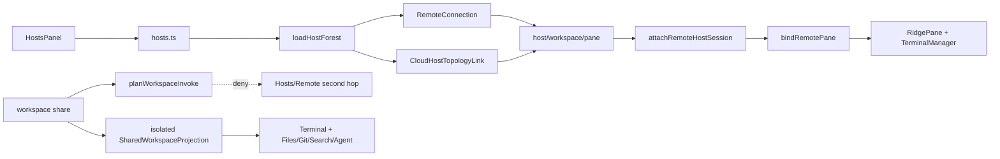

# Iteration 62 阶段报告：三层资源树

## 已完成

- `hostForest.ts` 复用 `RemoteLink.listWorkspaces/listWorkspacePanes`，按 host 隔离失败，工作区 pane 列表并行。
- `hosts.ts` 建立 LAN `RemoteConnection` 与 public Cloud E2EE 独立 topology link；LAN 不校验 cloud 账户，public full-host 沿用同账号 room 门禁。
- `HostsPanel.svelte` 改为 `host → workspace → pane`；工作区提供打开、新增、重命名、保存、分享、关闭；pane 提供接入、Agent 标记、切 shell、删除。
- `remotePaneBindings.ts` 将远端字节、stdin、resize 接入本地 `RidgePane`；删除失败不减引用，有第二 pane 时保持连接，最后 pane 移除时断连一次。
- `register_frontend_host` 仅为桌面 IPC；Rust/TS canonical deny 列表一致。`WorkspaceScope` 显式拒绝全部 desktop Host 方法，阻断共享资源二次转发。
- Explorer 标题、WorkspaceSidebar 行与 Hosts owner workspace 复用 `shareWorkspaceWithAccount`。
- `08eeff6` 新增不可持久化的 `SharedWorkspaceProjection`：scoped token 绑定 grant/workspace/device，独立 `TauriBridge/RpcClient`，不安装全局 transport、不启用 global workspace。
- 共享工作区在桌面内嵌 Remote terminal；桌面 Files/Git/Search/Agent 四侧栏改取同一显式 provider；文件可打开/写入，Git 与 teammate 资源可操作。
- 接入树以授权工作区真实 pane 替代伪节点，并随 pane 树与 metadata 推送更新；workspace 管理关闭、pane 保持 operator 权限。

## 架构

## 确定性证据

- `pnpm test`：107 files，1255 passed，1 skipped，exit 0。
- `pnpm exec svelte-check --tsconfig ./tsconfig.json`：0 errors，2 个既有 a11y warnings，exit 0。
- `cargo check -p ridge`：exit 0。
- `cargo test -p ridge hosts::desktop_surface::tests --lib`：2 passed，exit 0。
- `pnpm build:remote`：exit 0。
- `pnpm build`：exit 0。
- GitHub Actions `publish-remote` run `30265723678`：success；Remote artifact `0.1.6+g9a7e5f9` 已原子激活（231 文件，21.50 MiB）。
- `requirements_gate.py assert-executable` 与 `preflight.py --strict`：exit 0。
- CodeGraph：656 files / 13,444 nodes / 19,410 edges。

## 未闭与停止条件

- R62-WS-SHARE：代码侧已接原生桌面资源面；尚欠跨账号真链 E2E（邀请/接受/打开、读写/Git/Agent、pane 动态、撤销踢线、二跳拒绝），故仅代码关闭。
- R62-HOST-TREE、R62-GEOMETRY：自动门禁已绿；仍欠真实 LAN/public browser/host fixture E2E。
- 若 scoped provider 需把 remote absolute path 当本机路径、写入本机 `AppState.workspaces`，或允许调用任何 desktop Host/Remote 方法，则停止该方案。
