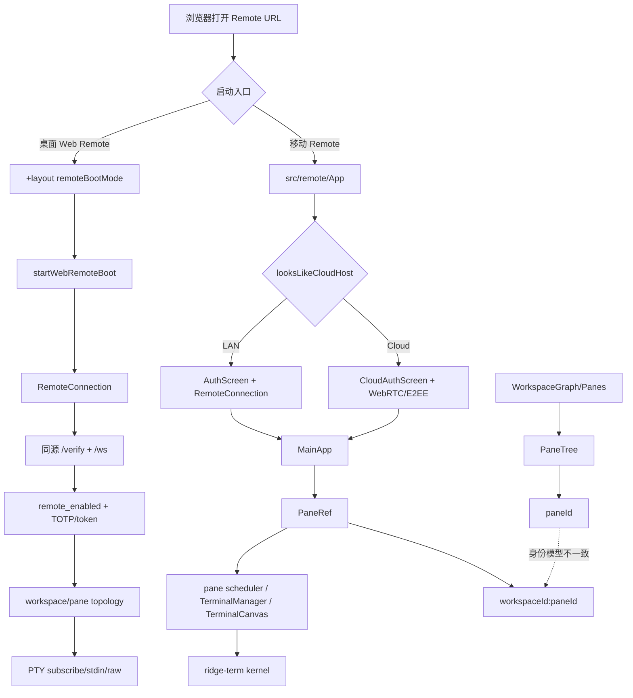

# Remote / pane / ridge-term / workspace 问题与结构审计

日期：2026-08-08  
基线：`eee0476a5a22105e599b5920503d73c14f70cf89`（`main` = `origin/main`）  
阶段：只读定位；本轮不修改业务代码、配置或测试。

## 结论先行

Remote 当前“完全接入不上”，首要嫌疑不是设备带宽，而是启动路径与身份边界未统一：

1. 本地 Cloud 开发配置可把 LAN 页面误判为 Cloud。`remoteBootMode` 去掉端口后比较 hostname；当 `RIDGE_CLOUD_BASE_DOMAIN=localhost:5001` 时，`localhost:5174`（Remote Vite）会被判为 Cloud，绕过 LAN TOTP/同源 WS。
2. 桌面 Web Remote 的 `+layout` 初始连接没有超时/失败终态。WS 被服务端以 503/401 拒绝时，浏览器只收到 `onerror/onclose`，`RemoteConnection` 转为 `disconnected` 并自动重连；`ready` 永不置位，用户只见等待或空壳。
3. Host 服务默认可能处于 stopped。服务端 `/ws` 在 `remote_enabled=false` 时直接返回 503；前端初始连接路径没有把该状态转成可行动错误。
4. Remote 已采用复合身份，但多处运行时仍以裸 `paneId` 为 Map key：TerminalManager、PTY bridge、Cloud raw 输出映射、WS raw 二进制路由、桌面 scrollback/关闭/清理。相同 pane id 跨 workspace 时会覆盖、错投或回退 active workspace。
5. `ridge-term` 内部 renderer、geometry、input、scrollback 本身不持有身份，这是合理的；问题在上层把错误 kernel/PTY 交给它，表现才像“ridge-term 黑屏、输入卡住、切 pane 错乱”。

这组证据指向“接入启动链 + 内核身份/生命周期”优先于“增加带宽/设备配置”。网络、CPU、渲染性能仍需在接通后分段测量，不能先归因于网速。

## 结构图



## A. Remote 连接链问题

### A1. 本地 Cloud 配置误把 LAN 页面判为 Cloud（P0，已具备确定性复现条件）

证据：

- `src/lib/remote/remoteBootMode.ts:3-10` 的 `hostOnly()` 把 `host:port` 截成 hostname。
- `src/lib/remote/remoteBootMode.ts:30-33` 仅比较 `host === base` 或 hostname 后缀。
- `vite.remote.config.js:187-203` 的 Remote Vite 监听 `5174`，并将 `/ws`、`/verify` 代理到 `127.0.0.1:9527`。
- `package.json:48-50` 与 `scripts/start-all.sh` 将 `RIDGE_CLOUD_BASE_DOMAIN` 设为 `localhost:5001`。
- `src/lib/remote/remoteBootMode.test.ts` 覆盖 `localhost + 9527127.xyz`，未覆盖 `hostname=localhost`、`baseDomain=localhost:5001`。

复现逻辑：

```text
页面：http://localhost:5174
baseDomain：localhost:5001
hostOnly(page)=localhost
hostOnly(base)=localhost
结果：cloud
实际意图：LAN Vite proxy → 127.0.0.1:9527
```

影响：页面不进入同源 `/verify` + LAN WS，而尝试 Cloud bootstrap；在本地 Cloud 未完整启动、凭据/设备未准备时，表现为 Remote 完全接不上。

### A2. 桌面 Web Remote 首次连接无超时，拒绝被降级为无限重连（P0）

证据：

- `src/routes/+layout.svelte:251-287` 创建 `RemoteConnection`，只监听 `connected` 与 `error`；无 `connecting` 超时、无 `disconnected` 首连失败阈值。
- `src/routes/+layout.svelte:287` 调 `conn.connect(host, port, token, 'token')`。
- `packages/remote/src/shared/transport/wsRemote.ts:740` 的 `onerror` 进入 `_handleDrop()`。
- `packages/remote/src/shared/transport/wsRemote.ts:909-945` 将普通 drop 转成 `disconnected` 并按退避重连。
- `src/routes/+layout.svelte:39-49,382-387` 只有 `ready=true` 才渲染页面；因此首连长期 `disconnected` 时会卡在 gate。
- 对比：`src/remote/AuthScreen.svelte:31-35,123-156` 有 `9000ms` 首连保护；桌面 `+layout` 没有同等保护。

服务端证据：

- `packages/ridge-remote/src/server_app.rs:287-296` 的 `/ws` 依赖认证；
- `packages/ridge-remote/src/server_app.rs:303-306` 在 `remote_enabled=false` 时返回 `503 SERVICE_UNAVAILABLE`；
- `packages/ridge-remote/src/server_app.rs:319-339` 对 token/code 不合法返回 `401`。

浏览器 WebSocket API 不把升级失败的 HTTP 503/401 直接交给业务层；当前代码没有在首连阶段用 `/health`、`/status` 或单独超时把它转成失败详情。故“服务未启动、token 无效、模式误判”在桌面 Web Remote 上都可能汇聚成无限等待。

### A3. Remote 服务启停是硬前置，但连接门没有行动闭环（P0/P1）

`REQ-REMOTE-01` 已规定 LAN Remote 默认 stopped、须显式启动；服务端也明确拒绝 disabled `/ws`。当前启动页面却只按连接结果等待，未在首连前确认：

- host 是否在线；
- Remote 是否 enabled；
- 实际监听端口是否为被打开的端口（`ridge-remote::bind_tcp` 允许端口向上探测）；
- 页面 `/verify` 与 `/ws` 是否指向同一端口。

这使“端口没开”和“认证失败”均无法在用户侧快速区分。

### A4. LAN adapter 的 `connect()` 是 no-op，生命周期所有权为隐式约定（P1）

证据：`packages/remote/src/shared/transport/lanWsAdapter.ts:150-154` 明确 `connect()` 不做任何事，连接由 Web Remote boot 驱动。

这本身可以是分层设计，但接口仍暴露 `connect()`，且 CodeGraph 未发现 `createLanWsTransport` 有完整生产入口测试。任何把 adapter 当作“可连接 transport”的调用方都会得到假成功；真实连接责任散落在 `+layout`、`AuthScreen`、`hosts.ts` 三套路径，增加了“已 attach adapter 但底层未连接”的误判空间。

### A5. Desktop / mobile 存在两套启动与认证入口，未形成单一 Transport SSOT（P1）

路径一：`src/routes/+layout.svelte` 的桌面 Web Remote gate，自己创建 `RemoteConnection`，接入 `bridge`，再置 `ready`。  
路径二：`src/remote/App.svelte` 的移动 Remote，依据 `looksLikeCloudHost()` 选择 `AuthScreen` 或 `CloudAuthScreen`，成功后把 `RemoteLink` 传入 `MainApp`。

两者的模式判定、首连超时、token/device 处理、错误呈现和 DataProvider 接入不同。现有 E2E 记录证明过 LAN 浏览器路径，但不等价于四路径（LAN/public × desktop/mobile）当前均闭合。

### A6. Desktop `/verify` 未提交 device，和 WS 的 device 绑定不一致（P1，偏安全/契约）

- `src/routes/+layout.svelte:307-316` 的 body 只有 `code`。
- `src/remote/AuthScreen.svelte:61-71` 会提交 `code` + `device`。
- `packages/ridge-remote/src/server_app.rs:263-283` 用 form 的可选 device 创建 token。
- `packages/remote/src/shared/transport/wsRemote.ts:705-711` 连接 WS 时总会附加 `getRemoteDeviceId()`。

结果是桌面 gate 取得的 token 可能是无 device 绑定 token，随后 WS 又携带 device。当前实现更像“安全降级”而非直接断连，但它说明两套认证入口未共用同一契约。

### A7. 连接成功早于 workspace topology ready，可能形成空壳（P0/P1）

第二个子代理的调用链审计补充：

```text
remote enabled / host
  → /verify
  → /ws 101
  → WebSocket connected
  → bridge.attach()
  → $/hello
  → list_workspaces
  → active_workspace
  → get_pane_layout
  → subscribe-pane
  → PTY binary frame
```

- `src/routes/+layout.svelte:261-269` 在 WebSocket `connected` 后立即 `bridge.attach()` 并置 `ready=true`。
- `src/lib/transport/tauriShim/bridge.ts:67-102` 中 `$/hello` 与 `use-global-workspace` 仍是异步后续动作。
- `src/routes/+page.svelte:1421-1433` 已侧面记录 web-remote 首次 workspace RPC 可能撞连接边沿并需要重试。
- `src/lib/stores/paneTree.ts:1417-1473` 中 `list_workspaces → active_workspace → layout` 任一步失败即抛错。
- `src/remote/MainApp.svelte:755-760` 会丢弃没有 `workspaceId` 的 panes；`packages/ridge-cli/src/kernel_host_impl.rs:50-83,454-458` 又允许空 workspace 或 `workspaceId:null` snapshot。

故“端口可连”与“Remote 可用”并非同一 readiness。若现场表现为 WS 101 后空白、无 pane 或 workspace RPC 超时，优先核对上述时序及 kernel workspace snapshot。

### A8. LAN / Public readiness 检查不等价于端到端可用（P1）

- `packages/ridge-cli/src/tui/mod.rs:96-105,136-145` 的 ready 检查只证明 TCP/进程状态，未证明 HTTPS、证书、`/verify`、WebSocket 升级及认证成功。
- LAN 服务端启用 TLS 且 fail-closed；自签证书、代理、实际监听端口均是独立断点。
- Public 路径还包含 signaling → offer/answer/ICE → WebRTC DataChannel → E2EE → TOTP → `subscribe-pane`，现有 MockPeer/协议测试不能替代真实 relay + 浏览器 + PTY 实链。
- `packages/ridge-cli/src/session.rs:148-164,205-209,659-717` 可见已有事件驱动与 30 秒握手超时，但缺少真实 Cloud WebRTC E2E。

最小现场证据顺序应为：`POST /verify`、`GET /ws → 101`、`$/hello`、workspace 三步 RPC、`subscribe-pane`、首个 PTY binary frame；此前任一步失败，后续 ridge-term 表现均不能单独作为根因。

## B. workspace / pane 身份问题

### B1. TerminalManager 以裸 paneId 为全局 key（P1，核心身份错误）

证据：

- `packages/remote/src/shared/terminal/manager.ts:567-578`：`panes`、`workerAttached`、`workerInitializing` 等以 `Map<string,...>` 保存。
- `:1679-1684`：`attach(paneId, ..., workspaceId)` 虽接收 workspaceId，去重仍检查裸 paneId。
- `:2269-2272`：Entry 保存 workspaceId，但 key 仍是 paneId。
- `:2729-2825,2843-2979,3539-3568`：detach、park、unpark、scrollback、feed、input、resize 继续按裸 paneId 查找。

触发条件：`workspace-a:pane-x` 与 `workspace-b:pane-x` 并存时，第二次 attach 可能被判已存在；输入、输出、scrollback、resize、focus、park/unpark 可落到另一 workspace 的 kernel。

### B2. PTY bridge 同样丢失 workspace 边界（P1）

- `packages/remote/src/shared/terminal/ptyBridge.ts:56`：`bridges = new Map<string, Bridge>()`。
- `:80-90,130,262,328-344`：注册、输出、销毁、存在性查询按裸 paneId。
- `src/lib/components/RidgePane.svelte:1308-1313,1373-1379` 虽传入 workspaceId，仍进入裸 key。
- `src/lib/stores/paneTree.ts:1784-1805` 的 runtime cleanup/teardown 只接收 paneId。

现有 `ptyBridge.test.ts` 只测单 workspace 单 pane；没有同 paneId、不同 workspace 的并存测试。

### B3. Cloud raw 输出映射会覆盖 workspace（P1）

- `src/lib/remote/cloud/cloudHostTopologyLink.ts:50`：`workspaceByPane = new Map<string,string>()`。
- `:261-265`：原始回调只收到 paneId，再查 Map 补 workspace。
- `:330-334`：activatePane 用裸 paneId 写 Map。

`w1:p` 与 `w2:p` 先后 active 时，后者覆盖前者；前 workspace 的 raw bytes 会错归属或丢失。当前 cloud topology 测试使用不同 paneId，未覆盖同名 pane。

### B4. WebSocket raw binary 帧只携带 paneId（P1）

- `packages/remote/src/shared/transport/wsRemote.ts:567`：`paneRefs` 以裸 paneId 为 key。
- `:749-772`：binary 帧解析 paneId 后 `paneRefs.get(paneId)`。
- `:1242`：订阅写入 `paneRefs.set(paneId, pane)`。
- `:1648`：关闭按裸 paneId 删除。

文本 metadata/resize 已带 workspaceId + paneId，但 raw 帧没有 workspaceId；多 workspace 同 paneId 时后订阅覆盖前订阅。

### B5. Desktop scrollback / close / cleanup 仍可回退 active workspace（P1）

- `src/lib/components/RidgePane.svelte:788-804,1385-1391` 的 scrollback 请求只带 paneId。
- `src-tauri/src/commands/terminal.rs:2688-2735` 接收可选 workspace_id，缺失时走 resolver。
- `src-tauri/src/commands/pane.rs:15-37` 缺 workspace 时按 active/全局扫描解析。
- `src/lib/stores/paneTree.ts:1807-1845` 的 close 调用只传 paneId。
- `src-tauri/src/commands/cloud_pane.rs:63-80,194-207` 对缺 workspace 的 pane 继续回退 active 或扫描首个匹配项。

竞态：W1 的异步 scrollback 已发出，用户切到 W2，迟到请求仍可能以 active workspace 解析，导致错取、空结果或写入错误 kernel。

### B6. `workspaceScope` 的 pane allowlist 不是复合身份（P1，需验证）

- `packages/remote/src/shared/cloud/workspaceScope.ts:13-16` 保存 `workspaceId` 与 `paneIds: Set<string>` 两个分离字段。
- `:54` 的 pane key 集合只识别 paneId/targetPaneId/sourcePaneId。
- `:114-139` 只校验 paneId 是否在 Set；只有请求显式提供 `workspaceId` 时才比较 workspace。
- `:175-190` 仅对 method 名含 `workspace` 或少数前缀的调用补写 workspaceId；普通 pane 方法不自动补写。

因此，`subscribe_pane`、`write_to_pty`、`resize` 等若只带 paneId，可能通过 pane allowlist 后仍不携带 workspaceId，最终依赖 host active workspace。该条需要在真实 workspace-share/remote host fixture 中证实，但结构上已与“复合身份必带”契约冲突。

### B7. active workspace 删除后的回退不确定（P2）

`packages/ridge-core/src/workspace/graph.rs:71-78` 删除 active workspace 后使用 `HashMap::keys().next()` 选回退 workspace。顺序未定义，多 workspace 时回退不稳定；缺 workspaceId 的兼容路径会放大该问题。

### B8. 跨 workspace attach 依赖调用方手动维护 metadata（P2）

`packages/ridge-core/src/workspace/pane_tree.rs:528-565` 的 `attach_external_leaf` 只把 UUID 插入布局树，要求调用方先插入 `Pane` / PTY 元数据。当前 `src-tauri/src/commands/pane.rs:440-462` 做对了，但没有测试防止未来调用方形成“布局有 leaf、panes/PTY 无记录”的半状态。

## C. ridge-term / PaneTree 问题

### C1. ridge-term 不是身份根因，但接收方无法自证 pane（结论）

- `packages/ridge-term/src/render/renderer.rs`、`src/term/scrollback.rs`、`src/input.rs` 均是 pane-local，不带 workspaceId/paneId。
- `packages/remote/src/shared/terminal/paneGeometry.ts:29-132` 的几何输入也不带身份。

这符合分层设计；身份必须在 `RidgePane/TerminalCanvas → TerminalManager/PTY bridge → backend` 入口统一完成。当前裸 key 使 renderer 可能“正确渲染错误 kernel”。

### C2. `PaneTree::find_path` 的路径内容疑似错误（P1，已可静态确认）

`packages/ridge-core/src/workspace/pane_tree.rs` 的 `find_path` 注释称记录父节点路径，但递归命中前执行 `path.push(pane_id)`，写入的是目标 pane id，不是实际 child index/父节点。该方法目前标记 dead-code，未见对应测试；一旦被 workspace 导航、拖拽或调试 UI 使用，返回路径会随深度重复目标 id。

### C3. PaneTree 序列化测试偏 happy-path，缺少不变量反序列化测试（P2）

已有测试覆盖 serde golden、split、neighbor、比例更新和缺失 pane，但未覆盖：

- children 与 ratios 长度不一致的反序列化树；
- 空 Split、空 children 导致 `children.len()-1` 的导航风险；
- leaf 在布局树中存在但 `panes` 无 metadata；
- 跨 workspace 同 paneId 的 attach/close/resize 全流程。

## D. 近期用户痛点与 NLM 线索

NLM MCP 本轮因本机 `auth.json` / profiles 权限拒绝且外部 CDP 尚未完成登录，未能实时查询；未读取或输出任何凭据。以下来自仓库已有的本地 NLM 缓存，只作低权威假设：

- 用户明确要求 Ridge 内核彻底脱离 Tauri；Tauri、TUI、Web 仅是外壳。
- 用户认为文件系统、Git、Remote 接入、Agent 编组/历史、设置都应是内核能力，`rdg` 无头不可用可能正源于 Tauri 耦合残留。
- 用户希望 Remote 直达 Ridge 内核，切 pane 秒切、输入无卡顿。

当前代码可验证的对应线索：

- `src/routes/+layout.svelte:252-267` 的 web-remote boot 仍显式导入 `bridge` 与 `TauriDataProvider`；即便底层是 shim，接入权力边界仍经过 Tauri 兼容层。
- `src/remote/App.svelte` 移动路径也以 `$lib/transport/tauriShim` / `WsDataProvider` 分流。
- `packages/ridge-cli`、`packages/ridge-remote`、`src-tauri` 各自拥有 host/remote 生命周期，尚未形成一个可被 Tauri/TUI/Web 同等调用的单一 daemon contract。

这些是架构假设，不替代真实运行根因；修复前须用 dev:cdp 与真 LAN/public fixture 证实。

## E. 现有验证与缺口

### 已有证据

- `docs/iterations/2026-08-03-iteration-129-lan-remote-e2e.md` 记录 `node scripts/rdg-remote-e2e.mjs --skip-build` 曾以 exit 0 通过本地 LAN desktop/mobile smoke；边界明确不覆盖 public WebRTC/TURN、真实设备、WebView2 heap、双窗口/双 host。
- `src/lib/remote/remoteBootMode.test.ts` 已有公网/LAN 基础判定测试，但漏掉 `localhost:5001` 端口碰撞。
- `src/remote/lib/paneLifecycle.test.ts` 已覆盖不同 workspace 的同名 pane 生命周期；但未覆盖 TerminalManager、PTY bridge、Cloud raw、WS raw、desktop scrollback 的同名 pane。
- `packages/remote/src/shared/terminal/paneGeometry.test.ts` 已覆盖 DPR、shared grid、cell bounds、visual offset；几何本身不是当前首要根因。

### 本轮执行到的阻塞

定向 Vitest 首次运行触发 pnpm 依赖目录重建；无 TTY 时被中止。设置 `CI=true` 后开始重装约 966 个包，但因 registry 下载极慢在 121 秒超时，尚未得到测试 pass/fail 结果。故本轮不宣称测试绿或红。

另：用户所说 `dev:cdp` 在 `package.json:26` 的实际脚本名是 `tauri:dev:cdp`；这不是代码根因，但后续 runbook 必须使用实际命令。

## F. 后续最小验证矩阵（只列问题验证，不在本轮改代码）

1. `remoteBootMode`：`localhost:5174` + `RIDGE_CLOUD_BASE_DOMAIN=localhost:5001`；确认 LAN 不被路由到 Cloud。
2. Host stopped：Remote disabled 时 `/health`、`/verify`、`/ws` 的状态码与 UI 文案；确认首连在有限时间内进入可行动错误。
3. LAN desktop：有效/无效 token、证书未信任、端口探测、首连断线/重连、stdin echo、workspace/pane list。
4. LAN mobile：同上，且验证 `AuthScreen` 与 `+layout` 是否同一认证契约。
5. Cloud desktop/mobile：同账号、公网 host online/offline、E2EE/relay、TOTP、pane subscribe/stdin/raw。
6. 复合身份压力：同时构造 `w1:p` 与 `w2:p`，并行 attach、subscribe、输入、输出、resize、scrollback、park/unpark、close。
7. ridge-term：错误 kernel 绑定、`find_path`、空 Split、ratio mismatch、跨 workspace attach metadata。
8. 性能归因：分别采集 WS/WebRTC upgrade、首帧、首 PTY bytes、host CPU、client CPU、队列深度、带宽；未经此分段不得建议加设备/加带宽。

## 修复优先级（下一阶段）

| 优先级 | 先修的问题 | 必须带的确定性测试 |
|---|---|---|
| P0 | 本地 LAN/Cloud 模式误判；首连无限重连/无错误；remote stopped 无行动反馈 | mode matrix；初连 timeout/503/401；health/status gate |
| P1 | TerminalManager/PTY bridge/Cloud raw/WS raw 全面改为复合身份边界 | `w1:p` + `w2:p` 并存全链路测试 |
| P1 | Desktop scrollback/close/cleanup 补 workspaceId，禁止 active fallback | 切 workspace 后迟到响应不得错投 |
| P1 | `workspaceScope` 普通 pane 方法强制复合身份 | 省略/错误 workspace 明确拒绝 |
| P1 | `PaneTree::find_path` 与跨 workspace attach 不变量 | 深层 path、缺 metadata、空 Split/比例异常 |
| P2 | 统一 desktop/mobile/rdg 的 boot、认证、transport/daemon contract | 四路径 LAN/public × desktop/mobile E2E |

本轮文档完成；业务修复、Sonar 扫描、`tauri:dev:cdp`、完整 E2E 与下一轮 NLM 冷循环均未开始，避免违反“首阶段只写问题、不改代码”的约束。
