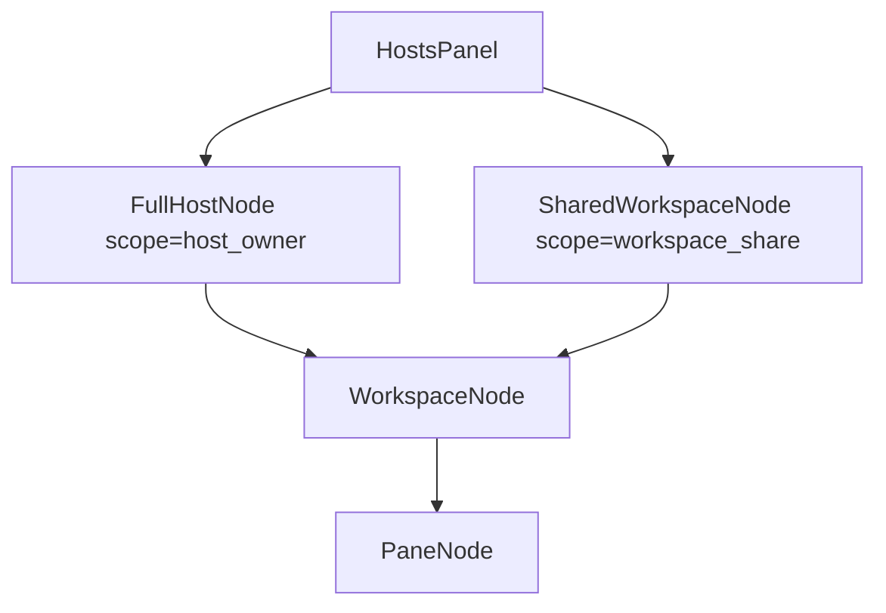
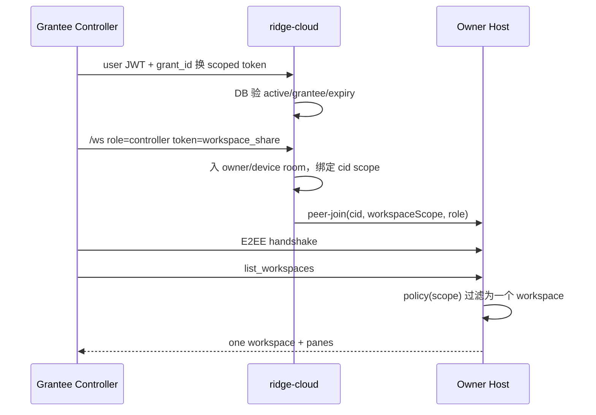
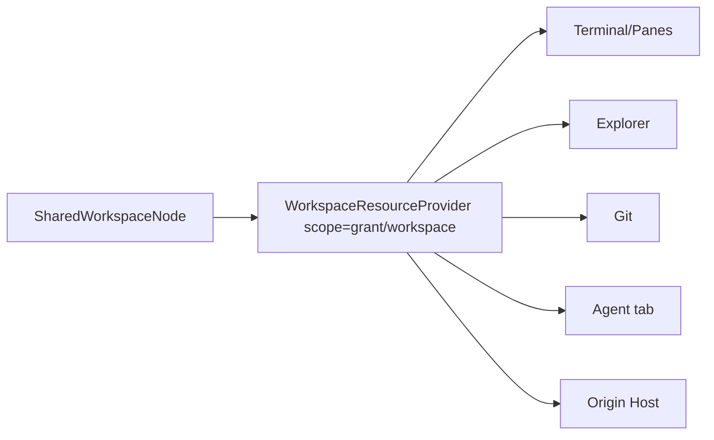
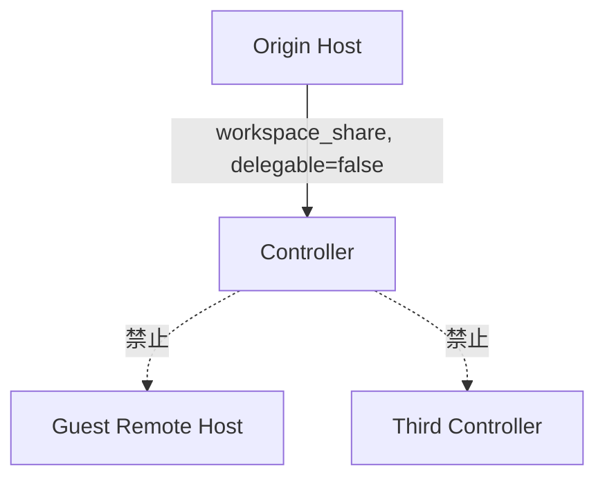

# 主机树与单工作区分享设计

状态：`DRAFT / 待用户批准 REQUIREMENTS-SPEC Pending`

## 1. 结论

两条入口共用 Hosts 侧栏，不共用授权语义：

| 入口 | 身份关系 | 可见范围 | 根节点 |
| --- | --- | --- | --- |
| 公网接入主机 | host/controller 同一 Ridge 用户 | host 全部 workspace/pane | 普通主机 |
| LAN 接入主机 | 不限制 Ridge 账户关系；校验 LAN TOTP/session/E2EE | host 全部 workspace/pane | 普通主机 |
| 分享工作区 | owner 定向授权另一 Ridge 用户 | 恰一个 workspace 及其 pane | 受限“共享工作区” |

公网整机接入以 cloud 账户归属为门禁；LAN 不校验账户归属，仅走 LAN 自身认证。分享不把 TOTP 交给受邀者，改用可撤销的 workspace grant。

## 2. 当前代码事实与缺口

- `HostRecord.sessions` / `HostSessionMeta` 仅主机→扁平 session；无 workspace DTO。
- `connect_host` 仅 TCP probe，丢弃 token，并伪造 `probe/reachability-ok` session。
- `HostConnectDialog` 的 LAN/public 两腿皆落同一 `connectHost('remote', ...)`；公网登录态未参与后端授权。
- `LanOutboundTransport` 仍需 `inject_socket_ready`；没有生产 OS socket read/write loop。
- `WorkspaceTree` 已有单连接 workspace/pane CRUD 原语；`HostsPanel` 未复用，仍渲染 flat sessions。
- ridge-cloud 协议明定 host/controller 同账号，房间键为 `{user_id}/{device}`；无 workspace grant、invite、guest scope。
- native headless 链已有 creator workspace/pane DTO、Agent Center 拉取与 `summon_native_session`；须以现有测试确认，不并入分享授权模型。

## 3. 统一领域模型



前端统一成判别联合：

```ts
type HostAccess =
  | { kind: 'owner'; hostId: string; scope: 'host'; capabilities: Capability[] }
  | {
      kind: 'share';
      grantId: string;
      hostId: string;
      workspaceId: string;
      role: 'viewer' | 'operator';
      capabilities: Capability[];
    };
```

共享节点虽视觉纳入 Hosts forest，却绝不伪装整机：标题带“共享”，host 菜单不出现“添加工作区/忘记主机”。

shared workspace 为 **remote projection**，不插入控制端本地 `AppState.workspaces`。Explorer、Git、Agent、Terminal 四面持同一 `WorkspaceResourceProvider`；其 origin 始终指向 owner host。资源管理器仍把远端 pane `cwd` 渲染成普通 `ExplorerWorkspaceGroup.columns`：位置、折叠、目录树、文件打开体验与本机 cwd 一致，唯 I/O provider 与 capability 不同。

## 4. Cloud 授权模型

新增顺序 migration：

```text
workspace_share_grants
  id UUID PK
  owner_user_id UUID
  device_id UUID
  workspace_id UUID
  grantee_user_id UUID
  role viewer|operator
  status pending|active|revoked|expired
  expires_at nullable
  created_at / accepted_at / revoked_at
  UNIQUE(owner_user_id, device_id, workspace_id, grantee_user_id)
```

API：

- owner：`POST /api/v1/workspace-shares`、`GET ...`、`PATCH role/expiry`、`DELETE revoke`。
- grantee：`GET /api/v1/workspace-shares/inbox`、`POST /:id/accept|decline`。
- controller：`POST /:id/access-token` 换 15 分钟 scoped token。

Cloud 与桌面分工：

| 环节 | ridge-cloud | owner 桌面/host | grantee 桌面 |
| --- | --- | --- | --- |
| 创建邀请 | 解析 username/email，校验 owner/device 绑定，落 grant | 提交当前 `device_id + workspace_id`；证明 workspace 存在且可分享 | — |
| 接受邀请 | 校验 grantee，改 active，推送 inbox 事件 | — | 接受/拒绝并刷新 Hosts 共享节点 |
| 建连 | 签发短期 scoped token，路由至 owner/device room | 以 `cid` 建 `WorkspaceShare` scope，二次校验 workspace/role | 建 scoped provider，不注册成 host |
| 数据 | 仅转 E2EE 帧，不见资源明文 | 执行 Terminal/Explorer/Git/Agent RPC 与事件过滤 | 以共享 cwd/四 tab 呈现 |
| 撤销/到期 | DB 置状态并终止对应 controller cid | 清订阅、拒绝旧 token/后续 RPC | 移除共享节点、关闭相关视图 |

Cloud 另提供 owner grants 列表、grantee inbox、角色/到期修改及状态推送；不承载文件、Git、Agent、PTY 数据。`workspace_id` 只作不透明授权键，展示名可存邀请时快照，不能据此枚举同 host 资源。

JWT 新 scope：

```json
{
  "scope": "workspace_share",
  "sub": "<grantee_user_id>",
  "grant_id": "...",
  "owner_user_id": "...",
  "device_id": "...",
  "workspace_id": "...",
  "role": "viewer|operator",
  "exp": "15m"
}
```

数据库为真相源：WS upgrade 每次重查 active/expiry/role；token 仅缓存身份声明。公网整机 controller 继续 `scope=user` 且 `sub == device.owner_user_id`；LAN 不复用此账户门禁。

## 5. WS 房间与 host 双重门禁



relay 负责房间/身份第一闸；host bridge 为第二闸。每个 `cid` 维护：

```text
ControllerScope::HostOwner { user_id }
ControllerScope::WorkspaceShare { grant_id, workspace_id, role, expires_at }
```

所有请求走一个 `authorize_remote_call(scope, method, args)`，禁止 handler 各写散落 if：

| 操作 | owner | viewer | operator |
| --- | --- | --- | --- |
| list workspace/pane、subscribe/output | ✓ | 仅目标 workspace | 仅目标 workspace |
| stdin/resize/focus | ✓ | ✗ | ✓ |
| create/delete pane、change shell | ✓ | ✗ | ✓ |
| create/close workspace、share/转分享 | ✓ | ✗ | ✗ |
| Explorer 文件树/读取/搜索 | ✓ | 仅目标 root 只读 | 仅目标 root 读写 |
| Explorer 打开文件 | ✓ | ✓，远端只读 buffer | ✓，远端可保存 |
| Explorer 新建/保存/重命名/删除/粘贴 | ✓ | ✗ | ✓，仅目标 root |
| Git status/diff/log | ✓ | 仅目标 root | 仅目标 root |
| Git 写操作 | ✓ | ✗ | ✓，沿用既有 HITL/进程闸 |
| Agent roster/状态/最近回复 | ✓ | 仅目标 workspace | 仅目标 workspace |
| Agent 派活/暂停/恢复/召唤 | ✓ | ✗ | ✓，沿用既有 HITL |
| Remote/Hosts 启停、host export | ✓ | ✗ | ✗ |

事件亦按 scope 投影；不得先广播全量、再靠前端隐藏。

### 5.1 资源面同源



- `WorkspaceResourceProvider` 复用现有 Remote RPC；每调用都附隐式 scope，不让 UI 自报任意 `workspaceId`。
- `ExplorerWorkspaceGroup`/cwd 行复用现有视觉与交互模型；列数据增 `providerId + accessRole`，文件打开/刷新/写入经 provider 分派，不把 origin host 路径交给本机 FS API。
- Explorer：host canonicalize workspace root 与目标路径；拒绝 `..`、root 外绝对路径、越界 symlink。
- viewer：文件仍可打开；编辑器 buffer 标只读，隐藏或禁用保存、新建、重命名、删除、剪切/粘贴。operator：复用正常 Remote 写能力。两者皆以 host policy 为安全真相。
- 降级规则：若上述只读链任一写入口或 host RPC 未闭环，v1 仅发行 operator，角色选择器不展示 viewer；不得以前端隐藏冒充 viewer。
- Git：repo root 须 canonicalize 后位于 workspace root；所有外部 git 仍经现有唯一进程闸。
- Agent：只投影该 workspace topology/history/health；写操作携稳定 agent id，host 再反查归属。

### 5.2 非转授/非二跳



四层硬闸：

1. cloud：`workspace_share` token 不能以 `role=host` 入房，不能创 device/新 share；grant 不含转授权。
2. host：policy 永拒 Remote/Hosts/share/export 方法。
3. controller backend：shared projection 不写本地 workspace graph，不进入 `host_list_snapshot`/Remote host inventory。
4. UI：共享视图不出现 Remote/Host/再次分享入口；此层仅体验收敛，安全不依赖它。

即使 guest 同时启动自己的 LAN/public Remote，导出器只枚举 `origin=local_owned`；`origin=shared_remote` 必为负断言。

## 6. LAN 与公网

- 公网 full-host：沿现有 cloud room；同账号门禁不变。
- LAN full-host：不要求 controller 与 host 属于同一 Ridge 账户；host 只校验既有 LAN TOTP/session/E2EE 凭据。不得暗中回退至 cloud owner user id 校验。
- workspace share v1：仅 cloud relay。后续可在 scoped cloud 握手成功后协商 LAN 数据面，但授权仍取 cloud grant，不另造 LAN 分享协议。
- 两腿共享 `RemoteLink`/RPC/DTO/policy；差异止于 transport 与 credential acquisition。

## 7. Hosts 侧栏交互

```text
主机 A（我的主机）                 ⋯
  工作区 alpha                     ⋯
    pane 1                         ⋯
    pane 2                         ⋯
共享：beta · alice/office-host     ⋯
  工作区 beta                      ⋯
    pane 7                         ⋯
```

- 主机 `⋯`：添加工作区、刷新、连接详情、断开、忘记。
- owner 工作区 `⋯`：打开、添加 pane、重命名、保存、分享/管理成员、关闭。
- shared 工作区 `⋯`：打开、刷新、退出分享；operator 另有添加 pane。
- pane `⋯`：接入/聚焦、复制标识；owner/operator 可切 shell、标记 Agent、删除；viewer 无写项。
- 打开 shared workspace 后，主区域呈现其 Terminal、Explorer、Git、Agent 四 tab；不切成本地 workspace，不出现 Remote/Hosts 转发入口。
- 删除 pane/关闭 workspace/撤销分享须确认；删除 pane 只作用于目标 pane，不连带 workspace 或其他 pane。
- pane 删除成功并刷新拓扑后，计算该控制端对同源 `hostId` 的接入 pane 引用数：为 `0` 时断开一次 host 连接；仍有第二个 pane 时保持连接。只计该控制端已接入的 pane，不计 host 全部 pane；删除失败不减计数。
- 删除与接入/刷新须按 host 串行或带 generation 校验，避免并发完成顺序造成误断线。

### 7.1 Ridge 桌面分享入口

三处入口调用同一 `openWorkspaceShareDialog(origin, workspaceId)`，不复制业务状态：

1. 本机 Explorer 工作区标题：新增 `⋯ → 分享工作区`。
2. `WorkspaceTree.svelte` 工作区行：新增 `⋯ → 分享工作区`，与关闭动作并列。
3. `HostsPanel.svelte` 已接入 owner 工作区：`⋯ → 分享工作区`。

`WorkspaceShareDialog` 含：受邀账号、角色、到期时间、待接受/已接受成员、改角色、撤销。未登录 cloud 时先登录；本机尚未注册可路由的 public host/device 时，明确要求启用公网 Remote，不得创建不可连接邀请。grantee 的邀请收件箱及已接受共享统一进入 Hosts 侧栏“共享给我”；shared projection 菜单永无再次分享。

## 8. 实施切片

1. 先删 probe 假 session 与“live 下一里程”误导文案，建立诚实 disconnected/unsupported 状态。
2. 抽 `HostTopology`、`HostAccess`、capability policy 与跨入口契约测试。
3. 复用既有 `RemoteLink.listWorkspaces/listWorkspacePanes/create* / close*`，用 adapter 接 Hosts store；不再扩 `list_panes` 平行协议。
4. 完成 LAN/public 真实 provider 注册表与 per-host lifecycle。
5. Hosts 三层 forest + 分级菜单 + role/capability 收敛。
6. 抽 `WorkspaceResourceProvider`，让 Terminal/Explorer/Git/Agent 四面同吃一个 scoped origin；共享 cwd 复用 `ExplorerWorkspaceGroup` 呈现，文件 I/O 按 provider/role 分派；shared projection 不入本地 workspace graph。
7. ridge-cloud grant/invite/scoped JWT/WS room 门禁、inbox/owner grants API、状态事件及撤销踢线。
8. host per-cid scope、路径/repo/agent 归属校验、RPC/事件双闸、撤销踢线。
9. 加非转授负契约：share token 不能作 host；guest Remote inventory 永无 shared projection。
10. headless 只作代码证据复核；若现有 header→DTO→store→Agent Center→summon 任一测缺，则补契约测，不与 share scope 合流。

## 9. 停止条件与验收

- 若 adapter 需复制 `RemoteLink` RPC 名称/DTO，停；先收敛共享接口。
- 若任何 share 请求可见 sibling workspace id/title/pane/event，立即停机修安全边界。
- 若 shared workspace 可进入 guest 本地 workspace graph/Remote export inventory，立即停机修非转授边界。
- 若 Explorer/Git/Agent 任一调用仅靠前端隐藏 workspaceId、host 未作归属校验，未完成。
- 若撤销仅阻新连、不终止既有 cid，未完成。
- 若 LAN 仍只 probe TCP 或需测试注入 socket，不称“已接入”。
- LAN fixture 须证明异账号亦可凭有效 TOTP/session 接入；无效凭据仍拒绝。
- pane 生命周期测须覆盖：第二个同源接入 pane 存在则不断线；删掉该控制端最后一个同源接入 pane 则只断开一次；删除失败不断线。
- 共享 cwd 测须证明与本机 cwd 同层呈现、文件可打开；viewer 所有写入口与 RPC 双拒，operator 仅写 origin root。若走 operator-only，角色 API/UI 不得宣称支持 viewer。
- 三个桌面入口须命中同一分享 command/dialog；未登录、未启用公网 host、撤销/到期皆有确定状态。
- 自动闸：cloud repo/auth/WS、host policy、transport isolation、Svelte store/menu、`pnpm check`、相关 Rust workspace。
- 代码验收不冒充真机；公网/LAN 各需一条 loopback/live fixture，生产凭据与真机证据另列用户轨。

## 10. 待批准决策

1. 首选 `viewer/operator`、默认 `viewer`；若只读闭环成本过高，v1 明确降级为 operator-only，不做伪 viewer。
2. 分享只支持定向 Ridge 账号，不做匿名 bearer link。
3. workspace share v1 仅 cloud relay；LAN 优化后置。
4. viewer 可读 Terminal/Explorer/Git/Agent；operator 可该区既有写操作，但不可 workspace/分享/host 管理。
5. shared workspace 永不可经 guest Remote/Hosts 二次转发；projection 与本地 workspace graph 物理分离。
