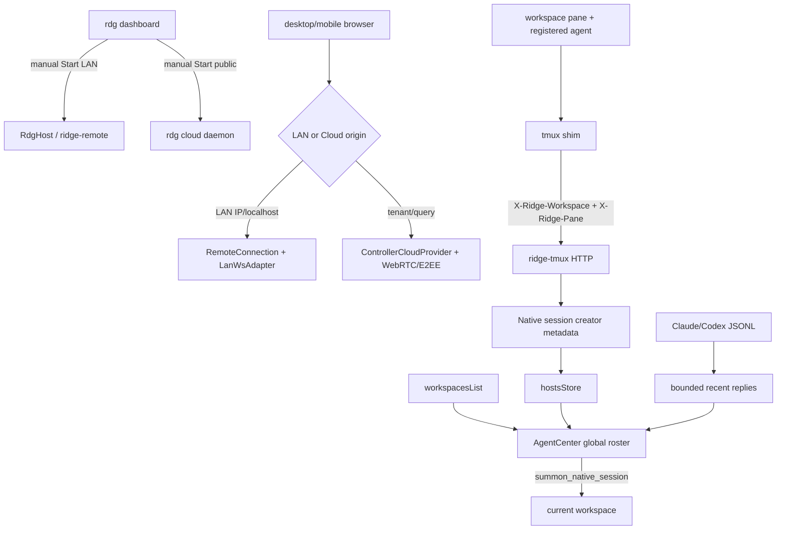

# rdg Remote 与 Agent Center 贯通设计

日期：2026-07-27  
范围：`wind` 主仓 + `C:\code\ridge-cloud` 配额门控  
需求：`REQ-REMOTE-01/02`、`REQ-CLOUD-01`、`REQ-MOBILE-01`、`REQ-AGENT-01/02`

## 1. 现状证据

- `dashboard::App::new` 把 LAN URL 写成 `https://{ip}:{port}/login`，`run()` 又无条件发送 `Action::StartLanRemote`。
- TUI 已有 `StartDaemon/StopDaemon`，但标签仍为 daemon，用户无法直认其为公网 Remote。
- desktop-web 的 `+layout.svelte` 对所有 host 先尝试 cloud cookie/bootstrap，再回退 LAN；LAN IP 不应依赖 cloud API，失败/延迟可把浏览器停在未 ready 的空壳。
- ridge-cloud `ws::handler` 仅在 controller 角色查询真实会员状态；host 角色固定 `is_real_premium=false`，会以免费额度执行 `reconcile_down`。
- ridge-cloud `devices.enabled=false` 同时代表手动停用与额度停用，故无法安全自动恢复。
- `AgentCenterPanel` 只接单个 `workspaceId`；`RidgePane` 虽轮询前台进程，却未写 `paneForegroundProcessStore`，也未把识别结果注册到 pane teammate 状态。
- `read_claude_history` 只读 `~/.claude/history.jsonl` 的用户输入 `display`，并非 assistant 回复。
- native session 已可 `list/summon`，但 `NativeSessionInfo` 无创建工作区/pane，Agent Center 也不消费 Hosts store。
- `discover_cli_agents` 只扫 agent 进程名；它既不识别 agent 创建的 native shell，也无法把任意 OS PID 变成可召唤 PTY。

## 2. 总体数据流

## 3. 决策

### D1：Remote 启停为显式状态

- 删除 dashboard 启动时的 LAN action。
- LAN/public 菜单用产品名，不暴露 daemon 实现词。
- LAN 状态 URL 为可复制根 origin；登录/验证路由由 SPA 自行处理。
- daemon 仍复用现有 `daemon_ctl` 与 `daemon::run`，不新建第二套生命周期。

### D2：LAN 启动链先分类、后接线

- 新增纯 helper：仅 cloud query 或合法租户域走 cloud boot；IP、localhost、普通 LAN hostname 直接走 `startWebRemoteBoot`。
- helper 独立单测，避免在 Svelte 生命周期中靠端到端猜分支。
- LAN 仍用共享 `RemoteConnection → LanWsAdapter → bridge → TauriDataProvider`；不另写协议。

### D3：配额停用原因进入数据库

- 新 migration 增 `devices.parked_by_quota BOOLEAN NOT NULL DEFAULT FALSE`。
- quota bulk park 同时置 `enabled=false, parked_by_quota=true`；quota restore 仅选 `parked_by_quota=true` 并清标记。
- console/manual enable/disable 清 `parked_by_quota`，保持用户决策优先。
- WS 对 host/controller 均加载真实用户；仅 controller 检查 `can_use_remote`，但二者均按真实 group limit 对账。
- 每次连接执行“先降后补”的 quota reconcile，使升级/配额空位可自愈历史 quota park，不复活手动停用。

### D4：Mobile UI 只改承载与视觉，不改行为

- `WorkspaceTree` 的 backdrop、主 popup、saved popup 使用既有 `portal` action。
- team 入口由 `Users` 换 `Bot`。
- pane header Agent 按钮保留状态色、脉冲、tooltip 与 aria，仅移除尾随文案，缩为图标按钮。
- popup 右上操作按钮去 border/background 外壳；触控尺寸不缩。

### D5：Agent Center 改为全局读模型，写操作带所属工作区

- 前端从 `workspacesList` 并行调用既有 `get_teammate_topology({workspaceId})`，形成 `{workspaceId, workspaceName, profile}` 聚合；不新增协议方法。
- 成员列表全局展示，工作区以次级文字/tooltip 呈现，不拆成工作区 Tab。
- pause/resume、目标、编组等写操作始终携带成员所属 workspace id；焦点工作区只用于“召唤落点”。
- 顶部 MCP guide/copy/HITL/健康徽章移入可滚动 content 的“控制”section，header 仅留标题。

### D6：前台 agent 识别与 pane 状态同源

- 复用 `teammate::discover::KNOWN_AGENT_NAMES` 语义，在前端放一份小型纯函数并以 fixture 对齐。
- `RidgePane` 现有 1 秒前台进程轮询同时更新 `paneForegroundProcessStore`。
- 仅组件自己自动注册的 agent 在进程离开时自动 release；人工标记不被自动撤销。
- register/release 后端 emit 既有 `teammate-layout-changed`，pane layout 回包成为 header/roster SSOT。

### D7：最近回复读会话 JSONL，不读 prompt history

- 新 command 扫描 Claude projects 与 Codex sessions 的 JSONL。
- 上限：最近 100 个文件、每文件尾部 1 MiB、最终最多 100 条；按文件 mtime 预筛。
- Claude 取 `type=assistant` 的 `message.content[].text`；Codex 取 `response_item/message/assistant` 的 `output_text|text`。
- 项目路径仅用于本机过滤；回复不上传 NotebookLM、不写持久日志。

### D8：可召唤后台 shell 以 creator metadata 归因

- 每个 GUI pane spawn 时注入 `RIDGE_PANE_ID`；tmux shim 与已有 `RIDGE_WORKSPACE_ID` 一并转成 header。
- ridge-tmux `NewSessionReq/Session/NativeSessionInfo` 保存可选 creator workspace/pane。
- Agent Center 将 creator `(workspace,pane)` 与聚合 roster 匹配，嵌套显示；未匹配 session 放“未归因后台 Shell”。
- 点击调用既有 `summon_native_session`，目标为当前查看工作区。
- 任意 OS 后台 PID无 PTY master，明确不提供伪唤起。

## 4. 验证

| 层 | 确定性闸 |
| --- | --- |
| Rust wind | `cargo test -p ridge-cli`；`cargo test -p ridge-tmux`；`cargo test -p ridge --lib` |
| TypeScript/Svelte | 聚焦 Vitest；`pnpm check`；`pnpm build:remote`；`pnpm build:desktop-web` |
| LAN | rdg dashboard/boot helper tests；真实 `rdg` LAN probe 或 Playwright 同构握手 |
| ridge-cloud | `cargo test`；migration/schema 查询测试；WS handler 门控回归 |
| 跨层 | Agent 前台进程 → register event → layout `agent_state`；tmux header → list metadata → Agent Center attach |

## 5. 停机条件

- 需删除/覆盖用户现有设备或 NotebookLM 来源。
- 配额修复会复活 `parked_by_quota=false` 的手动停用设备。
- LAN 修复需要引入第二套 Remote 协议或绕过 TOTP/session。
- 无头进程无 Ridge PTY master，却只能靠杀进程/注入句柄伪装“唤起”。
- 现有 `Cargo.lock` 用户改动与本轮依赖恢复发生冲突。
