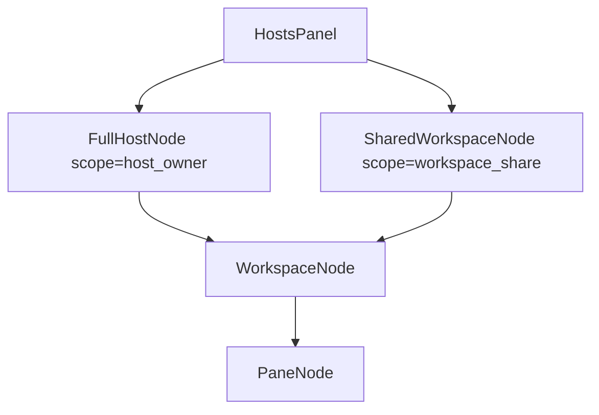
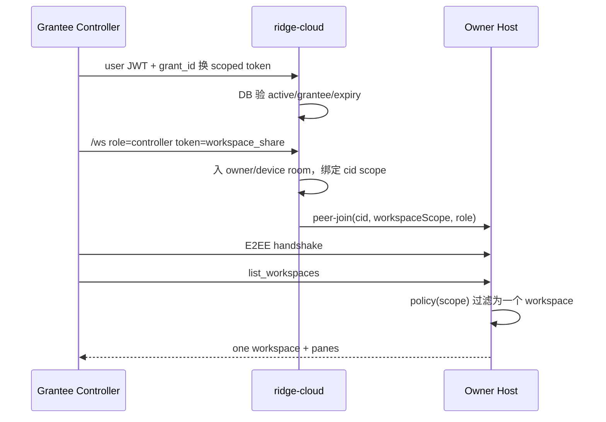

# 主机树与单工作区分享设计

状态：`DRAFT / 待用户批准 REQUIREMENTS-SPEC Pending`

## 1. 结论

两条入口共用 Hosts 侧栏，不共用授权语义：

| 入口 | 身份关系 | 可见范围 | 根节点 |
| --- | --- | --- | --- |
| 接入主机 | host/controller 同一 Ridge 用户 | host 全部 workspace/pane | 普通主机 |
| 分享工作区 | owner 定向授权另一 Ridge 用户 | 恰一个 workspace 及其 pane | 受限“共享工作区” |

TOTP 证明“握有此 host 的临时验证码”，不能证明账户归属；故 LAN 整机接入仍须同账号 proof。分享不把 TOTP 交给受邀者，改用可撤销的 workspace grant。

## 2. 当前代码事实与缺口

- `HostRecord.sessions` / `HostSessionMeta` 仅主机→扁平 session；无 workspace DTO。
- `connect_host` 仅 TCP probe，丢弃 token，并伪造 `probe/reachability-ok` session。
- `HostConnectDialog` 的 LAN/public 两腿皆落同一 `connectHost('remote', ...)`；公网登录态未参与后端授权。
- `LanOutboundTransport` 仍需 `inject_socket_ready`；没有生产 OS socket read/write loop。
- `WorkspaceTree` 已有单连接 workspace/pane CRUD 原语；`HostsPanel` 未复用，仍渲染 flat sessions。
- ridge-cloud 协议明定 host/controller 同账号，房间键为 `{user_id}/{device}`；无 workspace grant、invite、guest scope。
- native headless 链已有 creator workspace/pane DTO、Agent Center 拉取与 `summon_native_session`；须以现有测试确认，不并入分享授权模型。

## 3. 统一领域模型



前端统一成判别联合：

```ts
type HostAccess =
  | { kind: 'owner'; hostId: string; scope: 'host'; capabilities: Capability[] }
  | {
      kind: 'share';
      grantId: string;
      hostId: string;
      workspaceId: string;
      role: 'viewer' | 'operator';
      capabilities: Capability[];
    };
```

共享节点虽视觉纳入 Hosts forest，却绝不伪装整机：标题带“共享”，host 菜单不出现“添加工作区/忘记主机”。

## 4. Cloud 授权模型

新增顺序 migration：

```text
workspace_share_grants
  id UUID PK
  owner_user_id UUID
  device_id UUID
  workspace_id UUID
  grantee_user_id UUID
  role viewer|operator
  status pending|active|revoked|expired
  expires_at nullable
  created_at / accepted_at / revoked_at
  UNIQUE(owner_user_id, device_id, workspace_id, grantee_user_id)
```

API：

- owner：`POST /api/v1/workspace-shares`、`GET ...`、`PATCH role/expiry`、`DELETE revoke`。
- grantee：`GET /api/v1/workspace-shares/inbox`、`POST /:id/accept|decline`。
- controller：`POST /:id/access-token` 换 15 分钟 scoped token。

JWT 新 scope：

```json
{
  "scope": "workspace_share",
  "sub": "<grantee_user_id>",
  "grant_id": "...",
  "owner_user_id": "...",
  "device_id": "...",
  "workspace_id": "...",
  "role": "viewer|operator",
  "exp": "15m"
}
```

数据库为真相源：WS upgrade 每次重查 active/expiry/role；token 仅缓存身份声明。整机 controller 继续 `scope=user` 且 `sub == device.owner_user_id`。

## 5. WS 房间与 host 双重门禁



relay 负责房间/身份第一闸；host bridge 为第二闸。每个 `cid` 维护：

```text
ControllerScope::HostOwner { user_id }
ControllerScope::WorkspaceShare { grant_id, workspace_id, role, expires_at }
```

所有请求走一个 `authorize_remote_call(scope, method, args)`，禁止 handler 各写散落 if：

| 操作 | owner | viewer | operator |
| --- | --- | --- | --- |
| list workspace/pane、subscribe/output | ✓ | 仅目标 workspace | 仅目标 workspace |
| stdin/resize/focus | ✓ | ✗ | ✓ |
| create/delete pane、change shell | ✓ | ✗ | ✓ |
| create/close workspace、share/转分享 | ✓ | ✗ | ✗ |
| 文件/Git/Search | ✓ | v1 ✗ | v1 ✗ |

事件亦按 scope 投影；不得先广播全量、再靠前端隐藏。

## 6. LAN 与公网

- 公网 full-host：沿现有 cloud room；同账号门禁不变。
- LAN full-host：controller 登录 cloud 后换短期 `lan_host_access` proof；host 校验签名与 owner user id，再走 LAN TOTP/E2EE。离线时仅接受 host 本地已批准、可撤销的 trusted-device grant。
- workspace share v1：仅 cloud relay。后续可在 scoped cloud 握手成功后协商 LAN 数据面，但授权仍取 cloud grant，不另造 LAN 分享协议。
- 两腿共享 `RemoteLink`/RPC/DTO/policy；差异止于 transport 与 credential acquisition。

## 7. Hosts 侧栏交互

```text
主机 A（我的主机）                 ⋯
  工作区 alpha                     ⋯
    pane 1                         ⋯
    pane 2                         ⋯
共享：beta · alice/office-host     ⋯
  工作区 beta                      ⋯
    pane 7                         ⋯
```

- 主机 `⋯`：添加工作区、刷新、连接详情、断开、忘记。
- owner 工作区 `⋯`：打开、添加 pane、重命名、保存、分享/管理成员、关闭。
- shared 工作区 `⋯`：打开、刷新、退出分享；operator 另有添加 pane。
- pane `⋯`：接入/聚焦、复制标识；owner/operator 可切 shell、标记 Agent、删除；viewer 无写项。
- 删除 pane/关闭 workspace/撤销分享须确认；操作后按该 host 增量刷新，不全局闪烁。

## 8. 实施切片

1. 先删 probe 假 session 与“live 下一里程”误导文案，建立诚实 disconnected/unsupported 状态。
2. 抽 `HostTopology`、`HostAccess`、capability policy 与跨入口契约测试。
3. 复用既有 `RemoteLink.listWorkspaces/listWorkspacePanes/create* / close*`，用 adapter 接 Hosts store；不再扩 `list_panes` 平行协议。
4. 完成 LAN/public 真实 provider 注册表与 per-host lifecycle。
5. Hosts 三层 forest + 分级菜单 + role/capability 收敛。
6. ridge-cloud grant/invite/scoped JWT/WS room 门禁。
7. host per-cid scope、RPC/事件双闸、撤销踢线。
8. headless 只作代码证据复核；若现有 header→DTO→store→Agent Center→summon 任一测缺，则补契约测，不与 share scope 合流。

## 9. 停止条件与验收

- 若 adapter 需复制 `RemoteLink` RPC 名称/DTO，停；先收敛共享接口。
- 若任何 share 请求可见 sibling workspace id/title/pane/event，立即停机修安全边界。
- 若撤销仅阻新连、不终止既有 cid，未完成。
- 若 LAN 仍只 probe TCP 或需测试注入 socket，不称“已接入”。
- 自动闸：cloud repo/auth/WS、host policy、transport isolation、Svelte store/menu、`pnpm check`、相关 Rust workspace。
- 代码验收不冒充真机；公网/LAN 各需一条 loopback/live fixture，生产凭据与真机证据另列用户轨。

## 10. 待批准决策

1. 角色采用 `viewer/operator`，默认 `viewer`。
2. 分享只支持定向 Ridge 账号，不做匿名 bearer link。
3. workspace share v1 仅 cloud relay；LAN 优化后置。
4. viewer 不可 stdin；operator 可 pane 级管理，但不可 workspace/分享管理。
5. v1 禁共享工作区文件/Git/Search，待路径沙箱另立需求。
